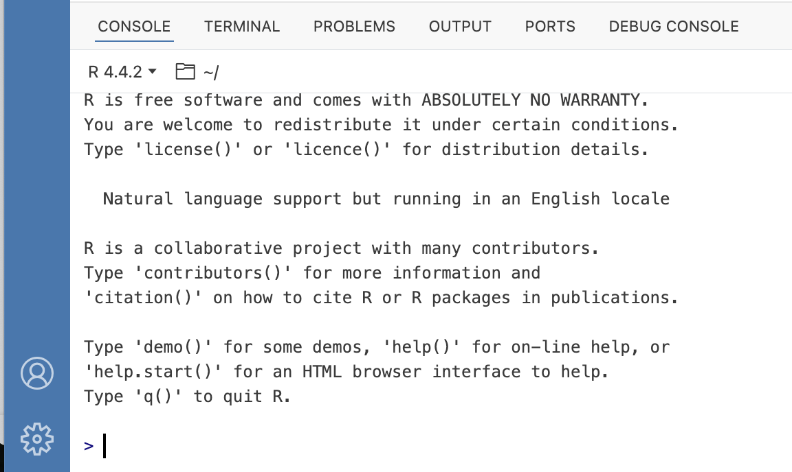
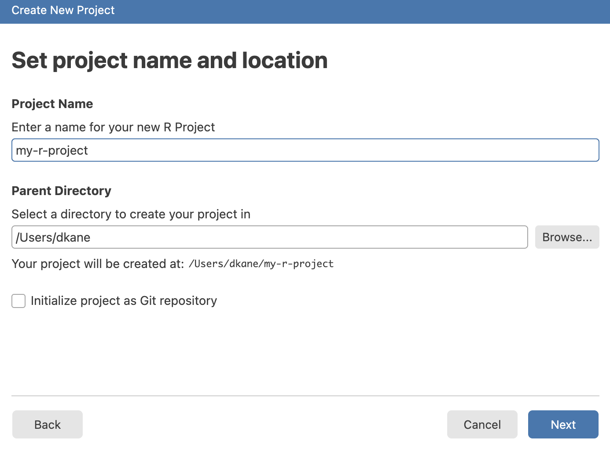
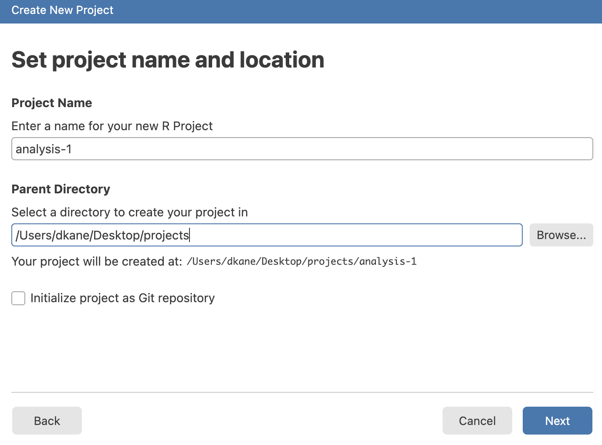
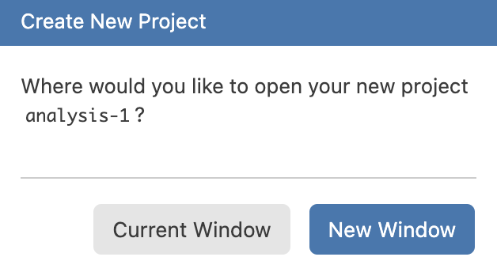
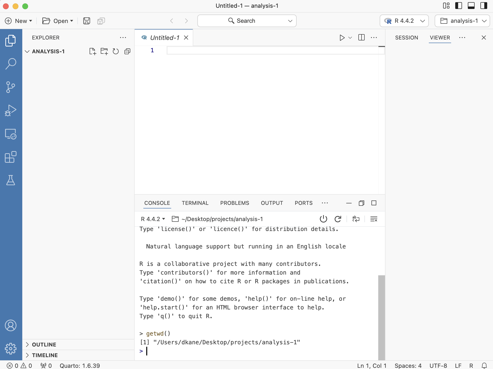
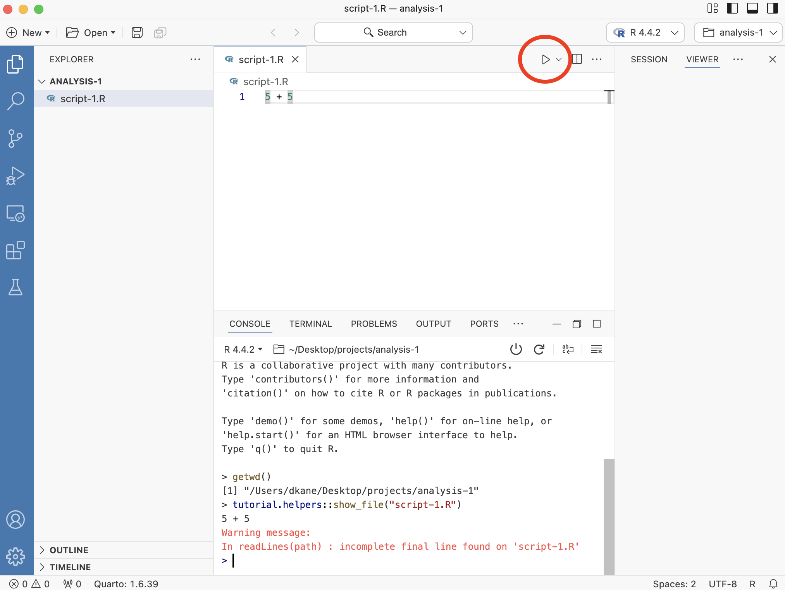
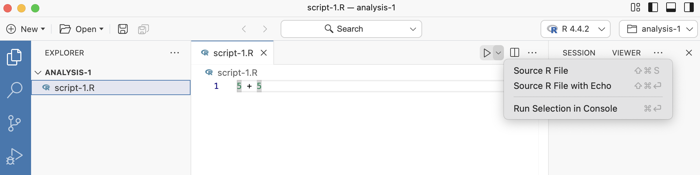
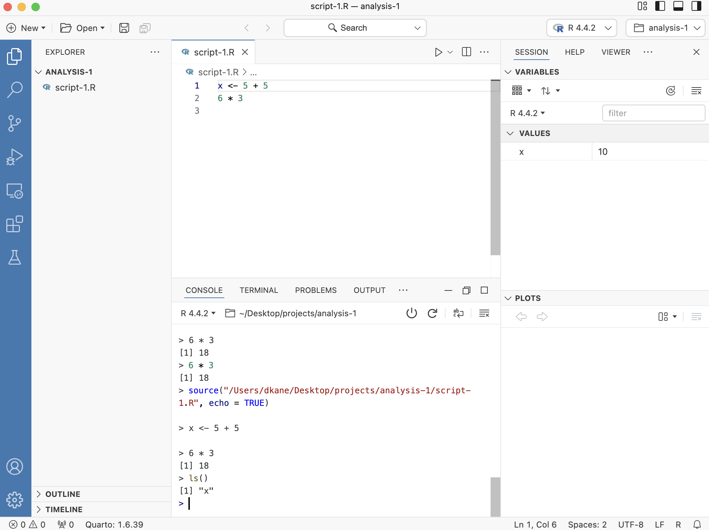

```{r setup, include = FALSE}
library(learnr)
library(tutorial.helpers)
library(tidyverse)
library(knitr)
knitr::opts_chunk$set(echo = FALSE)
knitr::opts_chunk$set(out.width = '90%')
options(tutorial.exercise.timelimit = 60, 
        tutorial.storage = "local")
```

```{r copy-code-chunk, child = system.file("child_documents/copy_button.Rmd", package = "tutorial.helpers")}
```

```{r info-section, child = system.file("child_documents/info_section.Rmd", package = "tutorial.helpers")}
```

<!-- Need to deal with the issue of keyboard short cuts. For now, I have mostly deleted them. Need to figure out which set to use and how to add them back. -->

<!-- Make the experience good for Windows users. Key issue is adding Windows hints/clarifications to questions which are written implicitly assuming students are on a Mac. -->

<!-- What about Chromebooks??!! Too much to worry about. -->

<!-- Teach about show_file() and how it won't work without doing library(tutorial.helpers) in the Console. First, show it fails. Second, do library() command in Console. Third, show it works now. Fourth, restart R and show it now fails. Lesson: Whenever you get "function not found," it probably means a failure to load a library. -->


<!-- To Format the chunk labels you need to comment out the example comment line in Script 1. And there is at least one more example later. -->

<!-- We do not use the Terminal in this tutorial. Maybe mention it, though? -->

## Introduction
### 

This tutorial teaches you how to use [**Positron**](https://positron.posit.co) with [**R**](https://www.r-project.org/about.html) scripts.


## Checking your setup
### 

<!-- Make it as easy to use for Windows students. For example, the use of forward versus backward slashes. -->

<!-- Should provide better guidance for Windows students. I think that their ~ directories are actually their Documents/ folders, which are often backed up on One Drive. So, have them put, by hand, a projects directory on their Desktop and then use that. Or maybe dir.create("~/../Desktop/projects) would work. -->

<!-- MP: I remember that when I first set up R/RStudio/RTools, my ~ directory was C:\\Users\\mark.p\\. It seems like RS typically defaults ~ to %USERPROFILE% -- see https://tinyurl.com/gpt-default-tilde.  -->

This tutorial assumes that you have read and completed all the steps in the "Tutorials in Positron" tutorial from the [**tutorial.helpers**](https://ppbds.github.io/tutorial.helpers/) package, i.e., this package. We will ask you to **c**opy/**p**aste the **c**ommand/**r**esponse so often, we shorten this instruction to CP/CR.

### Exercise 1

Load the **tutorial.helpers** package into your R Console using the `library()` function.

Run `search()` in the Console to see the libraries that you've currently loaded. CP/CR. That is, copy and paste that command and the result into the space below.

```{r checking-your-setup-1}
question_text(NULL,
	answer(NULL, correct = TRUE),
	allow_retry = TRUE,
	try_again_button = "Edit Answer",
	incorrect = NULL,
	rows = 3)
```

### 

Your answer should look something like this:

```
> library(tutorial.helpers)
> search()
 [1] ".GlobalEnv"               "package:tutorial.helpers" "tools:rstudio"           
 [4] "tools:positron"           "package:stats"            "package:graphics"        
 [7] "package:grDevices"        "package:utils"            "package:datasets"        
[10] "package:methods"          "Autoloads"                "package:base"            
>
```

Don't worry if your answer does not match our answer exactly, either in this question or in any other question.

### 

The string "package:tutorial.helpers" should be in the output. If you skip this step, commands like `show_file()` will not work without a `tutorial.helpers::` prefix.

### Exercise 2

Load the **tidyverse** package into your R Console using the `library()` function.

If this fails, the most likely cause is that you failed to installed the **tidyverse** package, among others. Run `install.package('tidyverse')` in the Console to fix this and then try `library(tidyverse)` again.

### 

Run `search()` in the Console to see the libraries that you've currently loaded. CP/CR. That is, copy and paste that command and the result into the space below.

```{r checking-your-setup-2}
question_text(NULL,
    answer(NULL, correct = TRUE),
    allow_retry = TRUE,
    try_again_button = "Edit Answer",
    incorrect = NULL,
    rows = 3)
```

### 

There should be strings such as "package:tidyverse" in the output. These are the packages that are currently loaded in your workspace.

### Exercise 3

Look at the top left of your Console. Here you should see the version of R you are running. It should look something like the image below.

```{r}

```

Type `R.version$version.string` into the Console and hit `Enter`. CP/CR.

```{r checking-your-setup-3}
question_text(NULL,
    answer(NULL, correct = TRUE),
    allow_retry = TRUE,
    try_again_button = "Edit Answer",
    incorrect = NULL,
    rows = 3)
```

### 

This should be the same as the version you saw at the top left of the Console. Make sure it is the [most recently released](https://cran.r-project.org/) version of R.

### Exercise 4

Shortly, we will create a new "project" for you to work in. Before we do this, it might be useful to understand where you are right now.

In the Console, run `getwd()`. CP/CR.

```{r checking-your-setup-4}
question_text(NULL,
    answer(NULL, correct = TRUE),
    allow_retry = TRUE,
    try_again_button = "Edit Answer",
    incorrect = NULL,
    rows = 3)
```

### 

This function returns the "path" to your current working directory. A path is simply the information which allows you to reach a location on your computer. In this case, if you wanted to find the folder from which R is running, you would follow the path returned by `getwd()`.

More info on paths can be found [here](https://people.ischool.berkeley.edu/~kevin/unix-tutorial/section3.html).

### Exercise 5

<!-- DK: Test to ensure that ~ works on Windows. I am not sure if it does. The environment variable %USERPROFILE% might be what we need, perhaps only if RTools has been installed. -->

Whenever you start a new project, you will want to store it in a location which you can easily find. Right now, you are likely in an arbitrary location on your computer. It would be much more useful to have a location dedicated to your projects.

From the Console, run `path.expand("~")`. CP/CR.

```{r checking-your-setup-5}
question_text(NULL,
	answer(NULL, correct = TRUE),
	allow_retry = TRUE,
	try_again_button = "Edit Answer",
	incorrect = NULL,
	rows = 3)
```

### 

My answer:

```
> path.expand("~")
[1] "/Users/dkane"
```

The tilde symbol, `~`, refers to a user's home directory. Your answer should look similar. If you are on Windows, the directory separators will be backward slashes rather than forward slashes, as on my Mac. And there will also be a disk, generally `C:`, on which these directories are placed. So, on Windows, the answer might be:

```
> path.expand("~")
[1] "C:/Users/dkane/"
```

The important point is that, in almost all non-pathological set ups, you will have a home directory. It is important to know where that is.

### Exercise 6

Let's take a look at the directories in your home directory. From the Console, run `list.files(path.expand("~"))`. CP/CR.

```{r checking-your-setup-6}
question_text(NULL,
	answer(NULL, correct = TRUE),
	allow_retry = TRUE,
	try_again_button = "Edit Answer",
	incorrect = NULL,
	rows = 3)
```

### 

My answer:

```
> list.files(path.expand("~"))
 [1] "Applications" "counties.R"   "Desktop"      "Documents"    "Downloads"    "Library"     
 [7] "miniconda3"   "Movies"       "Music"        "Pictures"     "Public"       "temp"        
>
```

If you are on a Mac, then the `Desktop` directory is a handy location in which to store all your coding projects. On Windows, however, the `Desktop` is less convenient because OneDrive often backs it up automatically, which can cause all sorts of problems later on.

**Avoid doing data science in any directory which is backed up by OneDrive, or any other backup service.**

### Exercise 7

Let's make a folder, and call it `projects`, and store it someplace sensible. **If you on a Mac**, then, from the Console, run: 

```
dir.create(file.path(path.expand("~/Desktop"), "projects"))
```

**If you on Windows**, then, from the Console, run: 

```
dir.create(file.path(path.expand("~"), "projects"))
```


CP/CR. 

```{r checking-your-setup-7}
question_text(NULL,
	answer(NULL, correct = TRUE),
	allow_retry = TRUE,
	try_again_button = "Edit Answer",
	incorrect = NULL,
	rows = 3)
```

### 

If that command works, you are all set. (If you get a message about the directory already exists, then you are also all set.) If not, you will need to create a `projects` directory by hand. Helpful resources can be found [here](https://support.microsoft.com/en-us/office/create-a-new-folder-cbbfb6f5-59dd-4e5d-95f6-a12577952e17) for Windows, and [here](https://support.apple.com/guide/mac-help/organize-files-using-folders-mh26885/mac) for macOS.

### 

**The path to your data science projects should not include any folders with spaces (or other weird characters) in their names.** For example, this is a reasonable location for R projects if you are using a Mac:

```
/Users/dkane/Desktop/projects/
```

And if you are using Windows . . .

````
C:/Users/dkane/projects/
````

Again, you can place your `projects` directory where you want, as long as you keep track of where it is.

## Projects
### 

Good data scientists keep their work organized. You should place your work in different projects, which are simply folders (that is, directories) on your computer. Each separate project is a folder within your main folder for your data science work, i.e.,  `/Users/dkane/Desktop/projects/`.  


### Exercise 1

<!-- DK: Consider adding more images and/or a gif. -->

**Read all of the instructions before starting this exercise.**

From the `File` menu, select `New Project ...`. (You can also click on the "New Project" icon on the *Welcome* screen.)

From the "Project Type" screen, select "R Project." Click "Next." Doing so brings up the "Create New Project" screen:

```{r}

```

Enter `analysis-1` as your "Project Name."" Set the "Parent Directory" to your `projects` directory. (You may have to "Browse" your computer to find it.) Do **not* initialize the project as a Git repository.

```{r}

```

Click "Next."

The "Set up project configuration" screen should appear. Accept the default option, which should be the version of R which you installed. Click "Create." Then:

```{r}

```

You can have multiple "Windows" open when you use Positron. Getting used to moving between Windows is important; the short-cut-key `Command/Ctrl + \`` may be useful.

Select "New Window." You will need to move back-and-forth between the two windows, one of which is this tutorial and the other of which is the actual `analysis-1` project in which we will be working.

### 

Now that you have read all the directions, we can go through the steps. 

### 

In the new window, run `getwd()` in the Console. (In other words, you are **not** doing this in the Console in the window in which you are completely this tutorial, if only because the Console in this window is *busy* running the tutorial itself.)


CP/CR.

```{r projects-1}
question_text(NULL,
    answer(NULL, correct = TRUE),
    allow_retry = TRUE,
    try_again_button = "Edit Answer",
    incorrect = NULL,
    rows = 3)
```

### 

This path should now be different than our previous path, similar to the path below. Creating/opening a project moves the R session to that directory.

````
/Users/dkane/Desktop/projects/analysis-1/
````

### 

If your path does not include your `projects` folder, you probably did not fill in the "Parent Directory" box correctly. It should be the path to your `projects` folder, including `projects` itself.


### Exercise 2

The new window should look like this:

```{r}

```

The *Welcome* screen has disappeared. There is a blank, unsaved file named `Untitled-1` in the Editor pane. You can tell it is unsaved because its name is *italicized*. By deafult, the Explorer button in the Activity Bar on the far left has been activated, showing us that the `analysis-1` directory has no files in it yet.

### 

Run `list.files()`. Again, we are issuing all these commands in the other window, not the window in which this tutorial is running. 

CP/CR.

```{r projects-2}
question_text(NULL,
    answer(NULL, correct = TRUE),
    allow_retry = TRUE,
    try_again_button = "Edit Answer",
    incorrect = NULL,
    rows = 3)
```

### 

`list.files()` returns files contained in your current project. There are none so far.

Keeping all the files associated with a given project --- input data, R scripts, analytic results, and figures --- together in one directory is very wise.

Everything you need is in one place and cleanly separated from all the other projects that you are working on.


## Script 1
### 

So far, we have only worked in the Console, but it's quite difficult to type more than a few lines of code into the Console at once. One solution is to use [R scripts](https://r4ds.hadley.nz/workflow-scripts.html#scripts), files which contain a permanent copy of our code.

### Exercise 1

The file `Untitled-1` should already be in your Editor window. If it is not, you can create a new file by clicking the `File -> New File ...` drop down menu, and then selecting `R File`.

### 

Type `5 * 5` into your R script file. Save the file. Name it `script-1.R`. (Note that R will provide the `.R` suffix, so you only need to type `script-1`.) 

In the Console, run:

````
tutorial.helpers::show_file("script-1.R")
````

CP/CR.

```{r script-1-1}
question_text(NULL,
	answer(NULL, correct = TRUE),
	allow_retry = TRUE,
	try_again_button = "Edit Answer",
	incorrect = NULL,
	rows = 3)
```

### 

You might have gotten this warning:

````
Warning message:
In readLines("script-1.R") : incomplete final line found on 'script-1.R'
````

This means that your file needs a blank line at the end. As a rule of thumb, it is always a good idea to have the last line of any text file be blank.

R scripts are permanent copies of your code. You can save them and also work with them interactively.

### Exercise 2

Note the "Source" button, which is in the top right corner of the Editor. 

```{r}

```

If you hover your cursor over it, you will see "Source R File." Press the Source button. (We will sometimes shorten the instruction "press the source button" to just "source" the script.)

Note what happens in the Console. CP/CR.


```{r script-1-2}
question_text(NULL,
    answer(NULL, correct = TRUE),
    allow_retry = TRUE,
    try_again_button = "Edit Answer",
    incorrect = NULL,
    rows = 2)
```

### 

You answer should look like this:

````
> source("/Users/dkane/Desktop/projects/analysis-1/script-1.R")
````

### 

Whenever you run an R script file by hitting the "Source" button, Positron will send all the code in the file to the Console. 

### Exercise 3

Right next to the Source button is a small downward pointing arrow. Clicking on it produces three options, the top (default) of which is the simple Source which you ran in the last question.

```{r}

```

Select the second option: "Source R File with Echo." CP/CR.

```{r script-1-3}
question_text(NULL,
	answer(NULL, correct = TRUE),
	allow_retry = TRUE,
	try_again_button = "Edit Answer",
	incorrect = NULL,
	rows = 3)
```

### 

Your answer should look like this:

```
> source("/Users/dkane/Desktop/projects/analysis-1/script-1.R", echo = TRUE)

> 5 + 5
[1] 10
>
```

The file is sourced, as before. But, this time, each line in the file is "echoed," meaning we see both the code, `5 + 5` in this case, and the return value, if any, which is `10`.

### Exercise 4

There are often "shortcut key" combinations which perform the same task as clicking a button. Placing your cursor inside the R script window and using the keyboard shortcut `(Cmd/Ctrl) + Shift + (Return/Enter)` is the same as hitting the "Source R File with Echo" option. 

Note that `Return` is the name of a Mac key and `Enter` the name of the corresponding Windows key, just like `Cmd` ("Command") is a Mac key and `Ctrl` ("Control") is the equivalent Windows key. In other words, on the Mac, we hit `Cmd + Shift + Return` while on Windows it is `Ctrl + Shift + Enter`. However, typing `Return/Enter` all the time is annoying, so, going forward, we will just use `Enter`. Mac users are expected to remember that this means the `Return` key.

Try it now. CP/CR.

```{r script-1-4}
question_text(NULL,
    answer(NULL, correct = TRUE),
    allow_retry = TRUE,
    try_again_button = "Edit Answer",
    incorrect = NULL,
    rows = 2)
```

### 

Using shortcut keys is quicker and more professional than clicking buttons. 

### Exercise 5

In your R script, type `6 * 3` in the line after `5 + 5`. Save the file with `Cmd/Ctrl + S`. (Note that the `S` in that shortcut key just refers to the "S" key on your keyboard. You don't need to capitalize it.)

Source this file with echo. CP/CR.

```{r script-1-5}
question_text(NULL,
    answer(NULL, correct = TRUE),
    allow_retry = TRUE,
    try_again_button = "Edit Answer",
    incorrect = NULL,
    rows = 2)
```

### 

The answer is what you might expect:

````
> source("/Users/dkane/Desktop/projects/analysis-1/script-1.R", echo = TRUE)

> 5 + 5
[1] 10

> 6 * 3
[1] 18
>
````

### 

Each line is echoed. Each line is executed.  The results of each line, if there are any, are printed.

The output you see is the same as what would happen if you copied each line to the Console and hit `Enter` after each one.

### Exercise 6

Instead of sourcing the entire file, we can just execute (or "run") a single line. In `script-1.R`, place your cursor on the same line as `6 * 3` and click the "Run Selection in Console" option, the third choice in the Source button. CP/CR.

```{r script-1-6}
question_text(NULL,
    answer(NULL, correct = TRUE),
    allow_retry = TRUE,
    try_again_button = "Edit Answer",
    incorrect = NULL,
    rows = 2)
```

You should get:

````
> 6 * 3
[1] 18
>
````

### 

Instead of both lines in the script executing, only the second line does. And the process by which this happens has nothing to do with the entire script. **Run is not the same thing as Source.** With Run, you are just copy/pasting some of the lines from the script to the Console at a time. With Source, you're copy/pasting *all* lines from the script. 

### Exercise 7

The shortcut key for running a single line of code is `Cmd/Ctrl + Enter`. In your R script, place your cursor on the same line as `5 + 5` and hit `Cmd/Ctrl + Enter`. CP/CR.

```{r script-1-7}
question_text(NULL,
    answer(NULL, correct = TRUE),
    allow_retry = TRUE,
    try_again_button = "Edit Answer",
    incorrect = NULL,
    rows = 2)
```

### 

Only the first line of the script is executed. `Cmd/Ctrl + Enter` is probably the single most commonly used shortcut key because it is very handy to execute your code line-by-line.

`Cmd/Ctrl + Enter` is "smart" in two ways. First, if you highlight more than one line of code, and then place your cursor within the highlighted area, it will execute all the code in that area. Second, even if nothing is highlighted,  if the line with the cursor is part of a block of code which extends over multiple lines --- like creating a plot --- it will execute all the code in that block.

### Exercise 8

Go back to the first line in your R script. Change `5 + 5` to `x <- 5 + 5`, thereby creating an object named `x` with a value of 10. Save the file. Click the "Source R File with Echo" option. CP/CR.

```{r script-1-8}
question_text(NULL,
	answer(NULL, correct = TRUE),
	allow_retry = TRUE,
	try_again_button = "Edit Answer",
	incorrect = NULL,
	rows = 3)
```

Your answer should look like:

````
> source("~/Desktop/projects/analysis-1/script-1.R", echo=TRUE)

> x <- 5 + 5

> 6 * 3
[1] 18
> 
````

### 

Note how the `x <- 5 + 5` is executed (and echoed) but nothing is printed. The assignment operator (`<-`) does not generate a printed result.


### Exercise 9

In the Console tab, run `ls()`. CP/CR.

```{r script-1-9}
question_text(NULL,
    answer(NULL, correct = TRUE),
    allow_retry = TRUE,
    try_again_button = "Edit Answer",
    incorrect = NULL,
    rows = 2)
```

### 

`ls()` returns a list of objects present in your environment. These are the same objects displayed under Variables in your Session tab in the Secondary Side Bar in Positron (on the right side). 

```{r}

```

## Script 2
### 

Let's create this plot:

```{r diamond-hist}
hist_p <- ggplot(data = diamonds,
                 mapping = aes(x = carat)) +
  geom_histogram(bins = 100,
                 color = "white") +
  scale_y_continuous(labels = scales::comma_format()) +
  labs(title = "Histogram of Carat (Weight) among 50,000 Diamonds",
       subtitle = "Carats just at or above meaningful numbers are very common",
       x = "Carat",
       y = "Number",
       caption = "diamonds data set from ggplot2 package")

hist_p
```

### Exercise 1

Click `File -> New File ... -> R File`. At the top of the Editor, the file should be called `Untitled-1` (or something similar). 

### 

Click the "Save current document" icon -- the disk image to the right of the Open dropdown menu. Or use the shortcut `Cmd/Ctrl + S` to save the script. Let's call this file `script-2`. The `.R` suffix is added automatically.

In the Console, run `list.files()`. CP/CR.

```{r script-2-1}
question_text(NULL,
    answer(NULL, correct = TRUE),
    allow_retry = TRUE,
    try_again_button = "Edit Answer",
    incorrect = NULL,
    rows = 2)
```

### 

Save your scripts (with informative names) in the project, edit them, run them line-by-line or in their entirety. Restart R frequently to make sure you’ve captured everything in your scripts.

Scripts and projects give you a solid workflow that will serve you well in the future. Always remember to create one project for each data analysis project. That project may contain multiple scripts files, along with other material.

### Exercise 2

Restart your R session with `Cmd/Ctrl + Shift + 0`. (Again, we are assuming that you are doing this work in a different Positron window, not the same one as you are using for this tutorial.)

From the Console, run `list.files()`. CP/CR.

```{r script-2-2}
question_text(NULL,
	answer(NULL, correct = TRUE),
	allow_retry = TRUE,
	try_again_button = "Edit Answer",
	incorrect = NULL,
	rows = 3)
```

### 

Your answer should look like:

```
R 4.4.2 exited (preparing for restart)
R 4.4.2 restarted.
> list.files()
[1] "script-1.R" "script-2.R"
>
```

The two files we had from before --- `script-1.R`, and `script-2.R` --- still exist. Our work, if we have saved it, is preserved even when R (or Positron) restarts. 

### Exercise 3

From the Console, run `ls()`. CP/CR.

```{r script-2-3}
question_text(NULL,
	answer(NULL, correct = TRUE),
	allow_retry = TRUE,
	try_again_button = "Edit Answer",
	incorrect = NULL,
	rows = 3)
```

### 

`x` is gone! The environment --- the place in the computer where R creates and uses objects --- is cleaned, by default, each time R restarts. This is a good thing! For our work to be "reproducible," we want to be able to start from nothing except our code and raw data.   

### Exercise 4

At the top of `script-2.R`, type

````
library(tidyverse)
````

You will see, in the top bar of the Editor, that `script-2.R`, the name of the file, has a black dot next to it. This indicates that there are unsaved changes in the file.

### 

Run the entire file with `Ctrl + Shift + Enter`. Note how much material --- the "Attaching core tidyverse packages" and so on --- is produced because we are sourcing the file with `echo=TRUE`. 

### 

Run `search()` in the Console. CP/CR.

```{r script-2-4}
question_text(NULL,
    answer(NULL, correct = TRUE),
    allow_retry = TRUE,
    try_again_button = "Edit Answer",
    incorrect = NULL,
    rows = 2)
```

### 

This function returns a list of loaded packages. This should include the string `package:tidyverse`.

### Exercise 5

Skip a line and add the following comment to the file:

````
# This is an example of a code comment within an R script.
````

Save the file. 

In the Console, run:

````
tutorial.helpers::show_file("script-2.R")
````

CP/CR.


```{r script-2-5}
question_text(NULL,
    answer(NULL, correct = TRUE),
    allow_retry = TRUE,
    try_again_button = "Edit Answer",
    incorrect = NULL,
    rows = 2)
```

### 

Did you remember to have a blank line at the end of the file? If not, you got a warning. Always have a blank line at the end of any text file.

### 

Comments begin with a hash (also known as a "pound sign"): `#`. R will ignore everything on the line to the right of the hash when trying to run the code.

Comments are an extremely useful tool when writing code. If they're placed well, it becomes much easier to *debug* (find and fix mistakes) if something goes wrong. 

There are a few "guidelines" to writing comments, for example:

  - Comments should be used sparingly. 
  - Comments are unnecessary and in fact distracting if they state the obvious. 
  - Comments that contradict the code are worse than no comments. Always make a priority of keeping the comments up-to-date when the code changes!

Typically, when reading code, you should be able to answer 3 questions fairly easily, for every line: 

  - **What** is this code doing, 
  - **How** is it doing it, and
  - **Why** is it being done. 
  
The **what** and **how** can be deduced from the code itself. The **why**, though, is a bit trickier, and it is highly recommended that you use comments to make it easier to tell **why** something is being done. 

```{r echo = T, eval = F}
# This is an example of a poor comment:
...
x <- x + 1    # Increment x
...

# This is an example of a good comment:
...
x <- x + 1    # Account for borders
...
```

### Exercise 6

Change the code comment in `script-2.R` from "This is an example of a code comment within an R script." to a one sentence description of one of your recent meals. Save the file. 

In the Console, run:

````
tutorial.helpers::show_file("script-2.R")
````

CP/CR.


```{r script-2-6}
question_text(NULL,
    answer(NULL, correct = TRUE),
    allow_retry = TRUE,
    try_again_button = "Edit Answer",
    incorrect = NULL,
    rows = 2)
```

### 

Get in the habit of adding comments.

Figuring out *why* something was done is much more difficult than understanding *how* it was done. For example, `geom_smooth()` has an argument called `span`, which controls the smoothness of the curve, with larger values yielding a smoother curve. Suppose you decide to change the value of `span` from its default of 0.75 to 0.9: it’s easy for a future reader to understand what is happening, but unless you note your thinking in a comment, no one will understand *why* you changed the default.


### Exercise 7

<!-- DK: At this stage, we could just copy/paste in all the code. Or even ask AI for the code? We are no longer in the business of asking students to add one line of code at a time. -->

Skip a line after your comment. Call `ggplot()`, setting `data` to `diamonds` and mapping `x` to `carat` within `aes()`. 

Run the entire file again. Note the sloppiness of the word "run" in this instruction. It is not always clear what "run" means. For example, it does *not* mean to click the "Run" button! In general, "run" means to "execute" all the code in the file, most commonly by either using `Ctrl + Shift + Enter` or by pressing the "Source" button.

### 

This should generate a blank plot in the Plots tab in buttom of the Secondary Side Bar.

### 

In the Console, run:

````
tutorial.helpers::show_file("script-2.R")
````

CP/CR.


```{r script-2-7}
question_text(NULL,
    answer(NULL, correct = TRUE),
    allow_retry = TRUE,
    try_again_button = "Edit Answer",
    incorrect = NULL,
    rows = 2)
```

### 

`ggplot()` will generate a blank plot, at least until a `geom` layer is added. 

### Exercise 8

Add a layer with `geom_histogram()`. Change the border color in our graph by setting `color` to `"white"` within `geom_histogram`, and change the number of columns in our plot by setting the `bins` argument to `100`. Remember that, to connect the `ggplot()` call to `geom_histogram()`, we need a `+`. 

Run the file. Again, to "run" a script generally means to "execute" it, meaning sending it to the R process. We have learned two ways to (easily) execute an entire file: pressing the "Source" button or hitting the associated shortcut key: `Ctrl + Shift + Enter`.

### 

This should generate bars on your plot. Did you remember to place a `+` after the `ggplot()` call and before the `geom_histogram()` layer?

### 

In the Console, run:

````
tutorial.helpers::show_file("script-2.R")
````

CP/CR.


```{r script-2-8}
question_text(NULL,
    answer(NULL, correct = TRUE),
    allow_retry = TRUE,
    try_again_button = "Edit Answer",
    incorrect = NULL,
    rows = 5)
```

### 

The `color` argument used here modifies the *border* color of our columns. To change the *fill* color, use the `fill` argument.

### Exercise 9

It would be nice if the numbers on the Y-axis were formatted better, i.e., with commas. The easiest way to do that is to add this line to the script.

````
scale_y_continuous(labels = scales::comma_format())
````

Do so. Run the file. Note that you don't need to save the file first. If you execute a file with either "Source" or `Ctrl + Shift + Enter`, RStudio will save the file automatically.

Don't forget that you will need a `+` after the call to `geom_histogram()`.

In the Console, run:

````
tutorial.helpers::show_file("script-2.R")
````

CP/CR.

```{r script-2-9}
question_text(NULL,
	answer(NULL, correct = TRUE),
	allow_retry = TRUE,
	try_again_button = "Edit Answer",
	incorrect = NULL,
	rows = 3)
```

### 

We use `scale_y_continuous()` (and `scale_x_continuous()`) to modify the labels and the breaks in numeric axes. The **scales** package provides a variety of useful formatting tools, including `comma_format()`, `dollar_format()` and others.


### Exercise 10

Now let's make our graph look a little nicer by adding a `labs()` layer with an appropriate title, subtitle, and axis labels.

Reminder, this is what our graph should look like

```{r}
hist_p
```

Run your R script to see your completed plot. Again, note the wording here! In casual language, we use the word "run" to generically mean "Tell the computer to execute the commands in this file." We don't necessarily care how that is achieved.

### 

In the Console, run:

````
tutorial.helpers::show_file("script-2.R")
````

CP/CR.

```{r script-2-10}
question_text(NULL,
    answer(NULL, correct = TRUE),
    allow_retry = TRUE,
    try_again_button = "Edit Answer",
    incorrect = NULL,
    rows = 8)
```

### 

Good coding style is like correct punctuation: you can manage without it, butitsuremakesthingseasiertoread. Even as a very new programmer, it’s a good idea to work on your code style. Using a consistent style makes it easier for others (including future-you!) to read your work and is particularly important if you need to get help from someone else. 

Note the nice formatting. After the `ggplot()` call, the next two commands --- `geom_histogram()` and `labs()` --- are both indented the same amount. Similarly, arguments to a given function --- like `bins` and `color` --- are lined up with each other.


### Exercise 11

Now we have the code which creates a plot in `script-2.R`. How do we use this plot for other things? Right now we have to run `script-2.R` every time we want to see the plot, which is a little inconvenient.

### 

We can use the `ggsave()` function. Type `?ggsave` in the R Console. This will open the help page for `ggsave()`. Copy and paste the Description from the help page into the space below.

```{r script-2-11}
question_text(NULL,
    answer(NULL, correct = TRUE),
    allow_retry = TRUE,
    try_again_button = "Edit Answer",
    incorrect = NULL,
    rows = 5)
```

`ggsave()` is used to save plots as individual files, separate from the code which created the plot. In this case we will be using the "png" format.

### Exercise 12

We want to save our entire graph to an object, which can be done by setting our plot equal to a variable. Call this variable `hist_p`.

Now using the `ggsave()` function we can create a png of our plot from our code. In `ggsave()`, set `plot` to `hist_p`, `file` to `"diamonds.png"`.

Your entire file should look like:

````
library(tidyverse)

# Had an OK filet mignon at Cheesecake Factory.
hist_p <- ggplot(data = diamonds,
                 mapping = aes(x = carat)) +
  geom_histogram(bins = 100,
                 color = "white") +
  scale_y_continuous(labels = scales::comma_format()) +                
  labs(title = "Histogram of Carat (Weight) among 50,000 Diamonds",
       subtitle = "Carats just at or above meaningful numbers are very common",
       x = "Carat",
       y = "Count",
       caption = "diamonds data set from ggplot2 package")

ggsave(plot = hist_p, file = "diamonds.png")
````

Run your code. CP/CR.

```{r script-2-13-ex}
question_text(NULL,
	answer(NULL, correct = TRUE),
	allow_retry = TRUE,
	try_again_button = "Edit Answer",
	incorrect = NULL,
	rows = 3)
```

Your answer should look something like:

```
> source("/Users/dkane/Desktop/projects/analysis-1/script-2.R", echo = TRUE)

> library(tidyverse)

> # Had an OK filet mignon at Cheesecake Factory.
> 
> hist_p <- ggplot(data = diamonds,
+                  mapping = aes(x = carat)) +
+   geom_histo .... [TRUNCATED] 

> ggsave(plot = hist_p, file = "diamonds.png")
Saving 3.33 x 3.33 in image
>
```

You are witnessing a conversation between your script and R. Your script tells R to do this, then do that, and then do this other thing. R does those things, occasionally providing a response or update.


### Exercise 13

In the Console, run `list.files()`. CP/CR.

```{r script-2-12}
question_text(NULL,
    answer(NULL, correct = TRUE),
    allow_retry = TRUE,
    try_again_button = "Edit Answer",
    incorrect = NULL,
    rows = 2)
```

### 

You should see the `diamonds.png` file which contains your plot. Click on the Explorer button on the Activity Bar on the left in order to see all the files in the `analysis-1` directory. Click on the `diamonds.png` file to open your plot in the Editor.

If the title text flows out of the image, you might want to modify the `scale` argument in `ggsave()` to find a better image size. `scale` is set to 1 by default.

## Script 3
### 

Let's make another plot, this time in a script inside of a *different* project. We'll be making this plot:

```{r script-3-0}
car_plot <- ggplot(mpg, aes(displ, hwy, colour = class)) + 
  geom_point()

car_plot
```

### Exercise 1

Type `getwd()` into the Console. CP/CR. 

```{r script-3-1}
question_text(NULL,
    answer(NULL, correct = TRUE),
    allow_retry = TRUE,
    try_again_button = "Edit Answer",
    incorrect = NULL,
    rows = 5)
```

### 

Your answer should look like this:

```
"/Users/dkane/Desktop/projects/analysis-1"
```

Somewhere in the path should be `analysis-1`, the name of the project you're in right now. 

### Exercise 2

Type `list.files()` into the Console. CP/CR. 

```{r script-3-2}
question_text(NULL,
	answer(NULL, correct = TRUE),
	allow_retry = TRUE,
	try_again_button = "Edit Answer",
	incorrect = NULL,
	rows = 3)
```

### 

This command shows the files in the directory.

Note that "project" has multiple meanings. First, "project" is a generic term for an a project which contains our code/data, generally with a sensible name. Second, `analysis-1`, note the use of typewriter font, is the name of a specific project. Third, `analysis-1` --- the same string in the same font --- can refer to the directory in which the project is located. 

For the most part, the names of projects and the directories in which they reside are used interchangeably.

### Exercise 3

From the Positron menu, select `File -> New Project ...`. (Again, all of this occurs in the Positron window in which you are **not** running this tutorial.) Select  "R Project" and click "Next." 

Use `analysis-2` for the "Project Name." Ensure that "Parent Directory" is set to the location of your `projects` directory. Click "Next" and then "Create." 

Choose "Current Window," rather than "New Window" as we did before, since we no longer need to see the `analysis-1` project. 

### 

Type `getwd()` into the Console. CP/CR.

```{r script-3-3}
question_text(NULL,
    answer(NULL, correct = TRUE),
    allow_retry = TRUE,
    try_again_button = "Edit Answer",
    incorrect = NULL,
    rows = 5)
```

### 

Your answer should look like this:

```
"/Users/dkane/Desktop/projects/analysis-2"
```

Somewhere in the path should be `analysis-2`, the name of the project you just made and are now in. 

### Exercise 4

Now, we have to create the script where we'll be creating our plot. 

In the menu bar on the top of the window, press `File -> New File -> R Script`. Type `5 * 5` and a newline into the file and hit `Ctrl/Cmd + S` to save it. Save it as `script-3.R` (the `.R` is automatically supplied by the dialog box when you save, so you only need to type `script-3`). 

In the console, run `list.files()`. CP/CR. 


```{r script-3-4}
question_text(NULL,
	answer(NULL, correct = TRUE),
	allow_retry = TRUE,
	try_again_button = "Edit Answer",
	incorrect = NULL,
	rows = 3)
```

### 

You should see `script-3.R` somewhere in the output. 

### Exercise 5

Go back to editing `script-3.R`. Get rid of everything that's already there. Copy-paste the below code into the script, and save with `Ctrl/Cmd + S`. 

````
library(tidyverse)

car_plot <- ggplot(mpg, aes(displ, hwy, colour = class)) + 
  geom_point()

car_plot
````

Don't forget to have an empty line at the end of the file! 

Once you're done, source the script with the "Source" button in the top right. 

### 

Back in the Console, run `tutorial.helpers::show_file('script-3.r')`. CP/CR. 

```{r script-3-5}
question_text(NULL,
	answer(NULL, correct = TRUE),
	allow_retry = TRUE,
	try_again_button = "Edit Answer",
	incorrect = NULL,
	rows = 3)
```

The output should have the same chunk of code as the one you were given to copy-paste above. 

<!-- DK: Ends sort of quickly and is somewhat sloppy. -->

## Summary
### 

<!-- DK: Revisit Introduction and Summary. -->

This tutorial covered [Chapter 2 Workflow: basics](https://r4ds.hadley.nz/workflow-basics.html),  [Chapter 4 Workflow: code style](https://r4ds.hadley.nz/workflow-style.html), [Chapter 6 Workflow: scripts and projects](https://r4ds.hadley.nz/workflow-scripts.html), and some material in [Chapter 28 Quarto](https://r4ds.hadley.nz/quarto.html) from [*R for Data Science (2e)*](https://r4ds.hadley.nz/) by Hadley Wickham, Mine Çetinkaya-Rundel, and Garrett Grolemund. You learned how to use [R scripts](https://r4ds.hadley.nz/workflow-scripts.html#scripts) and how to create [projects](https://docs.posit.co/ide/user/ide/guide/code/projects.html).


```{r download-answers, child = system.file("child_documents/download_answers.Rmd", package = "tutorial.helpers")}
```
