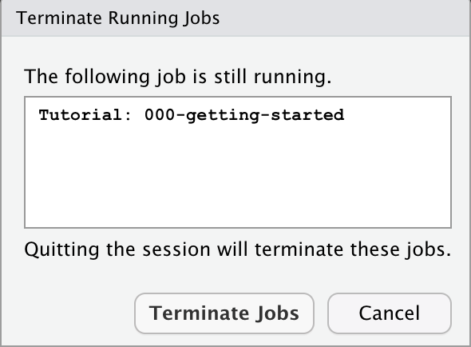

```{r setup, include = FALSE}
library(learnr)
library(tutorial.helpers)
library(tidyverse)
knitr::opts_chunk$set(echo = FALSE)
options(tutorial.exercise.timelimit = 60, 
        tutorial.storage = "local") 
```

```{r copy-code-chunk, child = system.file("child_documents/copy_button.Rmd", package = "tutorial.helpers")}
```

<!-- DK: Set up a default version of this on RStudio Cloud that anyone can run at anytime? Could add a question about looking at a data set. -->


## Introduction
### 

This tutorial is an introduction to the general use of R tutorials created with the [**learnr**](https://rstudio.github.io/learnr/) package. It is meant for beginning students who have never completed a tutorial.

### 

You may complete a tutorial either on your laptop or on a cloud computing platform, if one is provided. Either way, you will download a copy of your answers to the Downloads folder on your computer once you are done. Then, you will submit your answers to your instructor and/or keep a copy for yourself.

### 

Many tutorials begin by asking for your your name and email. Fill yours in and then click the **"Submit Answer"** button. If you make a mistake, you can click **"Edit Answer"** and try again. 


```{r info-section, child = system.file("child_documents/info_section.Rmd", package = "tutorial.helpers")}
```

## Tutorial exercises 
### 

In each tutorial, there will be a set of exercises for you to complete. For non-coding questions, you write your answer and then hit the "Submit Answer" button, as you did above.

### 

Clicking **"Start Over"** --- look for small letters at the bottom of the left-hand side menu --- deletes all your work for a tutorial and allows you to begin the entire tutorial again.

### Exercise 1

Let's practice some simple math. Type `4 + 5` into the box below. Hit **"Run Code"** to see your results. Clicking **"Hint"** gives you a hint about what to type. 

```{r tutorial-exercises-1, exercise = TRUE}

```

```{r tutorial-exercises-1-hint-1, eval = FALSE}
4 + 5
```

### 

Once you click "Run Code", the answer `[1] 9` should appear below the code you entered. This is the same behavior you would see if you ran this code in the RStudio Console tab.

### 

There are two types of answers for tutorial questions: prose and code. With prose answers, you will use the "Submit Answer" button, as you did with your name and email. With code answers, you use the "Run Code" button, as you did for this question.

### 

If you don't "Run Code" (or "Submit Answer") your response, nothing is recorded.

### Exercise 2

Let's use variables to perform the same calculation. Below, we have already assigned 5 to `x` and 4 to `y`. On the line below those two provided lines of code, add the two variables by typing `x + y`. Hit "Run Code" to see your results. 

```{r tutorial-exercises-2, exercise = TRUE}
x <- 5
y <- 4

```

```{r tutorial-exercises-2-hint-1, eval = FALSE}
x <- 5
y <- 4
x + y
```

### 

Once you click "Run Code", the answer `[1] 9` should appear below the code you entered. 

### Exercise 3

We will often need to copy code from our previous exercises to continue working on a multi-stage problem. To make this easier, we provide a `Copy previous code` button. Below the following box, click on the `Copy previous code` button. 

```{r tutorial-exercises-3, exercise = TRUE}

```

<button onclick = "transfer_code(this)">Copy previous code</button>

### 

This should paste all work from the previous exercise into the above exercise code area. Note that this will only copy code which has already been run in the previous exercise.

### 

Change the values to `x <- 6` and `y <- 10`. Hit "Run Code". You should get the answer 16.

### 

Note that the assignment symbol --- `<-` --- is a less-than-sign followed by a dash. We often pronounce the symbol as "gets." So, we might say, when reading this code, that "x gets 6."

### Exercise 4

Let's load our first R package. Type  `library(tidyverse)` and then hit "Run Code". 

```{r tutorial-exercises-4, exercise = TRUE}

```

```{r tutorial-exercises-4-hint-1, eval = FALSE}
library(...)
```

Nothing is returned, which is often the case with R code.

### 

Note that "library" and "package" mean the same things in R. We have different words for historical reasons. However, only the `library()` command will load a package/library, giving us access to the functions and data which it contains.

### 

If you used the hint, note how we did not provide the entire answer. This is our standard approach with hints.

### Exercise 5

Read all of the following instructions before continuing, as this tutorial will close once you take the first step. 

Restart your **R session** by clicking `Session -\> Restart R` from the main RStudio Menu. (Note that restarting R within this **RStudio instance** is a different thing than restarting the overall RStudio instance itself.)

You should receive the warning message shown below. (Note that this box might be "hidden" behind your tutorial.) Whenever you see this warning message, keep in mind that clicking "Terminate Jobs" will close any running tutorials. 

```{r}

```

Click "Terminate Jobs". Re-open this tutorial. Tutorial progress will have been saved automatically.


### Exercise 6

We often ask you to execute an R command in the R Console, the tab on the left portion of your RStudio screen. Type `version[['version.string']]` into the Console and hit the return key.

Copy/paste the command **and** the return value into this box.

```{r tutorial-exercises-6}
question_text(NULL,
	answer(NULL, correct = TRUE),
	allow_retry = TRUE,
	try_again_button = "Edit Answer",
	incorrect = NULL,
	rows = 3)
```

### 

Your answer should look something like:

````
> version[['version.string']]
[1] "R version 4.3.0 (2023-04-21)"
>
````

Your version of R may be more recent, but it should not be older. It is OK if your formatting differs from ours. Exactness does not matter. What matters is that you prove that you have executed the command as instructed.

### 

The tutorial workflow will often look like this. We tell you to run a command. You run it. We then ask you to copy/paste, from the Console, both the command itself and the response returned. Because we ask you to **c**opy/**p**aste the **c**ommand/**r**esponse so often, we usually shorten this instruction to CP/CR.


### Exercise 7

Run this command at the Console: `tutorial.helpers::set_rstudio_settings()`.

### 

You can generally call functions by just giving their name, like `set_rstudio_settings()`. However, it can be safer to preface the function names with the name of the package in which the function is found, separated by two colons. Since `set_rstudio_settings()` is in the **tutorial.helpers**, we can also call it using the double colon notation: `tutorial.helpers::set_rstudio_settings()`.

### 

To confirm that you have run this command, run `rstudioapi::readRStudioPreference(name = "load_workspace", default = "Code failed.")` from the R Console. CP/CR.

```{r tutorial-exercises-7}
question_text(NULL,
    answer(NULL, correct = TRUE),
    allow_retry = TRUE,
    try_again_button = "Edit Answer",
    incorrect = NULL,
    rows = 3)
```

### 

You should have pasted something like this in the box above:

````
> rstudioapi::readRStudioPreference(name = "load_workspace", default = "Code failed.")
[1] FALSE
> 
````

The response should be `FALSE`. If it is not, try re-running `tutorial.helpers::set_rstudio_settings()`. You have now selected sensible settings for using RStudio.


### Exercise 8

Run this command at the Console: `tutorial.helpers::set_binary_only_in_r_profile()`.

### 

Run this command at the Console: `options("pkgType")`. CP/CR.


```{r tutorial-exercises-8}
question_text(NULL,
	answer(NULL, correct = TRUE),
	allow_retry = TRUE,
	try_again_button = "Edit Answer",
	incorrect = NULL,
	rows = 3)
```

### 

This ensures that, when you install new packages, you will not, by default, try to compile them from the underlying source code itself. Doing so can only lead to trouble for those new to R programming.


### Exercise 9

Tutorials can include written responses. You have already seen several examples. Sometimes those written answers are just copies of the R commands and their results. Other times, we will ask you to write one or more sentences of prose. 

Copy and paste everything from `Exercise 9` through the end of this sentence into the answer box below.

```{r tutorial-exercises-9}
question_text(NULL,
    message = "We will sometimes provide an answer to written questions. Other times, like here, we won't. In the former case, we will not allow you to resubmit your answer. Don't stress! Most instructors grade tutorials on pass/fail basis, so, as long as you make an honest effort, you will do fine.",          
    answer(NULL, 
           correct = TRUE),
    allow_retry = FALSE,
    incorrect = NULL,
    rows = 6)
```

## Your answers
### 

At the end of every tutorial, you will save your work (and submit it, at the discretion of your instructor). We will do this in the next panel, labeled "Submit." Follow the instructions there. 

After hitting the "Download" button, you will be prompted to save a file named `getting-started_answers` with a suffix which depends on the button you selected. You may download your answers as `rds`, `html` or `pdf` files. This file will be saved in the default Downloads folder on your computer, even if you completed the tutorial on a cloud computing platform. If you want, you may download multiple formats.

### 

```{r download-answers, child = system.file("child_documents/download_answers.Rmd", package = "tutorial.helpers")}
```

## Summary
### 

You now understand how tutorials function and how to download copies of your answers.
