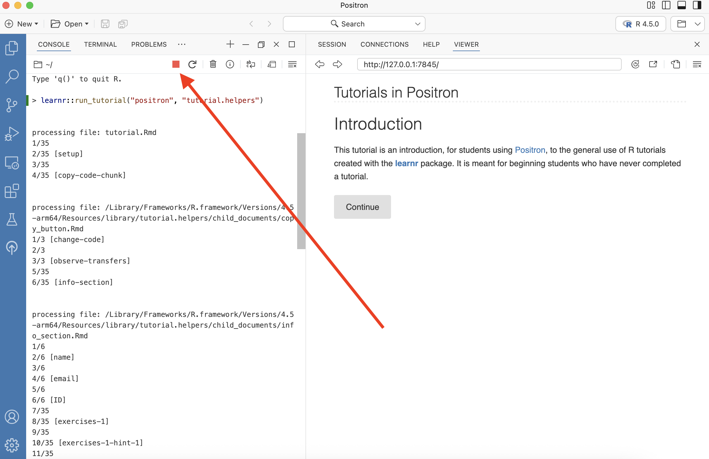
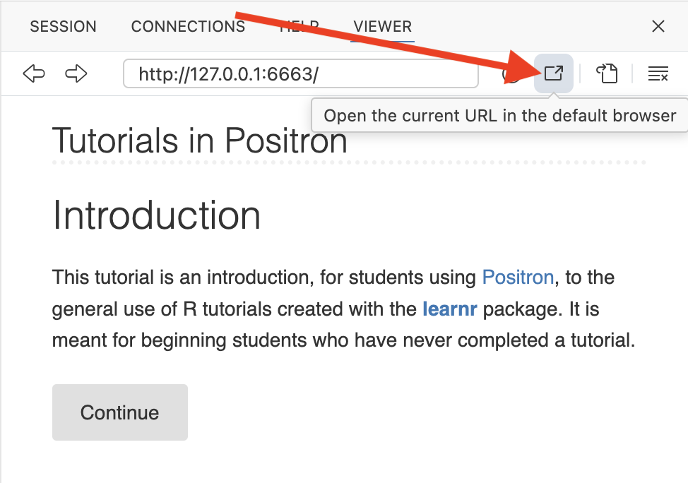
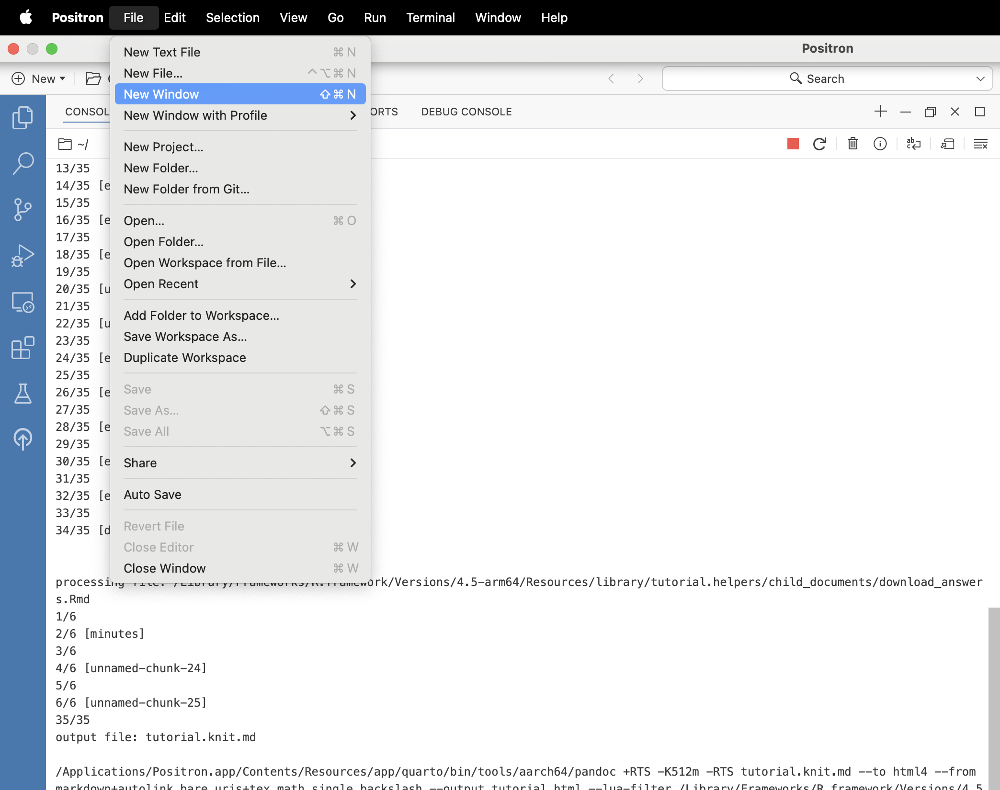
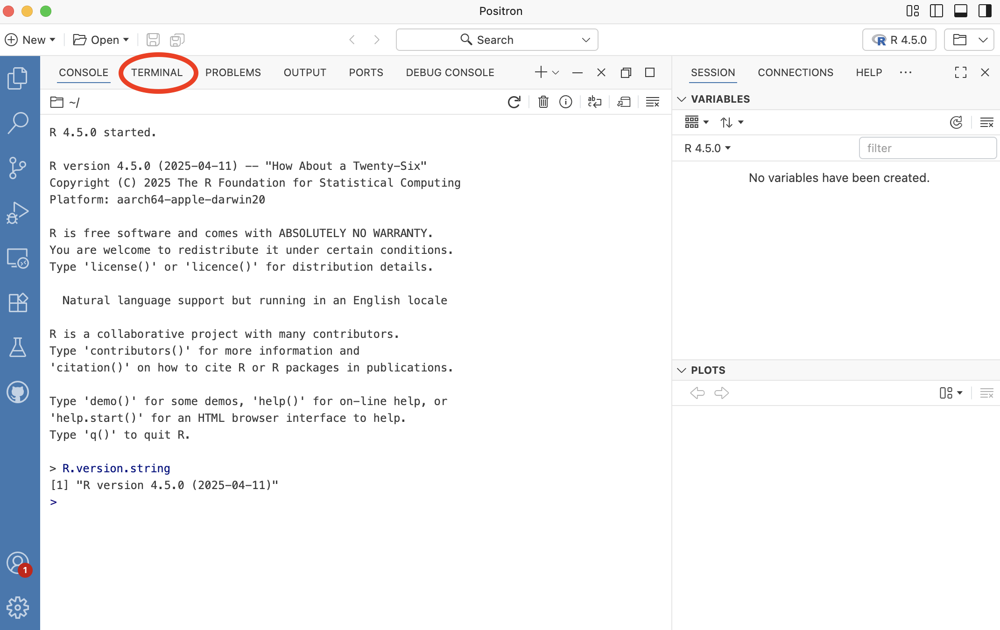
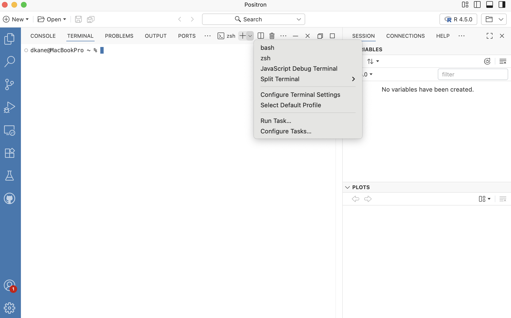
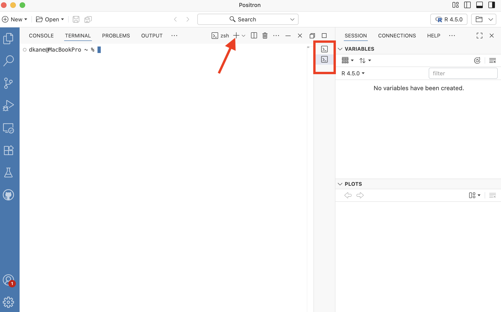

```{r setup, include = FALSE}
library(learnr)
library(tutorial.helpers)
library(knitr)

# Needed because fs::path_home() seems to be the best thing to use to identify the core home
# directory on Windows, and it works on the Mac as well. ?fs::path_home gives lots of details
# and discussion.

library(fs)

knitr::opts_chunk$set(echo = FALSE)
knitr::opts_chunk$set(out.width = '90%')
options(tutorial.exercise.timelimit = 60, 
        tutorial.storage = "local") 
```

```{r copy-code-chunk, child = system.file("child_documents/copy_button.Rmd", package = "tutorial.helpers")}
```

<!-- Find the Positron window naming page from the Posit docs. Use that image: positron-interface.jpeg  -->

<!-- Revist the initial instructions once you can use Positron in the cloud. Perhaps add a new vignette discussing Posit Workbench. -->

<!-- Get a Windows machine and show Windows versions of all images. -->

## Introduction
### 

This tutorial is an introduction, for students using [Positron](https://positron.posit.co/), to the general use of R tutorials created with the [**learnr**](https://rstudio.github.io/learnr/) package. It is meant for beginning students who have never completed a tutorial. 

Most students come to this tutorial after having completed the set-up steps outlined [here](https://ppbds.github.io/primer/getting-started.html#summary). If you fail to do so, some of these questions will be confusing.

### 

After you started the tutorial, your Positron window looked something like this:

```{r}

```

Note the red square at the top of the Console menu. This indicates that the Console is "busy." You can't do anything with this Console unless you stop running the tutorial. You can complete the tutorial in the Viewer pane in the Secondary Side Bar. 

###

Or you can "pop" a tutorial up into your browser by pressing the "Open the current URL in the default browser" button --- the item in the Viewer menu just to the right of the circular arrow. It looks like a rectangle containing an arrow pointing up and to the right.

```{r}

```

You can go back and forth between the Viewer tab and the browser. The tutorial is easier to read in the browser, but many students prefer to just keep everything inside of the Positron window.

###

You complete a tutorial on your computer. You download a copy of your answers to the `Downloads` folder on your computer. Then, you submit your answers to your instructor and/or keep a copy for yourself.

### 

Most tutorials begin by asking for your name and email. (Your instructor might also request that you fill in the "ID" field so that your work can be matched to a grading database. If not, leave the "ID" field blank.) Click "Continue" and then fill in your name and email. Click the **"Submit Answer"** button each time. If you make a mistake, you can click **"Try Again"** and, uh, try again.

If you are completing this tutorial as part of a class, you should use the same email address for every tutorial. It is best to use your "permanent" email address, one that you will always have access to. Do not use an email address associated with your current school or employer since you are likely to lose that email address some day.

```{r info-section, child = system.file("child_documents/info_section.Rmd", package = "tutorial.helpers")}
```

## Exercises
### 

Each tutorial includes exercises for you to complete. For non-coding questions, you write your answer and then hit the "Submit Answer" button, as you did above for your name and email address. 

### Exercise 1

Let's practice some simple math. Type `4 + 5` into the box below. Hit **"Run Code"** to see your results. Clicking **"Hint"** gives you a hint about what to type. 

```{r exercises-1, exercise = TRUE}

```

```{r exercises-1-hint-1, eval = FALSE}
4 + 5
```

### 

Once you click "Run Code," the answer `[1] 9` should appear below the code you entered. This is the same behavior you would see if you ran this code in the Console, which is where R is run.

###

There are two types of answers for tutorial questions: prose and code. With prose answers, you will use the "Submit Answer" button, as you did with your name and email. With code answers, you use the "Run Code" button, as you did for this question.

### Exercise 2

Let's use variables to perform the same calculation. Below, we have already assigned 5 to `x` and 4 to `y`. On the line below those two provided lines of code, add the two variables by typing `x + y`. Hit "Run Code" to see your results. 

```{r exercises-2, exercise = TRUE}
x <- 5
y <- 4

```

```{r exercises-2-hint-1, eval = FALSE}
x <- 5
y <- 4
x + y
```

### 

Once you click "Run Code", the answer `[1] 9` should appear below the code you entered. 

### 

If you don't "Run Code" (or "Submit Answer") your response, nothing is recorded.

### Exercise 3

We will often need to copy code from the previous exercise to continue working on a multi-step problem. To make this easier, we provide a "Copy previous code" button. Below the following box, click on the "Copy previous code" button. 

```{r exercises-3, exercise = TRUE}

```

<button onclick = "transfer_code(this)">Copy previous code</button>

```{r exercises-3-hint-1, eval = FALSE}
x <- ...
y <- 10
x + ...
```

### 

This should paste all work from the previous exercise into the above exercise code area. Note that this will only copy code which has already been run in the previous exercise.

### 

Change the values to `x <- 6` and `y <- 10`. Hit "Run Code." You should get the answer `[1] 16`.

### 

Note that the assignment symbol, `<-`, is a less-than-sign followed by a dash. We often pronounce this symbol as "gets." So, we might say, when reading this code, that "x gets 6."

### 

Did you remember to hit the "Run Code" button above? Lots of people forget! You must hit the button for your answer to be recorded.

### Exercise 4

<!-- DK: Seems like it should be possible to restart the R session. But the various buttons don't seem to work very well, at least when you are in a tutorial. Try this again in a month. In the meantime, this radical close-Positron approach is OK. -->

Read all of the following instructions before continuing. The purpose of this exercise is to demonstrate that your tutorial answers are saved automatically.

* Quit and then restart Positron.

* Restart the tutorial. The most common approach is to run this command at the Console:

````
learnr::run_tutorial("getting-started", package = "tutorial.helpers")
````

* Copy the above code now so that you can easily paste it into the Console after you restart Positron.

Now that you have read all the instructions, go ahead and follow them.

### 

Note how all your answers to previous questions have been saved. It is not a problem to quit a tutorial. In fact, if you ignore a tutorial, it will eventually quit automatically.

### Exercise 5

Click `File -> New Window` in the Positron menu.

```{r}

```

This brings up a new instance of Positron, completely independent of this one. This is the most common set up when working on tutorials. One Positron window, this one, runs the tutorial, but we don't do any work in it. We generally don't even bother to create a second Console. The second Positron window is where we do the work which the tutorial requires.

###

There are many ways to move between Positron windows. One approach is to hold down the Control key and hit the letter "W." This is usually abbreviated as `Ctrl + w`. This pulls up a list of the open Positron windows. You then select the one you want and hit `Enter`. On the Mac, you can hold down the Command key and then hit the backtick key: `` ` ``, i.e., ``Cmd + ` ``. This "cycles through" the open Positron windows. `Alt + Tab` on Windows has a similar effect, although the cycle will include all open applications, not just Positron windows.

<!-- 
DK: Not sure on the best way to have students handle this. Right now, we report the facts above and leave it at that. But we could guide them through the creation of a shortcut key which would be the same (?) for both Mac and Windows. Maybe `workbench.action.quickSwitchWindow` is the key command, and we should set that to a specific command sequence for everyone. This would involve, I think, editing/creating the `keybindings.json` file. 

{
  "key": "ctrl+alt+w",
  "command": "workbench.action.quickSwitchWindow"
}

But need to worry about how this might interact, eventually, with doing Positron in the cloud. Would need to pick a sequence which is not pre-empted by hr browser.
-->

###

In the Console in the new Positron window, type `version[['version.string']]`, hitting `return` (if using Mac) or `enter` (if using Windows). To avoid us having to type `return` or `enter` for each question we ask, we use the term `Enter` to specify hitting either the `return` or `enter` key, as appropriate.


**Do not just type the command into the answer box!** You must paste the command into the Console and then execute the command.

Copy/paste the command **and** the return value into this box.

```{r exercises-5}
question_text(NULL,
	answer(NULL, correct = TRUE),
	allow_retry = TRUE,
	try_again_button = "Edit Answer",
	incorrect = NULL,
	rows = 3)
```

### 

We typically provide example answers (like the answer below) after you submit your own response. Don't be concerned if your submitted answer differs from the example answer we show.

```{r exercises-5-test, echo = TRUE}
version[['version.string']]
```

Your version of R may be more recent, but it should not be older. It is OK if your formatting differs from ours. Exactness does not matter. What matters is that you prove that you have executed the command as instructed.

### 

Tutorial workflow will often look like this. We tell you to run a command **in the Console**, always in your second Positron window. You run it. We then ask you to copy/paste, from the Console, both the command itself and the response returned. Because we ask you to **C**opy/**P**aste the **C**ommand/**R**esponse so often, we usually shorten this instruction to CP/CR.

### Exercise 6

The Terminal tab is next to the Console tab within the Panel portion the Positron window. Click on the word “Terminal” to access it. We use the Console tab to talk to R. We use the Terminal tab to talk directly with the computer.

```{r}

```

###

At the Terminal, type `git --version`. Hit `Enter`. (Your computer may respond by asking if you want to install Git. You do. Go ahead and install.)

CP/CR.

```{r exercises-6}
question_text(NULL,
	answer(NULL, correct = TRUE),
	allow_retry = TRUE,
	try_again_button = "Edit Answer",
	incorrect = NULL,
	rows = 3)
```

###

My answer looks like this:

````
dkane@macbook positron.tutorials % git --version
git version 2.39.3 (Apple Git-146)
dkane@macbook positron.tutorials % 
````

As long as you have some version of Git installed, you are OK. 

But many of you will get an error like:

````
command not found: git
````

Or:

````
The term 'git' is not recognized as the name of a cmdlet, function, script file, or operable program.
````

Either means that Git is not installed on your computer.

### Exercise 7

If you got an error in the previous question, follow [these instructions](https://git-scm.com/book/en/v2/Getting-Started-Installing-Git) to install Git, if it was not installed automatically. If asked, you should allow "Git BASH" to be installed. You will sometimes see "BASH" or "Bash" or "bash," but all refer to the same shell, a program which is much better than the Powershell which comes with Windows.

Next, quit Positron using the menu commands: `Positron -> Quit Positron`. This is the safest way to ensure that Positron "discovers" your new Git installation.

Start Positron again. This tutorial will have been closed when you quit Positron. Restart the tutorial with:

```
learnr::run_tutorial("getting-started", "tutorial.helpers")
```

You will need to `File -> New Window` again to have an empty Console to work in.

At the Terminal, type `git --version`. Hit `Enter`. 

CP/CR.

```{r exercises-7}
question_text(NULL,
	answer(NULL, correct = TRUE),
	allow_retry = TRUE,
	try_again_button = "Edit Answer",
	incorrect = NULL,
	rows = 3)
```

###

If this works, you should be all set. If not, seek help. You need Git!

### Exercise 8

<!-- DK: Figure out what Windows does and/or looks like and then clarify these instructions. -->

The Console behaves almost identically regardless of the kind of computer you use. The Terminal, sadly, does not. Windows and Mac are very different. 

###

Every Terminal runs a “shell,” the program which serves as the interface between you and the computer.

###

On a Mac, the default shell is referred to as "[Unix-like](https://en.wikipedia.org/wiki/Unix-like)" since it acts very much like the traditional Unix command line. In Windows, the default shell is [PowerShell](https://en.wikipedia.org/wiki/PowerShell), which is an older technology. 

###

To start a new Terminal with a specific shell, press the downward arrow next to the `+` sign. 

```{r}
include_graphics("images/terminal-2.png")
```

See the red arrow above.

###

If you are using Windows, you should see an option for “Git Bash” (or maybe just “bash”). I don't, because I am not using Windows. But it doesn't matter, because I already have a Unix-like shell, `zsh`

###

If everything goes well, Git Bash should automatically be your default shell when you open the Terminal on Windows. However, if it doesn't default to Git Bash, you'll need to manually choose it. You can set it as the default option by using the "Select Default Profile" feature: 

```{r}

```

Again, this discussion is specifically for Windows users only. They might need to click on that tool and choose the option labeled "Git Bash" or "bash." Once selected, this will make it the default terminal for future sessions.

###

Click the `+` button (see red arrow below) to start a second Terminal and see if it works!

```{r}

```

The red rectangle highlights that we are now running two Terminals, between which we can switch back-and-forth. In fact, we can have multiple Terminals and multiple Consoles in one Positron window just by using the `+` button. Some people prefer this approach. We still recommend using a second Positron window to have an open Console for use while working on a tutorial.

###

From the Terminal, run `echo $0`. (To "run" a command at the Terminal or the Console means to type the command and then click the `Enter` key.)

CP/CR.

```{r exercises-8}
question_text(NULL,
	answer(NULL, correct = TRUE),
	allow_retry = TRUE,
	try_again_button = "Edit Answer",
	incorrect = NULL,
	rows = 3)
```

###

On a Mac, I get:

````
dkane@MacBookPro ~ % echo $0 
/bin/zsh
dkane@MacBookPro ~ % 
````

This means that, in the Terminal, I am using [Z shell](https://en.wikipedia.org/wiki/Z_shell). On Windows, your answer will probably be something like `bash`, referring to [Bash](https://en.wikipedia.org/wiki/Bash_(Unix_shell)), another Unix-like shell. Don't worry about the differences between them. 

The important thing is that, first, you now have Git installed and, second, if you are a Windows user, you now have a better shell than Powershell.

If this works, you should be all set. If not, seek help. You need a decent shell in the Terminal.

### Exercise 9

Let us make the Terminal "sleep" by typing the command `sleep 5` at the Terminal. Hit `Enter`. The `sleep 5` command at the Terminal pauses execution for 5 seconds. 

CP/CR. 

```{r exercises-9}
question_text(NULL,
	answer(NULL, correct = TRUE),
	allow_retry = TRUE,
	try_again_button = "Edit Answer",
	incorrect = NULL,
	rows = 3)
```

###

```
dkane@MacBookPro ~ % sleep 5
dkane@MacBookPro ~ % 
```

We can change the duration of the sleep using this format: `sleep [number]`. The number you put in is the duration (in seconds) for which the Terminal goes to sleep. 

### Exercise 10

Run `sleep 60` at the Terminal. (Again, "run" means to type the command and then hit the `Enter` key.) The command makes the Terminal go to sleep for 60 seconds. To cancel the running `sleep` command at the Terminal press `Ctrl + C` on your keyboard. Do so now, before `sleep 60` finishes.

When you press `Ctrl + C` while `sleep` is running, it immediately terminates the `sleep` command and returns you to the command prompt.

CP/CR.

```{r exercises-10}
question_text(NULL,
	answer(NULL, correct = TRUE),
	allow_retry = TRUE,
	try_again_button = "Edit Answer",
	incorrect = NULL,
	rows = 3)
```

### 

````
dkane@MacBookPro ~ % sleep 60
^C
dkane@MacBookPro ~ % 
````

`Ctrl + C` can stop any process from the Terminal. This is often necessary.

### Exercise 11

Positron and your R installation have some default settings which are not good for new users. Run this command at the Console to change them:

```
tutorial.helpers::set_positron_settings()
```

CP/CR.

```{r exercises-11}
question_text(NULL,
	answer(NULL, correct = TRUE),
	allow_retry = TRUE,
	try_again_button = "Edit Answer",
	incorrect = NULL,
	rows = 12)
```

### 

The output from this function will report the changes, if any, which were made. To learn more, look up the help page by running `?tutorial.helpers::set_positron_settings` at the Console.

### 

You can generally call a function by just giving its name along with the ending parentheses, as with `set_positron_settings()`. However, it can be safer to preface the function name with the name of the package in which the function is found, separated by two colons. Since `set_positron_settings()` is in the **tutorial.helpers** package, we can call it using this "double colon" notation: `tutorial.helpers::set_positron_settings()`, as we did above.

### Exercise 12

It is useful to understand where the R process is currently executing on your computer.

In the Console, run `getwd()`. This function is **get** **w**orking **d**irectory, meaning we want to know the directory in which the R process is located.

CP/CR.

```{r exercises-12}
question_text(NULL,
    answer(NULL, correct = TRUE),
    allow_retry = TRUE,
    try_again_button = "Edit Answer",
    incorrect = NULL,
    rows = 3)
```

### 

If you are on a Mac, you answer probably looks like:

````
> getwd()
[1] "/Users/dkane"
>
````

This is especially true if you are new to Positron. If you have used Positron before, then it might start out in the last directory in which you were working. Otherwise, it defaults to your "home" directory.

###

If I were on Windows, then the home directory would be something like `C:\Users\dkane\Documents` or even  `C:\Users\dkane\OneDrive\Documents` or even one of these with `\\` instead of `\` to separate out the directories. Note that on Windows:

* The file system starts on the `C:` drive.

* The directories are separated with backward slashes, instead of the forward slashes which we see on the Mac.

* The notion of a "home" directory is tricky, both in general and when compared with a Mac. On the Mac, the "home" directory is almost always something like `/Users/dkane`. On Windows, the "home" directory generally refers to a user's `Documents` folder, which is sometimes housed on `OneDrive`.

* `OneDrive`, like many cloud-backup systems, does not play particularly well with Git, the program almost everyone uses to keep track of changes in your code. **Do not put your data science projects in a folder which is backed up with OneDrive.**

### Exercise 13

In the Console, run `fs::path_home()`. 

CP/CR.

```{r exercises-13}
question_text(NULL,
	answer(NULL, correct = TRUE),
	allow_retry = TRUE,
	try_again_button = "Edit Answer",
	incorrect = NULL,
	rows = 3)
```

###

````
> fs::path_home()
/Users/dkane
````

This function returns the "path" to your home directory such that the Windows answer is more like the Mac answer. A path is simply the information which allows you to reach a location on your computer. 

More info on paths can be found [here](https://people.ischool.berkeley.edu/~kevin/unix-tutorial/section3.html).

If you are on Windows, you should have gotten a similar answer, something like:

````
C:\Users\dkane
````

Because it is Windows, the path begins with `C:` and the slashes are backwards slashes. 

The important point is that, in almost all non-pathological set-ups, you will have a home directory. It is important to know where that is.


### Exercise 14

Let's take a look at the directories in your home directory. From the Console, run `list.files(fs::path_home())`. CP/CR.

```{r exercises-14}
question_text(NULL,
	answer(NULL, correct = TRUE),
	allow_retry = TRUE,
	try_again_button = "Edit Answer",
	incorrect = NULL,
	rows = 3)
```

### 

My answer:

```
> list.files(fs::path_home())
 [1] "AppData"      "Applications" "Desktop"      "Documents"   
 [5] "Downloads"    "Library"      "miniconda3"   "Movies"      
 [9] "Music"        "Pictures"     "Public"       "temp"        
>           
```

If you are on a Mac, then the `Desktop` directory is a handy location in which to store all your coding projects.  If you are on Windows, then the `Desktop` directory might be less convenient because it is often, but not always, backed up on OneDrive.

**Avoid doing data science in any directory which is backed up by OneDrive or any other cloud backup service.**

### Exercise 15

Whenever you start a new project, you will want to store it in a location which you can easily find. Right now, you are likely in an arbitrary location on your computer. It would be much more useful to have a location dedicated to your projects.

From the Console, run `file.exists(file.path(fs::path_home(), "Desktop"))`. 

CP/CR.

```{r exercises-15}
question_text(NULL,
	answer(NULL, correct = TRUE),
	allow_retry = TRUE,
	try_again_button = "Edit Answer",
	incorrect = NULL,
	rows = 3)
```

### 

For me:

```
> file.exists(file.path(fs::path_home(), "Desktop"))
[1] TRUE
```

For almost all Mac users and many Windows users, this should return `TRUE` because there is a `Desktop` directory. For some Windows users, it will return `FALSE` because their `Desktop` directory is within a `OneDrive` directory which is automatically backed up to the cloud.

### Exercise 16

Let's make a folder, and call it `projects`. If `file.exists(file.path(fs::path_home(), "Desktop"))` returned `TRUE`, then run this at the Console:

```
dir.create(file.path(fs::path_home(), "Desktop", "projects"))
```

That should put your `projects` directory in your `Desktop` directory. (Note that "folder" and "directory" mean the same thing.) If you get a warning message, here or below, that this directory "already exists," then you are all set.

If `file.exists(file.path(fs::path_home(), "Desktop"))` returned `FALSE`, then run this at the Console:

```
dir.create(file.path(fs::path_home(), "projects"))
```

That will also create a `projects` directory, but in your home directory. 

CP/CR. 

```{r exercises-16}
question_text(NULL,
	answer(NULL, correct = TRUE),
	allow_retry = TRUE,
	try_again_button = "Edit Answer",
	incorrect = NULL,
	rows = 3)
```

### 

If that command works, you are all set. (If you get a message that the directory already exists, then you are also all set.) If not, you will need to create a `projects` directory by hand. Helpful resources can be found [here](https://support.microsoft.com/en-us/office/create-a-new-folder-cbbfb6f5-59dd-4e5d-95f6-a12577952e17) for Windows, and [here](https://support.apple.com/guide/mac-help/organize-files-using-folders-mh26885/mac) for macOS.

### 

**The path to your data science projects should not include any folders with spaces (or other weird characters) in their names.** 

For example, this is a reasonable location for R projects if you are using a Mac:

```
/Users/dkane/Desktop/projects/
```

And if you are using Windows . . .

```
C:/Users/dkane/projects/
```

Again, you can place your `projects` directory where you want, as long as you keep track of where it is.

### Exercise 17

<!-- DK: Is this necessary, or will Positron by default use the last directory you did stuff from, which will be `projects`, when it gives you a choice. So, changing the default behavior is not necessary. -->

It is handy for Positron to know where your `projects` directory is so that it can offer that directory as a default when you start a new project. To do so, from the Console, run this command after replacing "PUT YOUR PROJECT PATH HERE" with your project path.

````
tutorial.helpers::set_positron_settings(positron_settings = 
   list("files.dialog.defaultPath" = "PUT YOUR PROJECT PATH HERE"))
````

So, for example, I would run:

````
tutorial.helpers::set_positron_settings(positron_settings = 
   list("files.dialog.defaultPath" = "/Users/dkane/Desktop/projects"))
````

If I were using Windows:

````
tutorial.helpers::set_positron_settings(positron_settings = 
   list("files.dialog.defaultPath" = "C:/Users/dkane/projects"))
````

But you should not run either of those! Those only work for me. You need to run the command with your `projects` path.

CP/CR.

```{r exercises-17}
question_text(NULL,
	answer(NULL, correct = TRUE),
	allow_retry = TRUE,
	try_again_button = "Edit Answer",
	incorrect = NULL,
	rows = 3)
```

###

Look at the output from `tutorial.helpers::set_positron_settings()` to confirm that this worked. Don't worry if it did not.
 
### Exercise 18

Tutorials can include written responses. You have already seen several examples. Sometimes those written answers are just copies of the R commands and their results. Other times, we will ask you to write one or more sentences of prose. 

Copy and paste everything from the Exercise header above through the end of this sentence into the answer box below. That is, you are copying from this tutorial, not from the Console. Press "Submit Answer."

```{r exercises-18}
question_text(NULL,
    message = "We will sometimes provide an answer to written questions, as we do here. Other times, we won't. In the former case, we will not allow you to resubmit your answer. Don't stress! Most instructors grade tutorials on pass/fail basis, so, as long as you make an honest effort, you will do fine.",          
    answer(NULL, 
           correct = TRUE),
    allow_retry = FALSE,
    incorrect = NULL,
    rows = 6)
```

### Exercise 19

`show_file()` is a commonly-used function from the **tutorial.helpers** package. It makes it easy for you to share the contents of another file with your instructor, especially a file which you have edited. 

From the Console, run this command:

```
tutorial.helpers::show_file(file.path(R.home(), "COPYING"), end = 7)
```

CP/CR.

```{r exercises-19}
question_text(NULL,
	answer(NULL, correct = TRUE),
	allow_retry = TRUE,
	try_again_button = "Edit Answer",
	incorrect = NULL,
	rows = 10)
```

###

```{r exercises-19-test, include = FALSE}
tutorial.helpers::show_file(file.path(R.home(), "COPYING"), end = 7)
```

For now, don't worry about what `R.home()` and `file.path()` are doing, although you can read about them by running `?R.home` and `?file.path` at the Console. Those details are less important than seeing the intended usage of `show_file()`. 

### Exercise 20

We frequently ask that you `copy` content from an HTML file like a webpage. Don't worry if what you copy appears messy or has lost its formatting - that's perfectly fine. Our main concern is ensuring that your HTML contains roughly the correct information it's supposed to have.

###

Go to [the homepage](https://ppbds.github.io/tutorial.helpers/) of the **tutorials.package** and copy everything in the browser window from 'tutorial.helpers' in the upper left corner through the end of the `About this package` section.

CP/CR.

```{r exercises-20}
question_text(NULL,
	answer(NULL, correct = TRUE),
	allow_retry = TRUE,
	try_again_button = "Edit Answer",
	incorrect = NULL,
	rows = 3)
```

###

````
tutorial.helpers
0.5.0.9003
Reference
Articles
Changelog
Search for
Tutorial Helper Functions
About this package
tutorial.helpers provides functions and RStudio Addins to help you write R tutorials, especially if you follow my advice about the best way to do so. This approach is currently used in several packages, including r4ds.tutorials and positron.tutorials.
````

Again, your answer never needs to match ours exactly. 

## Your answers
### 

At the end of every tutorial, you will save your work -- and submit it, at the discretion of your instructor. We will do this in the next topic, labeled "Download answers." Follow the instructions there. 

Make sure to answer the question about how many **minutes** you spent on the tutorial and to click "Submit Answer."

After hitting the "Download" button, you will be prompted to save a file named `getting-started_answers.html`. This file will, by default, be saved in the `Downloads` folder on your computer. 

Unless told otherwise by your instructor, you should use the default file name, which will usually be of the form `short-name-of-tutorial` + `_answers` + `.html`. 

```{r download-answers, child = system.file("child_documents/download_answers.Rmd", package = "tutorial.helpers")}
```

## Summary
### 

You now understand how tutorials function and how to download a copy of your answers. Good luck with your data science journey!
