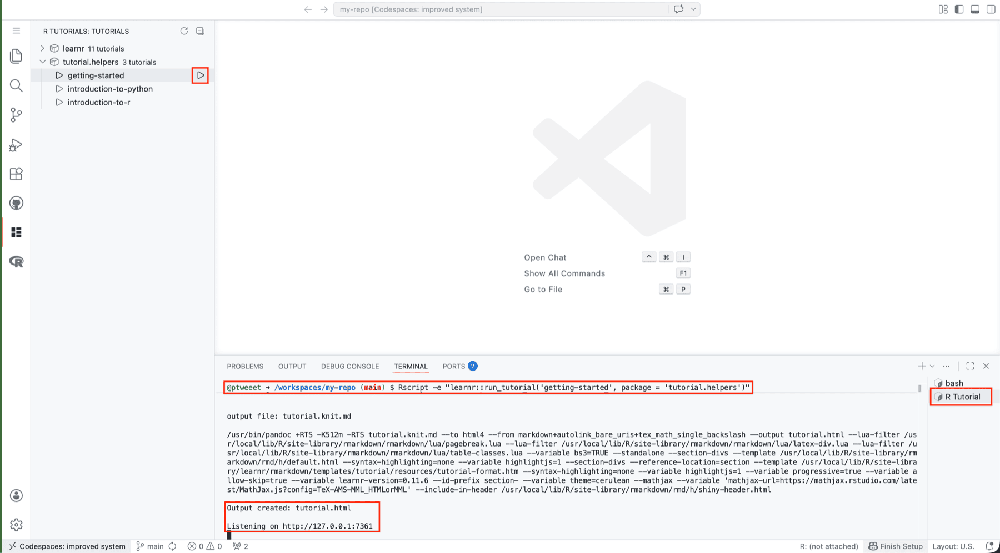
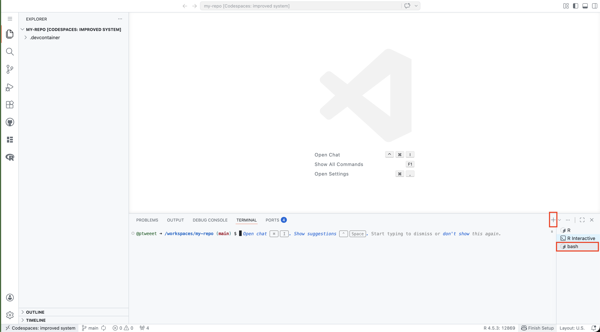
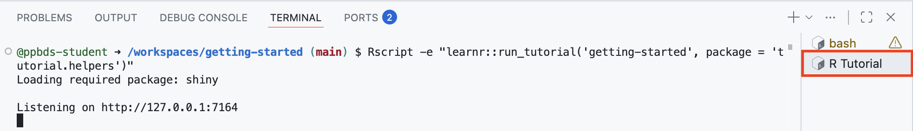
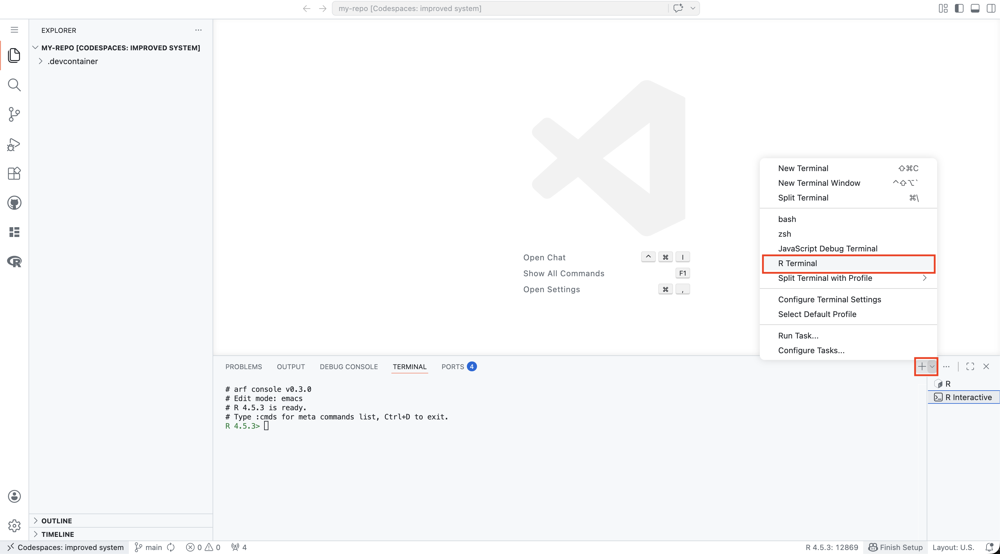

```{r setup, include = FALSE}
library(learnr)
library(tutorial.helpers)
library(knitr)

knitr::opts_chunk$set(echo = FALSE)
knitr::opts_chunk$set(out.width = '90%')
options(tutorial.exercise.timelimit = 60,
        tutorial.storage = "local")
```

## Introduction
###

This tutorial, intended for beginners, teaches students how to use [GitHub Codespaces](https://github.com/features/codespaces) to run R tutorials created with the [**learnr**](https://rstudio.github.io/learnr/) package. We also introduce students to the use of the bash Terminal, the R Terminal, and GitHub Copilot within VS Code.

Most students begin this tutorial after completing the setup steps outlined [here](https://ppbds.github.io/primer/getting-started.html). If you have not done that, some of these questions may be confusing.

###

After starting the tutorial, your Codespace looks something like this:

```{r}

```

###

Complete the tutorial in your Codespace. At the end, you will press a button to download a copy of your answers to the `Downloads` folder on your computer. Finally, submit your answers to your instructor and/or keep a copy for yourself.

###

Most tutorials begin by asking for your name and email. Your instructor might also ask you to fill in the "ID" field so that your work can be matched to a grading database. If not, leave the "ID" field blank. Click "Continue," then enter your name and email. Click the **"Submit Answer"** button each time. If you make a mistake, click **"Try Again"** and submit a new answer.

If you are completing this tutorial as part of a class, use the same email address for every tutorial.

```{r info-section, child = system.file("child_documents/info_section.Rmd", package = "tutorial.helpers")}
```

## Bash Terminal
###

Each tutorial includes exercises for you to complete. Most exercises ask you to run a command in a terminal and then copy the result into the answer box. After writing your answer, click the "Submit Answer" button, as you did above for your name and email address.

The **bash** Terminal is a text-based interface where you type commands to tell your Codespace what to do. The pattern is always the same: you send a command, the Terminal executes it, and it gives you something back. In this section you will practice the most common bash commands. (In the next section you will see that the R Terminal works exactly the same way.)

To do the exercises, you need a bash Terminal in which to type commands. Press the plus button (`+`) on the right side of the Panel to open one.

```{r}

```

### Exercise 1

In the bash Terminal, type `whoami` and then press `return` (on Mac) or `enter` (on Windows). To "run" a command means to type it and then press this key. To avoid repeating both terms in every question, we use `Enter` to mean either the `return` or `enter` key, as appropriate.

**Do not just type the command into the answer box!** You must run the command in the Terminal and then copy the result.

**C**opy and **P**aste both the **C**ommand *and* the **R**esponse from the Terminal into the box below. We will abbreviate this instruction in the future as **CP**/**CR**.

```{r bash-terminal-1}
question_text(NULL,
	answer(NULL, correct = TRUE),
	allow_retry = TRUE,
	try_again_button = "Edit Answer",
	incorrect = NULL,
	rows = 3)
```

###

We typically provide example answers, like the one below, after you submit your own response. Do not be concerned if your answer differs from the example we show.

````
@ppbds-student ➜ /workspaces/codespace-starter $ whoami
ppbds-student
@ppbds-student ➜ /workspaces/codespace-starter $
````

###

`whoami` prints the username of the account you are signed in as. Your Codespace is a complete computer running in the cloud, and you interact with it as the `ppbds-student` user. It is OK if your formatting differs from ours. What matters is that you show that you executed the command as instructed.

### Exercise 2

In the bash Terminal, run `echo $0`. (Again, "run" means to type the command and then press `enter`.)

CP/CR.

```{r bash-terminal-2}
question_text(NULL,
	answer(NULL, correct = TRUE),
	allow_retry = TRUE,
	try_again_button = "Edit Answer",
	incorrect = NULL,
	rows = 3)
```

###

````
@ppbds-student ➜ /workspaces/codespace-starter $ echo $0
/bin/bash
@ppbds-student ➜ /workspaces/codespace-starter $
````

###

A "shell" is the program that reads and interprets the commands you type in the Terminal. `echo $0` prints the name of the shell you are using: `/bin/bash`, the [Bash shell](https://en.wikipedia.org/wiki/Bash_(Unix_shell)). Every command you run in this Terminal --- starting with the `whoami` you just ran --- is interpreted by bash.

### Exercise 3

In the bash Terminal, run `pwd`.

CP/CR.

```{r bash-terminal-3}
question_text(NULL,
	answer(NULL, correct = TRUE),
	allow_retry = TRUE,
	try_again_button = "Edit Answer",
	incorrect = NULL,
	rows = 3)
```

###

````
@ppbds-student ➜ /workspaces/codespace-starter $ pwd
/workspaces/codespace-starter
@ppbds-student ➜ /workspaces/codespace-starter $
````

###

`pwd` stands for **p**rint **w**orking **d**irectory --- the folder the Terminal is currently "in." GitHub Codespaces place your repository under `/workspaces/`, so that is where you begin. Almost every command you run acts on this directory unless you tell it otherwise.

### Exercise 4

In the bash Terminal, run `ls`.

CP/CR.

```{r bash-terminal-4}
question_text(NULL,
	answer(NULL, correct = TRUE),
	allow_retry = TRUE,
	try_again_button = "Edit Answer",
	incorrect = NULL,
	rows = 3)
```

###

````
@ppbds-student ➜ /workspaces/codespace-starter $ ls
@ppbds-student ➜ /workspaces/codespace-starter $
````

###

`ls` **l**i**s**ts the files in the working directory. Notice that nothing was printed! That is because, by default, `ls` hides any file or folder whose name begins with a dot (`.`). The directory is not actually empty, as we will see next.

### Exercise 5

In the bash Terminal, run `ls -a`.

CP/CR.

```{r bash-terminal-5}
question_text(NULL,
	answer(NULL, correct = TRUE),
	allow_retry = TRUE,
	try_again_button = "Edit Answer",
	incorrect = NULL,
	rows = 3)
```

###

````
@ppbds-student ➜ /workspaces/codespace-starter $ ls -a
.  ..  .devcontainer  .git
@ppbds-student ➜ /workspaces/codespace-starter $
````

###

The `-a` flag (for "all") tells `ls` to reveal the hidden entries. `.` is the current directory and `..` is the directory just above it. `.git` stores the project's version history, and `.devcontainer` holds the configuration for your Codespace. A "flag" like `-a` is an option that changes how a command behaves.

### Exercise 6

In the bash Terminal, run `ls .devcontainer`.

CP/CR.

```{r bash-terminal-6}
question_text(NULL,
	answer(NULL, correct = TRUE),
	allow_retry = TRUE,
	try_again_button = "Edit Answer",
	incorrect = NULL,
	rows = 3)
```

###

````
@ppbds-student ➜ /workspaces/codespace-starter $ ls .devcontainer
STUDENT_WORKFLOW.md  connect-repo.sh  devcontainer.json  welcome.sh
@ppbds-student ➜ /workspaces/codespace-starter $
````

###

Giving `ls` a directory name lists what is inside that directory. The `.devcontainer` folder tells GitHub Codespaces how to build your workshop --- which version of R, Python, and Quarto to install, and which AI tools to include --- so that every student gets an identical setup.

### Exercise 7

In the bash Terminal, run `head .devcontainer/STUDENT_WORKFLOW.md`.

CP/CR.

```{r bash-terminal-7}
question_text(NULL,
	answer(NULL, correct = TRUE),
	allow_retry = TRUE,
	try_again_button = "Edit Answer",
	incorrect = NULL,
	rows = 12)
```

###

````
@ppbds-student ➜ /workspaces/codespace-starter $ head .devcontainer/STUDENT_WORKFLOW.md
# Student workflow

This Codespace is your **workshop** — it already has R, Python (with the usual data-science libraries), Quarto, the AI assistants, and all the right settings. But this` `codespace-starter` repo isn't *yours*, so you won't save your work here. Instead, you'll make your **own repo** and work in it. The tools travel with the Codespace, so your repo needs no setup of its own.

## 1. Create or connect to your repo (one command)

@ppbds-student ➜ /workspaces/codespace-starter $
````

###

`head` prints the first ten lines of a file, a quick way to peek at its contents without opening it. `STUDENT_WORKFLOW.md` explains the most important habit for this course: because `codespace-starter` is not your own repo, you create your own with `.devcontainer/connect-repo.sh` and do your work there.

### Exercise 8

Let us make the Terminal "sleep" by running `sleep 5` in the bash Terminal. The `sleep 5` command pauses execution for 5 seconds.

CP/CR.

```{r bash-terminal-8}
question_text(NULL,
	answer(NULL, correct = TRUE),
	allow_retry = TRUE,
	try_again_button = "Edit Answer",
	incorrect = NULL,
	rows = 3)
```

###

````
@ppbds-student ➜ /workspaces/codespace-starter $ sleep 5
@ppbds-student ➜ /workspaces/codespace-starter $
````

###

Many commands do their work silently and print nothing --- success is simply the return of the prompt. We can change the duration with `sleep [number]`, where the number is how many seconds the Terminal pauses.

### Exercise 9

Run `sleep 60` in the bash Terminal. This command makes the Terminal sleep for 60 seconds. To cancel the running `sleep` command, press `Ctrl + C` on your keyboard. Do so now, before `sleep 60` finishes.

CP/CR.

```{r bash-terminal-9}
question_text(NULL,
	answer(NULL, correct = TRUE),
	allow_retry = TRUE,
	try_again_button = "Edit Answer",
	incorrect = NULL,
	rows = 3)
```

###

````
@ppbds-student ➜ /workspaces/codespace-starter $ sleep 60
^C
@ppbds-student ➜ /workspaces/codespace-starter $
````

###

`Ctrl + C` interrupts whatever process is currently running in the Terminal and returns you to the prompt; the `^C` marks where you pressed it. This is one of the most useful things to know: when a command hangs or you change your mind, `Ctrl + C` stops it. You will use it again in the next exercise to stop the tutorial itself.

### Exercise 10

Read all of the following instructions before continuing. The purpose of this exercise is to demonstrate that your tutorial answers are saved automatically.

* Return to your Codespace and click the tab titled "R Tutorial" in the Panel.

```{r}

```

* Stop the tutorial by pressing `Ctrl + C` in the terminal. This is useful because it can interrupt any terminal process. A new line should appear where you can enter another command.

* To restart the tutorial, press the play button next to the "getting-started" tutorial.

* Finally, open the tutorial.


Now that you have read all the instructions, go ahead and follow them.

###

Notice that all of your answers to previous questions have been saved. It is not a problem to quit a tutorial. In fact, if you leave a tutorial idle, it will eventually quit automatically.

## R Terminal
###

The bash Terminal lets you talk to the computer. The R Terminal lets you talk to R, the programming language you will use for data science. The two work the same way: you type a command, press `Enter`, and the Terminal executes the command and gives you something back. The only real difference is the language --- bash commands like `ls` and `pwd` on the one hand, R commands like `sqrt(16)` on the other. Each exercise in this section asks you to run a one-line command and then CP/CR.

Create a new R Terminal by pressing the down arrow next to the plus button on the right side of the Panel Toolbar and selecting "New R Terminal."

```{r}

```

### Exercise 1

In the R Terminal, run `4 + 5`.

CP/CR.

```{r r-terminal-1}
question_text(NULL,
	answer(NULL, correct = TRUE),
	allow_retry = TRUE,
	try_again_button = "Edit Answer",
	incorrect = NULL,
	rows = 3)
```

###

````
R 4.5.3> 4 + 5
[1] 9
R 4.5.3>
````

###

At its simplest, R is a calculator. Just as the bash Terminal took `whoami` and handed back your username, the R Terminal takes `4 + 5` and hands back the result. You send a command; the Terminal sends something back. The `[1]` at the start of the output is a counter telling you that the line begins with the first element of the result --- useful when a result has many values spread across several lines.

### Exercise 2

In the R Terminal, run `sqrt(16)`.

CP/CR.

```{r r-terminal-2}
question_text(NULL,
	answer(NULL, correct = TRUE),
	allow_retry = TRUE,
	try_again_button = "Edit Answer",
	incorrect = NULL,
	rows = 3)
```

###

````
R 4.5.3> sqrt(16)
[1] 4
R 4.5.3>
````

###

`sqrt()` is a **function**. You "call" a function by writing its name followed by parentheses, placing any input --- here, `16` --- inside them. That input is called an **argument**. Almost everything you do in R involves calling functions on arguments.

### Exercise 3

In the R Terminal, run `getwd()`. This stands for **get** **w**orking **d**irectory, meaning that we want to know the directory in which the R process is currently located.

CP/CR.

```{r r-terminal-3}
question_text(NULL,
    answer(NULL, correct = TRUE),
    allow_retry = TRUE,
    try_again_button = "Edit Answer",
    incorrect = NULL,
    rows = 3)
```

###

````
R 4.5.3> getwd()
[1] "/workspaces/codespace-starter"
R 4.5.3>
````

###

`getwd()` is the R equivalent of the bash command `pwd` you ran earlier. Here it shows that R is operating inside your Codespace at `/workspaces/codespace-starter`. Note that `getwd()` takes no arguments, but you still need the parentheses to call it.

### Exercise 4

In the R Terminal, run `R.version.string`.

CP/CR.

```{r r-terminal-4}
question_text(NULL,
	answer(NULL, correct = TRUE),
	allow_retry = TRUE,
	try_again_button = "Edit Answer",
	incorrect = NULL,
	rows = 3)
```

###

````
R 4.5.3> R.version.string
[1] "R version 4.5.3 (2026-03-11)"
R 4.5.3>
````

###

Your version of R may be more recent, but it should not be older. `R.version.string` is not a function call --- it has no parentheses --- but a built-in variable whose value R simply prints.

### Exercise 5

`show_file()` is a commonly used function from the **tutorial.helpers** package. It makes it easy for you to share the contents of another file with your instructor, especially a file that you have edited.

You can generally call a function by giving its name followed by parentheses, as with `getwd()`. However, it can be safer to prefix the function name with the name of the package in which the function is found, separated by two colons. Since `show_file()` is in the **tutorial.helpers** package, we can call it using this "double-colon" notation: `tutorial.helpers::show_file()`.

In the R Terminal, run this command:

```
tutorial.helpers::show_file(file.path(R.home(), "COPYING"), end = 7)
```

CP/CR.

```{r r-terminal-5}
question_text(NULL,
	answer(NULL, correct = TRUE),
	allow_retry = TRUE,
	try_again_button = "Edit Answer",
	incorrect = NULL,
	rows = 10)
```

###

```{r r-terminal-5-test, include = FALSE}
tutorial.helpers::show_file(file.path(R.home(), "COPYING"), end = 7)
```

For now, don't worry about what `R.home()` and `file.path()` are doing, although you can read about them by running `?R.home` and `?file.path` in the R Terminal. Those details are less important than seeing the intended usage of `show_file()`.

### Exercise 6

Tutorials can include written responses. You have already seen several examples. Sometimes those written answers are simply copies of commands and their results. Other times, we will ask you to write one or more sentences of prose.

Copy and paste everything from the exercise header above, beginning with "Exercise 6," through the end of this sentence into the answer box below. In other words, you are copying from this tutorial, not from the Terminal. Press "Submit Answer."

```{r r-terminal-6}
question_text(NULL,
    message = "We will sometimes provide an answer to written questions, as we do here. Other times, we won't. In the former case, we will not allow you to resubmit your answer. Don't stress! Most instructors grade tutorials on pass/fail basis, so, as long as you make an honest effort, you will do fine.",
    answer(NULL,
           correct = TRUE),
    allow_retry = FALSE,
    incorrect = NULL,
    rows = 6)
```

### Exercise 7

We frequently ask you to `copy` content from an HTML file such as a webpage. Do not worry if what you copy appears messy or loses its formatting; that is perfectly fine. Our main concern is that what you paste contains roughly the information it is supposed to contain.

###

Go to [the homepage](https://ppbds.github.io/tutorial.helpers/) of the **tutorial.helpers** package and copy everything in the browser window from "tutorial.helpers" in the upper-left corner through the end of the `About this package` section.

CP/CR.

```{r r-terminal-7}
question_text(NULL,
	answer(NULL, correct = TRUE),
	allow_retry = TRUE,
	try_again_button = "Edit Answer",
	incorrect = NULL,
	rows = 3)
```

###

````
tutorial.helpers
0.6.2.9000
Reference
Articles
Changelog
Search for
Tutorial Helper Functions
About this package
tutorial.helpers provides functions to help you write R tutorials, especially if you follow my advice about the best way to do so.
````

Again, your answer never needs to match ours exactly.

## GitHub Copilot
###

GitHub Copilot is the AI coding assistant built into VS Code. In your Codespace it can answer questions, explain code, and write code for you. Learning to work with AI is now a core data science skill, and the rest of your tutorials will lean on it heavily.

Open the Copilot Chat panel by clicking the Copilot icon at the top of the VS Code window. The Chat view opens on the right-hand side, where you can type a message to Copilot just as you would in any chat interface.

### Exercise 1

In the Copilot Chat panel, type the following message and press `Enter`. Replace `<your-name>` with your actual name.

```
Hello! My name is <your-name>
```

Copy Copilot's response into the box below. This is the only exercise in which we ask you to copy what Copilot says back; usually we will confirm Copilot's work in another way.

```{r github-copilot-1}
question_text(NULL,
	answer(NULL, correct = TRUE),
	allow_retry = TRUE,
	try_again_button = "Edit Answer",
	incorrect = NULL,
	rows = 3)
```

###

```
Hello David! How can I help you today?
```

###

Copilot is a conversational AI assistant, the same kind of technology behind tools like ChatGPT. You "talk" to it in plain English, and it responds. Your exact response will differ from ours --- Copilot does not give the same answer twice --- and that is fine.

### Exercise 2

Copilot can do much more than chat: it can create and edit files for you. In the Copilot Chat panel, type the following message and press `Enter`.

```
Make a file called presidents.txt which includes the names of the first 5 US Presidents.
```

Copilot will create the file in your working directory. To confirm that it did, switch to your R Terminal and run:

```
tutorial.helpers::show_file("presidents.txt")
```

CP/CR.

```{r github-copilot-2}
question_text(NULL,
	answer(NULL, correct = TRUE),
	allow_retry = TRUE,
	try_again_button = "Edit Answer",
	incorrect = NULL,
	rows = 8)
```

###

````
R 4.5.3> tutorial.helpers::show_file("presidents.txt")
George Washington
John Adams
Thomas Jefferson
James Madison
James Monroe
R 4.5.3>
````

###

You can also see the new file without the Terminal. Click the Explorer icon at the top of the Activity Bar, on the far left of the VS Code window. The Explorer lists every file in your working directory, and `presidents.txt` should now appear there. Click on it to open the file in the Editor and read its contents directly. The Explorer is the easiest way to keep an eye on the files Copilot creates and edits for you --- and you should always check, because AI makes mistakes.

<!-- XX: The GitHub Copilot section still needs more exercises (about eight). Likely arc: ask Copilot to edit presidents.txt (e.g. add more presidents or a column), confirm with show_file(); ask Copilot to create a small R script and run it; ask Copilot to explain a piece of code. Each exercise follows the same instruction -> confirm-with-show_file()/ls -> answer / ### / knowledge-drop format. (No Copilot image exists yet in images/; add one when available.) -->

<!-- Explain the key different ways we can "run" something. -->

## Your answers
###

At the end of every tutorial, you will save your work and, if your instructor requests it, submit it. We will do this in the next topic, labeled "Download answers." Follow the instructions there.

Make sure to answer the question about how many **minutes** you spent on the tutorial and to click "Submit Answer."

After clicking the "Download" button, you will be prompted to save a file named `getting-started_answers.html`. By default, this file will be saved in the `Downloads` folder on your computer.

Unless your instructor tells you otherwise, you should use the default file name, which will usually be of the form `short-name-of-tutorial` + `_answers` + `.html`.

```{r your-answers-0, child = system.file("child_documents/download_answers.Rmd", package = "tutorial.helpers")}
```

## Summary
###

You now understand how tutorials work and how to download a copy of your answers. Good luck with your data science journey!

<p>
  
</p>
