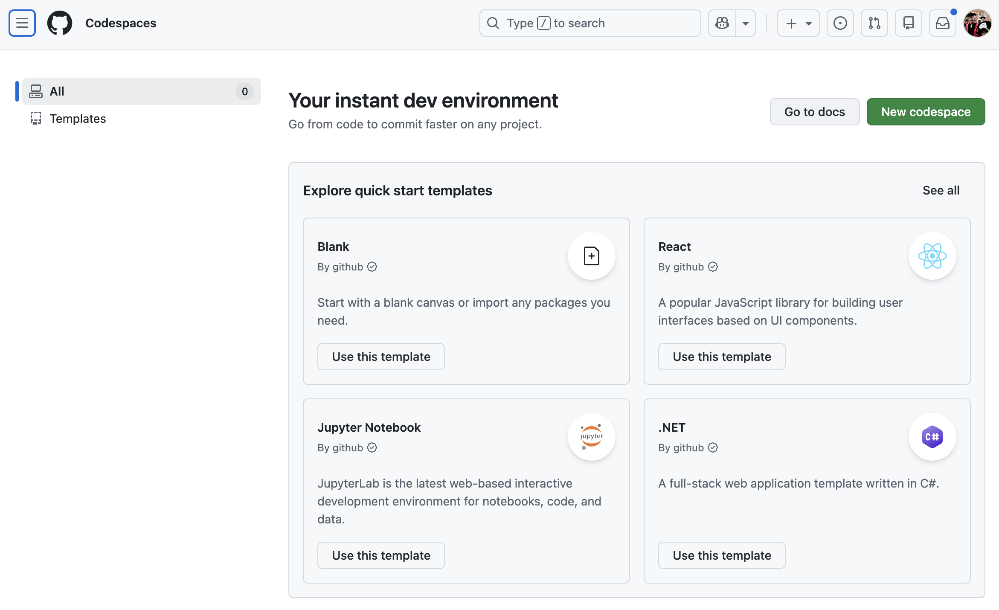
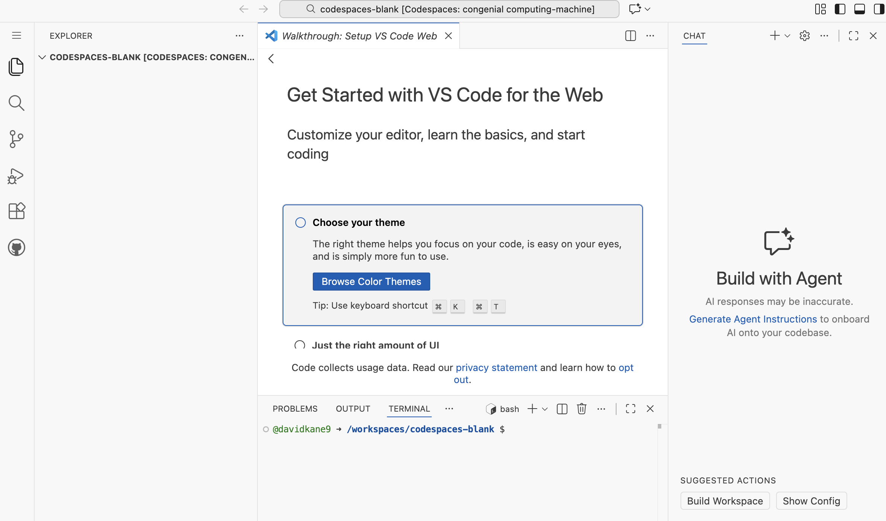

```{r setup, include=FALSE}
library(learnr)
library(tutorial.helpers)
library(knitr)

knitr::opts_chunk$set(echo = FALSE)
knitr::opts_chunk$set(out.width = '90%')
options(tutorial.exercise.timelimit = 60, 
        tutorial.storage = "local") 
```

```{r copy-code-chunk, child = system.file("child_documents/copy_button.Rmd", package = "tutorial.helpers")}
```

```{r info-section, child = system.file("child_documents/info_section.Rmd", package = "tutorial.helpers")}
```


### Introduction
##

ROUGH DRAFT! NOT CURRENTLY WORKING!

This is tutorial introduces you to using [Python](https://www.python.org/) for data science. You will learn how to work with data sets using **polars**, a DataFrame library that uses a syntax similar to R's **tidyverse**. You will learn how to chain operations using method chaining with pipes, and how to make plots using **plotnine**, which implements the grammar of graphics just like **ggplot2** in R.

###

This tutorial assumes that you have already completed the "Getting Started" tutorial in the [**tutorial.helpers**](https://ppbds.github.io/tutorial.helpers/) package. If you haven't, do so now. It is quick!

###

To complete this tutorial, you must either install Python on your local machine or work with [GitHub Codespaces](https://github.com/codespaces) in the cloud. Because Python installation is a tricky, finicky process, we do not provide any guidance. We recommend you use GitHub Codespaces instead. But all our instructions should work just as well on your machine.


## GitHub Codespaces
###

Professionals store their work on GitHub, or a similar *source control* tool. If your computer blows up, you don't want to lose your work. GitHub is like Google Drive --- both live in the cloud --- but for your computational work rather than your documents.

### Exercise 1

Create a GitHub account by following the instructions at the [GitHub homepage](https://github.com/). 

**Follow [this advice](https://happygitwithr.com/github-acct.html#username-advice) when choosing your username.** 

We recommend using a permanent email address for this account, not one which you lose access to when, for example, you change schools or jobs.

Copy your GitHub account URL in the field below.

```{r github-codespaces-1}
question_text(NULL,
    answer(NULL, correct = TRUE),
    allow_retry = TRUE,
    try_again_button = "Edit Answer",
    incorrect = NULL,
    rows = 2)
```

### 

Your answer should look like this:

```         
https://github.com/your-username
```

[Git](https://en.wikipedia.org/wiki/Git) is "software for tracking changes in any set of files, usually used for coordinating work among programmers collaboratively developing source code during software development."

### Exercise 2

Once you are logged in to GitHub, go to https://github.com/codespaces. (This is also accessible via the lefthand-side pull-down menu.)

```{r}

```

Press the "Use this template" button for the "Blank" template. This will create a new Codespace which looks like this:

```{r}

```

Copy/paste the URL for your Codespace

```{r github-codespaces-2}
question_text(NULL,
	answer(NULL, correct = TRUE),
	allow_retry = TRUE,
	try_again_button = "Edit Answer",
	incorrect = NULL,
	rows = 5)
```

###

A new URL is created for each Codespace. Ours was:

```
https://congenial-computing-machine-65ppr9j7wrhqq9.github.dev/
```

Yours will look similar.

### Exercise 3

Place your cursor in the Terminal, type `pwd` and hit `return/enter`. Copy/paste the command and return, an instruction which we will henceforth abbreviate as CP/CR.

```{r github-codespaces-3}
question_text(NULL,
	answer(NULL, correct = TRUE),
	allow_retry = TRUE,
	try_again_button = "Edit Answer",
	incorrect = NULL,
	rows = 5)
```

###

```
@davidkane9 ➜ /workspaces/codespaces-blank $ pwd
/workspaces/codespaces-blank
@davidkane9 ➜ /workspaces/codespaces-blank $ 
```

Your answer should look similar, except with your GitHub ID in place of mine, which is `davidkane9`. In this tutorial, we will just work at the Terminal because our goal is to learn from Python, not learn about Codespaces. We just use Codespaces as a handy, free location to use Python.


### Exercise 4

Type `python` at the Terminal and hit `enter/return`.

CP/CR.

```{r github-codespaces-4}
question_text(NULL,
	answer(NULL, correct = TRUE),
	allow_retry = TRUE,
	try_again_button = "Edit Answer",
	incorrect = NULL,
	rows = 5)
```

###

```
@davidkane9 ➜ /workspaces/codespaces-blank $ python
Python 3.12.1 (main, Nov 27 2025, 10:47:52) [GCC 13.3.0] on linux
Type "help", "copyright", "credits" or "license" for more information.
>>> 
```

This is the Python "shell" or "interpreter" or "console." It allows us to work with Python interactively. We will use the term "Console" and capitalize it for clarity.

### Exercise 5

At the Console,  type `2 + 2` and hit `enter/return`.

CP/CR.

```{r github-codespaces-5}
question_text(NULL,
	answer(NULL, correct = TRUE),
	allow_retry = TRUE,
	try_again_button = "Edit Answer",
	incorrect = NULL,
	rows = 5)
```

###

```
>>> 2 + 2
4
>>> 
```

You can exit the Console by typing `exit()`. Make sure to quit a codespace when you stop using it so that you don't use up your free credits.


## Working with data
###

Learn how to explore a data set using functions like `describe()`, `info()`, and `sample()`.

### Exercise 1

Before you start doing data science, you must import the libraries you are going to use. Let's start with the **polars** library. At the Console, type:

`import polars as pl`

Going forward, we won't remind you to hit `return/enter` after every command.

CP/CR.

```{r working-with-data-1}
question_text(NULL,
	answer(NULL, correct = TRUE),
	allow_retry = TRUE,
	try_again_button = "Edit Answer",
	incorrect = NULL,
	rows = 5)
```

###

You will probably get an error which looks like this:

```
>>> import polars as pl
Traceback (most recent call last):
  File "<stdin>", line 1, in <module>
ModuleNotFoundError: No module named 'polars'
>>> 
```

###

The **polars** library is not installed by default in Codespaces. So we need to install it, and the **plotnines** library ourselves. Note that, in Python, the terms "library," "package," and "module" are used (mostly) interchangeably. 


### Exercise 2

Run `exit()` at the Console. This ends your Python session and dumps you back into the shell. Run:

`pip install polars plotnine`

Note that the command "run" means to type the provided command and then hit the `return/enter` key.

CP/CR. (But just the first few lines.)


```{r working-with-data-2}
question_text(NULL,
	answer(NULL, correct = TRUE),
	allow_retry = TRUE,
	try_again_button = "Edit Answer",
	incorrect = NULL,
	rows = 5)
```

###

```
>>> exit()
@davidkane9 ➜ /workspaces/codespaces-blank $ pip install polars plotnine
Collecting polars
  Downloading polars-1.36.1-py3-none-any.whl.metadata (10 kB)
Collecting plotnine
  Downloading plotnine-0.15.2-py3-none-any.whl.metadata (9.5 kB)
Collecting polars-runtime-32==1.36.1 (from polars)
  Downloading polars_runtime_32-1.36.1-cp39-abi3-manylinux_2_17_x86_64.manylinux2014_x86_64.whl.metadata (1.5 kB)
...
```

One the of the most important parts of data science is keeping track of all the packages which you need and ensuring that they are installed when you need them.

### Exercise 3

Run `python` at the Terminal. This starts the Python Console again. At the Console, type:

`import polars as pl`

Going forward, we won't remind you to hit `return/enter` after every command.

CP/CR.

```{r working-with-data-3}
question_text(NULL,
	answer(NULL, correct = TRUE),
	allow_retry = TRUE,
	try_again_button = "Edit Answer",
	incorrect = NULL,
	rows = 5)
```

###

```
@davidkane9 ➜ /workspaces/codespaces-blank $ python
Python 3.12.1 (main, Nov 27 2025, 10:47:52) [GCC 13.3.0] on linux
Type "help", "copyright", "credits" or "license" for more information.
>>> import polars as pl
>>> 
```

In Python, we import libraries to access their functions and data. The `import` statement makes the library available, and using `as pl` creates a short alias so we can type `pl` instead of `polars` every time we use a function from the **polars** library.

Your answer never needs to match ours perfectly. Our goal is just to ensure that you are actually following the instructions.

### Exercise 4

DataFrames are spreadsheet-like data structures in **polars**. Let's load the famous iris dataset. We'll read it from a URL.

In the Console, run:

```
iris = pl.read_csv("https://raw.githubusercontent.com/mwaskom/seaborn-data/master/iris.csv")
iris
```

CP/CR.

```{r working-with-data-4}
question_text(NULL,
answer(NULL, correct = TRUE),
allow_retry = TRUE,
try_again_button = "Edit Answer",
incorrect = NULL,
rows = 15)
```

###

```
>>> iris = pl.read_csv("https://raw.githubusercontent.com/mwaskom/seaborn-data/master/iris.csv")
>>> iris
shape: (150, 5)
┌──────────────┬─────────────┬──────────────┬─────────────┬───────────┐
│ sepal_length ┆ sepal_width ┆ petal_length ┆ petal_width ┆ species   │
│ ---          ┆ ---         ┆ ---          ┆ ---         ┆ ---       │
│ f64          ┆ f64         ┆ f64          ┆ f64         ┆ str       │
╞══════════════╪═════════════╪══════════════╪═════════════╪═══════════╡
│ 5.1          ┆ 3.5         ┆ 1.4          ┆ 0.2         ┆ setosa    │
│ 4.9          ┆ 3.0         ┆ 1.4          ┆ 0.2         ┆ setosa    │
│ 4.7          ┆ 3.2         ┆ 1.3          ┆ 0.2         ┆ setosa    │
│ 4.6          ┆ 3.1         ┆ 1.5          ┆ 0.2         ┆ setosa    │
│ 5.0          ┆ 3.6         ┆ 1.4          ┆ 0.2         ┆ setosa    │
│ …            ┆ …           ┆ …            ┆ …           ┆ …         │
│ 6.7          ┆ 3.0         ┆ 5.2          ┆ 2.3         ┆ virginica │
│ 6.3          ┆ 2.5         ┆ 5.0          ┆ 1.9         ┆ virginica │
│ 6.5          ┆ 3.0         ┆ 5.2          ┆ 2.0         ┆ virginica │
│ 6.2          ┆ 3.4         ┆ 5.4          ┆ 2.3         ┆ virginica │
│ 5.9          ┆ 3.0         ┆ 5.1          ┆ 1.8         ┆ virginica │
└──────────────┴─────────────┴──────────────┴─────────────┴───────────┘
>>> 
```

Whenever we show outputs like this after a question, then we are showing our answer to the previous question, even if we do not label it as such.

### Exercise 5

In the Console, run `iris.describe()`. This provides summary statistics for numerical columns.

CP/CR.

```{r working-with-data-5}
question_text(NULL,
answer(NULL, correct = TRUE),
allow_retry = TRUE,
try_again_button = "Edit Answer",
incorrect = NULL,
rows = 10)
```

###

```
>>> iris.describe()
shape: (9, 6)
┌────────────┬──────────────┬─────────────┬──────────────┬─────────────┬───────────┐
│ statistic  ┆ sepal_length ┆ sepal_width ┆ petal_length ┆ petal_width ┆ species   │
│ ---        ┆ ---          ┆ ---         ┆ ---          ┆ ---         ┆ ---       │
│ str        ┆ f64          ┆ f64         ┆ f64          ┆ f64         ┆ str       │
╞════════════╪══════════════╪═════════════╪══════════════╪═════════════╪═══════════╡
│ count      ┆ 150.0        ┆ 150.0       ┆ 150.0        ┆ 150.0       ┆ 150       │
│ null_count ┆ 0.0          ┆ 0.0         ┆ 0.0          ┆ 0.0         ┆ 0         │
│ mean       ┆ 5.843333     ┆ 3.057333    ┆ 3.758        ┆ 1.199333    ┆ null      │
│ std        ┆ 0.828066     ┆ 0.435866    ┆ 1.765298     ┆ 0.762238    ┆ null      │
│ min        ┆ 4.3          ┆ 2.0         ┆ 1.0          ┆ 0.1         ┆ setosa    │
│ 25%        ┆ 5.1          ┆ 2.8         ┆ 1.6          ┆ 0.3         ┆ null      │
│ 50%        ┆ 5.8          ┆ 3.0         ┆ 4.4          ┆ 1.3         ┆ null      │
│ 75%        ┆ 6.4          ┆ 3.3         ┆ 5.1          ┆ 1.8         ┆ null      │
│ max        ┆ 7.9          ┆ 4.4         ┆ 6.9          ┆ 2.5         ┆ virginica │
└────────────┴──────────────┴─────────────┴──────────────┴─────────────┴───────────┘
>>> 
```

###

This method provides a quick statistical overview of each numerical variable in the dataset. In some cases, the tutorial displays the same object differently from what you were able to copy/paste. And that is OK! Your answer does not need to match our answer.

### Exercise 6

In the Console, run `iris.sample()`. This selects a random row from the dataset.

CP/CR.

```{r working-with-data-6}
question_text(NULL,
answer(NULL, correct = TRUE),
allow_retry = TRUE,
try_again_button = "Edit Answer",
incorrect = NULL,
rows = 7)
```

###

```
>>> iris.sample()
shape: (1, 5)
┌──────────────┬─────────────┬──────────────┬─────────────┬───────────┐
│ sepal_length ┆ sepal_width ┆ petal_length ┆ petal_width ┆ species   │
│ ---          ┆ ---         ┆ ---          ┆ ---         ┆ ---       │
│ f64          ┆ f64         ┆ f64          ┆ f64         ┆ str       │
╞══════════════╪═════════════╪══════════════╪═════════════╪═══════════╡
│ 6.3          ┆ 2.8         ┆ 5.1          ┆ 1.5         ┆ virginica │
└──────────────┴─────────────┴──────────────┴─────────────┴───────────┘
>>> 
```

Your answer will differ from this answer because of the inherent randomness in methods like `sample()`.

### Exercise 7

In the Console, hit the Up Arrow to retrieve the previous command. Edit it to add the argument `n = 4` to `iris.sample()`. This will return 4 random rows from the `iris` dataset.

CP/CR.

```{r working-with-data-7}
question_text(NULL,
answer(NULL, correct = TRUE),
allow_retry = TRUE,
try_again_button = "Edit Answer",
incorrect = NULL,
rows = 10)
```

###

```
>>> iris.sample(n = 4)
shape: (4, 5)
┌──────────────┬─────────────┬──────────────┬─────────────┬───────────┐
│ sepal_length ┆ sepal_width ┆ petal_length ┆ petal_width ┆ species   │
│ ---          ┆ ---         ┆ ---          ┆ ---         ┆ ---       │
│ f64          ┆ f64         ┆ f64          ┆ f64         ┆ str       │
╞══════════════╪═════════════╪══════════════╪═════════════╪═══════════╡
│ 5.0          ┆ 3.3         ┆ 1.4          ┆ 0.2         ┆ setosa    │
│ 6.3          ┆ 2.9         ┆ 5.6          ┆ 1.8         ┆ virginica │
│ 5.6          ┆ 2.8         ┆ 4.9          ┆ 2.0         ┆ virginica │
│ 5.2          ┆ 3.4         ┆ 1.4          ┆ 0.2         ┆ setosa    │
└──────────────┴─────────────┴──────────────┴─────────────┴───────────┘
>>> 
```

###

Editing code directly in the Console quickly becomes annoying. See the **[positron.tutorials](https://ppbds.github.io/positron.tutorials/)** package for tutorials about using the Positron IDE to write and organize your code.

### Exercise 8

In the Console, run `print(iris)`. This returns the same result as typing `iris`.

CP/CR.

```{r working-with-data-8}
question_text(NULL,
answer(NULL, correct = TRUE),
allow_retry = TRUE,
try_again_button = "Edit Answer",
incorrect = NULL,
rows = 10)
```

###

```
>>> print(iris)
shape: (150, 5)
┌──────────────┬─────────────┬──────────────┬─────────────┬───────────┐
│ sepal_length ┆ sepal_width ┆ petal_length ┆ petal_width ┆ species   │
│ ---          ┆ ---         ┆ ---          ┆ ---         ┆ ---       │
│ f64          ┆ f64         ┆ f64          ┆ f64         ┆ str       │
╞══════════════╪═════════════╪══════════════╪═════════════╪═══════════╡
│ 5.1          ┆ 3.5         ┆ 1.4          ┆ 0.2         ┆ setosa    │
│ 4.9          ┆ 3.0         ┆ 1.4          ┆ 0.2         ┆ setosa    │
│ 4.7          ┆ 3.2         ┆ 1.3          ┆ 0.2         ┆ setosa    │
│ 4.6          ┆ 3.1         ┆ 1.5          ┆ 0.2         ┆ setosa    │
│ 5.0          ┆ 3.6         ┆ 1.4          ┆ 0.2         ┆ setosa    │
│ …            ┆ …           ┆ …            ┆ …           ┆ …         │
│ 6.7          ┆ 3.0         ┆ 5.2          ┆ 2.3         ┆ virginica │
│ 6.3          ┆ 2.5         ┆ 5.0          ┆ 1.9         ┆ virginica │
│ 6.5          ┆ 3.0         ┆ 5.2          ┆ 2.0         ┆ virginica │
│ 6.2          ┆ 3.4         ┆ 5.4          ┆ 2.3         ┆ virginica │
│ 5.9          ┆ 3.0         ┆ 5.1          ┆ 1.8         ┆ virginica │
└──────────────┴─────────────┴──────────────┴─────────────┴───────────┘
>>> 
```

You can control how many rows to display using `iris.head(n)` for the first n rows or `iris.tail(n)` for the last n rows.

### Exercise 9

In the Console, run `iris.head(3)`. This returns the first 3 rows of the `iris` dataset.

CP/CR.

```{r working-with-data-9}
question_text(NULL,
answer(NULL, correct = TRUE),
allow_retry = TRUE,
try_again_button = "Edit Answer",
incorrect = NULL,
rows = 8)
```

###

```
>>> iris.head(3)
shape: (3, 5)
┌──────────────┬─────────────┬──────────────┬─────────────┬─────────┐
│ sepal_length ┆ sepal_width ┆ petal_length ┆ petal_width ┆ species │
│ ---          ┆ ---         ┆ ---          ┆ ---         ┆ ---     │
│ f64          ┆ f64         ┆ f64          ┆ f64         ┆ str     │
╞══════════════╪═════════════╪══════════════╪═════════════╪═════════╡
│ 5.1          ┆ 3.5         ┆ 1.4          ┆ 0.2         ┆ setosa  │
│ 4.9          ┆ 3.0         ┆ 1.4          ┆ 0.2         ┆ setosa  │
│ 4.7          ┆ 3.2         ┆ 1.3          ┆ 0.2         ┆ setosa  │
└──────────────┴─────────────┴──────────────┴─────────────┴─────────┘
>>> 
```

###

`head()` by default gives the top of the DataFrame, so your answer should match our answer. `sample()`, on the other hand, picks random rows to return. But, in both cases, the result is a DataFrame.

A central organizing principle of **polars** is that most methods take a DataFrame and return a DataFrame. This allows us to "chain" commands together, one after the other, creating a pipeline very similar to R's pipe operator `|>`.

### Exercise 10

In the Console, run `help(iris)`. CP/CR (but just the first few rows).


```{r working-with-data-10}
question_text(NULL,
answer(NULL, correct = TRUE),
allow_retry = TRUE,
try_again_button = "Edit Answer",
incorrect = NULL,
rows = 10)
```

###

```
Help on DataFrame in module polars.dataframe.frame object:

class DataFrame(builtins.object)
 |  DataFrame(data: 'FrameInitTypes | None' = None, schema: 'SchemaDefinition | None' = None, *, schema_overrides: 'SchemaDict | N
one' = None, strict: 'bool' = True, orient: 'Orientation | None' = None, infer_schema_length: 'int | None' = 100, nan_to_null: 'bo
ol' = False) -> 'None'
...
```

To exit from the help interface, type `q` and hit `return/enter`.

### Exercise 11

In the Console, run `iris.schema`. This shows the column names and data types. CP/CR.

```{r working-with-data-11}
question_text(NULL,
answer(NULL, correct = TRUE),
allow_retry = TRUE,
try_again_button = "Edit Answer",
incorrect = NULL,
rows = 10)
```

###

```
>>> iris.schema
Schema({'sepal_length': Float64, 'sepal_width': Float64, 'petal_length': Float64, 'petal_width': Float64, 'species': String})
>>> 
```

The `schema` attribute displays information about the DataFrame's structure including the data types of each column. For example, `sepal_length` is listed as `Float64`, meaning it's a 64-bit floating-point number. You can also use `iris.dtypes` to see just the data types, or `iris.columns` to see just the column names.

### Exercise 12

In the Console, run `import math` then `math.sqrt(144)`.

CP/CR.

```{r working-with-data-12}
question_text(NULL,
answer(NULL, correct = TRUE),
allow_retry = TRUE,
try_again_button = "Edit Answer",
incorrect = NULL,
rows = 5)
```

###

```
>>> import math
>>> math.sqrt(144)
12.0
>>> 
```

The square root function is one of many built-in functions in Python's **math** package. Most return their result, which Python then, by default, prints out. We did not need to use `pip` to install the math module because it is part of the base Python installation.

### Exercise 13

In the Console, run `x = math.sqrt(144)`.

CP/CR.

```{r working-with-data-13}
question_text(NULL,
answer(NULL, correct = TRUE),
allow_retry = TRUE,
try_again_button = "Edit Answer",
incorrect = NULL,
rows = 3)
```

###

```
x = math.sqrt(144)
```

###

The `=` symbol is the assignment operator in Python. In this case, we are *assigning* the value of `math.sqrt(144)` to the variable `x`. Nothing is printed out because of that assignment.

### Exercise 14

In the Console, run `x` or `print(x)`.

CP/CR.

```{r working-with-data-14}
question_text(NULL,
answer(NULL, correct = TRUE),
allow_retry = TRUE,
try_again_button = "Edit Answer",
incorrect = NULL,
rows = 3)
```

###

```
>>> x
12.0
>>> 
```

Now that `x` has been defined in the Console, it is available for your use. Above, we just print it out. But we could also use it in other calculations, e.g., `x + 5`.


## Method chaining and plots
###

Although **polars** includes hundreds of methods for data manipulation, the most important are `filter()`, `select()`, `sort()`, `with_columns()`, and `group_by()` with `agg()`. These work very similarly to their R tidyverse equivalents.

### Exercise 1

Let's warm up by examining the `tips` dataset. Run:

```
tips = pl.read_csv("https://raw.githubusercontent.com/mwaskom/seaborn-data/master/tips.csv")
tips
```

CP/CR.

```{r method-chaining-and-plots-1}
question_text(NULL,
	answer(NULL, correct = TRUE),
	allow_retry = TRUE,
	try_again_button = "Edit Answer",
	incorrect = NULL,
	rows = 20)
```

###

```
>>> tips = pl.read_csv("https://raw.githubusercontent.com/mwaskom/seaborn-data/master/tips.csv")
>>> tips
shape: (244, 7)
┌────────────┬──────┬────────┬────────┬──────┬────────┬──────┐
│ total_bill ┆ tip  ┆ sex    ┆ smoker ┆ day  ┆ time   ┆ size │
│ ---        ┆ ---  ┆ ---    ┆ ---    ┆ ---  ┆ ---    ┆ ---  │
│ f64        ┆ f64  ┆ str    ┆ str    ┆ str  ┆ str    ┆ i64  │
╞════════════╪══════╪════════╪════════╪══════╪════════╪══════╡
│ 16.99      ┆ 1.01 ┆ Female ┆ No     ┆ Sun  ┆ Dinner ┆ 2    │
│ 10.34      ┆ 1.66 ┆ Male   ┆ No     ┆ Sun  ┆ Dinner ┆ 3    │
│ 21.01      ┆ 3.5  ┆ Male   ┆ No     ┆ Sun  ┆ Dinner ┆ 3    │
│ 23.68      ┆ 3.31 ┆ Male   ┆ No     ┆ Sun  ┆ Dinner ┆ 2    │
│ 24.59      ┆ 3.61 ┆ Female ┆ No     ┆ Sun  ┆ Dinner ┆ 4    │
│ …          ┆ …    ┆ …      ┆ …      ┆ …    ┆ …      ┆ …    │
│ 29.03      ┆ 5.92 ┆ Male   ┆ No     ┆ Sat  ┆ Dinner ┆ 3    │
│ 27.18      ┆ 2.0  ┆ Female ┆ Yes    ┆ Sat  ┆ Dinner ┆ 2    │
│ 22.67      ┆ 2.0  ┆ Male   ┆ Yes    ┆ Sat  ┆ Dinner ┆ 2    │
│ 17.82      ┆ 1.75 ┆ Male   ┆ No     ┆ Sat  ┆ Dinner ┆ 2    │
│ 18.78      ┆ 3.0  ┆ Female ┆ No     ┆ Thur ┆ Dinner ┆ 2    │
└────────────┴──────┴────────┴────────┴──────┴────────┴──────┘
>>> 
```

The `tips` dataset contains information about restaurant tips, including total bill, tip amount, and other variables.

### Exercise 2

Run `tips.describe()` to see summary statistics.

```{python pipes-and-plots-2, exercise = TRUE}

```

```{python pipes-and-plots-2-hint-1, eval = FALSE}
import polars as pl
tips = pl.read_csv("https://raw.githubusercontent.com/mwaskom/seaborn-data/master/tips.csv")
tips.describe()
```

###

Note that this gives us statistics for the numerical columns in the dataset.

### Exercise 3

Use `.drop_nulls()` to remove rows with missing values. In **polars**, we pipe operations by calling methods one after another, just like in R! Try:

```
tips.drop_nulls()
```

```{python pipes-and-plots-3, exercise = TRUE}

```

```{python pipes-and-plots-3-hint-1, eval = FALSE}
import polars as pl
tips = pl.read_csv("https://raw.githubusercontent.com/mwaskom/seaborn-data/master/tips.csv")
tips.drop_nulls()
```

###

Note the number of rows in the DataFrame after `drop_nulls()`. This dataset actually has no missing values, so all rows remain.

We can chain methods by writing `tips.drop_nulls().head()` to first drop NA values and then show the first few rows.

### Exercise 4

Chain `.filter()` to filter rows. Use `pl.col("time") == "Dinner"` as the argument. This is very similar to R's `filter()`!

```{python pipes-and-plots-4, exercise = TRUE}

```

```{python pipes-and-plots-4-hint-1, eval = FALSE}
import polars as pl
tips = pl.read_csv("https://raw.githubusercontent.com/mwaskom/seaborn-data/master/tips.csv")
tips.filter(pl.col("time") == "Dinner")
```

###

This workflow --- in which we chain DataFrame methods together --- is very common in **polars** and very similar to R's pipe workflow.

The resulting DataFrame has the same number of columns as `tips` because `filter()` only affects the rows. But there are fewer rows now.

### Exercise 5

Continue the chain with `.select()` to choose specific columns. Use `["total_bill", "tip", "sex", "day"]` as the argument. You can use the "Copy Code" button to avoid retyping.

```{python pipes-and-plots-5, exercise = TRUE}

```

<button onclick = "transfer_code(this)">Copy previous code</button>

```{python pipes-and-plots-5-hint-1, eval = FALSE}
import polars as pl
tips = pl.read_csv("https://raw.githubusercontent.com/mwaskom/seaborn-data/master/tips.csv")
tips.filter(pl.col("time") == "Dinner").select(["total_bill", "tip", "sex", "day"])
```

###

Because `select()` doesn't affect rows, we have the same number as after `filter()`. But we only have 4 columns now. This is just like R's `select()` function!

### Exercise 6

Copy previous code. Continue the chain with `.describe()`.

```{python pipes-and-plots-6, exercise = TRUE}

```

<button onclick = "transfer_code(this)">Copy previous code</button>

```{python pipes-and-plots-6-hint-1, eval = FALSE}
tips.filter(pl.col("time") == "Dinner").select(["total_bill", "tip", "sex", "day"]).describe()
```

###

This gives us summary statistics for our filtered and selected data.

### Exercise 7

Copy previous code. Replace `.describe()` with `.drop_nulls()`.

```{python pipes-and-plots-7, exercise = TRUE}

```

<button onclick = "transfer_code(this)">Copy previous code</button>

```{python pipes-and-plots-7-hint-1, eval = FALSE}
tips.filter(pl.col("time") == "Dinner").select(["total_bill", "tip", "sex", "day"]).drop_nulls()
```

###

The number of rows stays the same because there are no missing values in this subset.

### Exercise 8

Continue the chain with `.sort("tip")` to sort by the tip column.

```{python pipes-and-plots-8, exercise = TRUE}

```

<button onclick = "transfer_code(this)">Copy previous code</button>

```{python pipes-and-plots-8-hint-1, eval = FALSE}
tips.filter(pl.col("time") == "Dinner").select(["total_bill", "tip", "sex", "day"]).drop_nulls().sort("tip")
```

###

The `sort()` method sorts the rows of a DataFrame. By default, it sorts in ascending order. This is just like R's `arrange()` function!

### Exercise 9

Copy the previous code. Add `descending=True` as an argument to `sort()` to sort in descending order. This is like using `desc()` in R!

```{python pipes-and-plots-9, exercise = TRUE}

```

<button onclick = "transfer_code(this)">Copy previous code</button>

```{python pipes-and-plots-9-hint-1, eval = FALSE}
.sort("tip", descending=True)
```

###

Got to respect someone who tips $10!

### Exercise 10

Let's make a plot! For plotting, we'll use plotnine, which works exactly like ggplot2 in R. Copy the previous code, but remove the `.sort()` line. Instead, save the result to a variable called `tips_dinner`, then convert it to pandas with `.to_pandas()` (plotnine works with pandas DataFrames), and create a plot using `ggplot()`.

Here's the pattern:
```
import polars as pl
from plotnine import ggplot, aes, geom_point

tips = pl.read_csv("https://raw.githubusercontent.com/mwaskom/seaborn-data/master/tips.csv")

tips_dinner = (tips
  .filter(pl.col("time") == "Dinner")
  .select(["total_bill", "tip", "sex", "day"])
  .drop_nulls()
  .to_pandas())

ggplot(tips_dinner, aes(x='total_bill', y='tip')) + geom_point()
```

```{python pipes-and-plots-10, exercise = TRUE}

```

<button onclick = "transfer_code(this)">Copy previous code</button>

```{python pipes-and-plots-10-hint-1, eval = FALSE}
from plotnine import ggplot, aes, geom_point

tips_dinner = (tips
  .filter(pl.col("time") == "Dinner")
  .select([...])
  .drop_nulls()
  .to_pandas())

ggplot(tips_dinner, aes(x='...', y='...')) + geom_point()
```

###

This creates a scatter plot showing the relationship between total bill and tip amount. Notice how similar this is to ggplot2 in R! We use `ggplot()`, `aes()`, and `geom_point()` just like in R.

### Exercise 11

Copy previous code. Now let's add jitter to see overlapping points better, just like in R! Change `geom_point()` to `geom_jitter()`.

```{python pipes-and-plots-11, exercise = TRUE}

```

<button onclick = "transfer_code(this)">Copy previous code</button>

```{python pipes-and-plots-11-hint-1, eval = FALSE}
from plotnine import ggplot, aes, geom_jitter

ggplot(tips_dinner, aes(x='total_bill', y='tip')) + geom_jitter()
```

###

This is exactly like using `geom_jitter()` in R's ggplot2! The jitter adds a small amount of random noise to help us see overlapping points.

### Exercise 12

Finally, add a title and labels using `plt.title()`, `plt.xlabel()`, and `plt.ylabel()`. Consider this example:

```
import matplotlib.pyplot as plt
import seaborn as sns
tips = sns.load_dataset('tips')

tips_dinner = (tips
               .query('time == "Dinner"')
               [['total_bill', 'tip', 'sex', 'day']]
               .dropna())

sns.scatterplot(data=tips_dinner, x='total_bill', y='tip', alpha=0.6)
plt.title('Dinner Tips vs Total Bill')
plt.xlabel('Total Bill ($)')
plt.ylabel('Tip ($)')
plt.show()
```

You can make yours look like this, or create your own title and labels.

```{python pipes-and-plots-12, exercise = TRUE}

```

<button onclick = "transfer_code(this)">Copy previous code</button>

```{python pipes-and-plots-12-hint-1, eval = FALSE}
plt.title('...')
plt.xlabel('...')
plt.ylabel('...')
plt.show()
```

###

Note that the code in the exercise block is not saved. If you want to save the code, you can copy/paste it into a Python script file (.py).

## Generative AI
###

Generative AI --- tools like [ChatGPT](https://chat.openai.com/), [Grok](https://x.ai/), [Claude](https://claude.ai/), [DeepSeek](https://www.deepseek.com/en) and so on --- are the future, of data science and everything else. The more you use these tools, the better off you will be. Unfortunately, the tools are changing so much that it is hard for a tutorial like this to stay up-to-date. This section provides some general advice and practice exercises.

### Exercise 1

Using any AI you like, ask it to write a one-sentence summary about the Python programming language. Copy the answer below.

```{r generative-ai-1}
question_text(NULL,
answer(NULL, correct = TRUE),
allow_retry = TRUE,
try_again_button = "Edit Answer",
incorrect = NULL,
rows = 5)
```

###

Example answer:

```
Python is a high-level, interpreted programming language known for its simplicity, readability, and versatility, widely used for web development, data analysis, artificial intelligence, and scientific computing.
```

If you do not want to pay for an AI service, then you will probably need to have free accounts with several different services. That way, if one service cuts you off for the day, you can switch to another.

### Exercise 2

Type this in the Python Console and hit Enter:
```
import polars as pl
iris = pl.read_csv("https://raw.githubusercontent.com/mwaskom/seaborn-data/master/iris.csv")
iris.head()
```

Copy/paste the command and the first few lines of output.

```{r generative-ai-2}
question_text(NULL,
answer(NULL, correct = TRUE),
allow_retry = TRUE,
try_again_button = "Edit Answer",
incorrect = NULL,
rows = 10)
```

###

```
import polars as pl
iris = pl.read_csv("https://raw.githubusercontent.com/mwaskom/seaborn-data/master/iris.csv")
iris.head()
```

When working with AI, you often need to tell it about the dataset. The easiest way to do that is often to just copy/paste the first few rows. That shows the AI what the column names and types are, which is key information for creating plots and data pipelines.

### Exercise 3

Copy/paste the top of the `iris` DataFrame into your AI interface and ask it to create a chain of methods using **polars** that calculates the average `sepal_length` for each `species`. Run the provided code in the Console. If it fails, show the AI the error and ask for better code.

CP/CR.

```{r generative-ai-3}
question_text(NULL,
answer(NULL, correct = TRUE),
allow_retry = TRUE,
try_again_button = "Edit Answer",
incorrect = NULL,
rows = 10)
```

###

Claude gave us this answer:

```
import polars as pl
iris = pl.read_csv("https://raw.githubusercontent.com/mwaskom/seaborn-data/master/iris.csv")
iris.group_by("species").agg(pl.col("sepal_length").mean())
```

###

This is a great answer! It uses `group_by()` just like R's tidyverse, and then `agg()` (short for aggregate) with `pl.col()` to specify which column to calculate the mean for. Notice how similar this is to R:

R version: `iris |> group_by(species) |> summarize(mean_sepal_length = mean(sepal_length))`

**polars** version: `iris.group_by("species").agg(pl.col("sepal_length").mean())`

Using AI is good! But intelligent use --- use in which you understand what the AI has done and try to improve/clarify its answer --- is even better.

### Exercise 4

Ask AI to create a beautiful plot using the `iris` dataset and the plotnine/seaborn libraries. Run the provided code in the Console. If it fails, show the AI the error and ask for better code.

```{r generative-ai-4}
question_text(NULL,
answer(NULL, correct = TRUE),
allow_retry = TRUE,
try_again_button = "Edit Answer",
incorrect = NULL,
rows = 20)
```

###

Example code from DeepSeek:

```
from plotnine import (
    ggplot, aes, geom_point, geom_smooth,
    facet_wrap, labs, theme_minimal
)
import polars as pl

# Load iris with Polars, then convert to pandas for plotnine
iris = pl.read_csv("https://raw.githubusercontent.com/mwaskom/seaborn-data/master/iris.csv").to_pandas()

(
    ggplot(iris, aes(x="sepal_length", y="sepal_width", color="species")) +
    geom_point(size=3, alpha=0.7) +
    geom_smooth(method="loess", se=False, span=0.9) +
    facet_wrap("~ species") +
    labs(
        title="Sepal Shape Variation Across Iris Species",
        x="Sepal Length (cm)",
        y="Sepal Width (cm)",
        color="Species"
    ) +
    theme_minimal()
)
```

###

Note:

* AI tools are great at generating visualizations, but you should understand the code they provide
* Different AI tools may suggest different approaches - compare and learn from them
* Always test the code and make sure you understand what each line does
* You can ask the AI to explain any part of the code you don't understand

The key is practice. Use AI every day!

## Summary
###

This tutorial introduced you to the Python language for data science. You learned how to work with datasets using **polars**, a fast DataFrame library with syntax very similar to R's tidyverse. You learned how to chain operations using method chaining (just like R's pipe operator `|>`), and how to make plots using **matplotlib** and **seaborn**.

The key advantage of **polars** is that it feels familiar to R users while providing the speed and ecosystem of Python. Functions like `filter()`, `select()`, `sort()`, and `group_by()` work almost identically to their R counterparts!

```{r download-answers, child = system.file("child_documents/download_answers.Rmd", package = "tutorial.helpers")}
```
