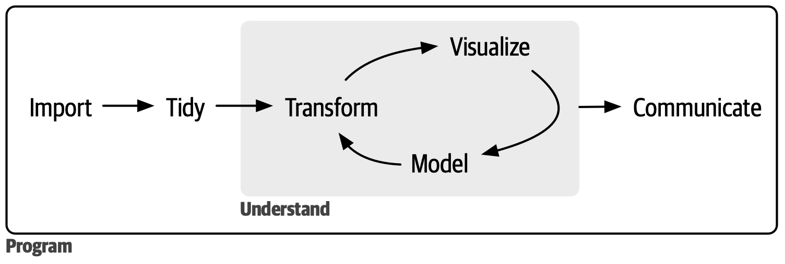

```{r setup, include = FALSE}
library(learnr)
library(tutorial.helpers)
library(knitr)
library(tidyverse)

knitr::opts_chunk$set(echo = FALSE)
knitr::opts_chunk$set(out.width = '90%')
options(tutorial.exercise.timelimit = 60, 
        tutorial.storage = "local") 

scat_p <- ggplot(data = mpg, 
                 mapping = aes(x = displ, 
                               y = hwy)) +
  geom_point(alpha = 0.5, color = "steelblue") +
  labs(title = "Measurements for Engine Displacement and Highway Fuel Efficiency of Select Car Models",
       subtitle = "Cars with greater engineer displacement are less fuel efficient",
        x = "Engine Displacement (L)",
        y = "Highway Efficiency (mpg)", 
       caption = "EPA (2008)")
```

```{r copy-code-chunk, child = system.file("child_documents/copy_button.Rmd", package = "tutorial.helpers")}
```

```{r info-section, child = system.file("child_documents/info_section.Rmd", package = "tutorial.helpers")}
```

<!-- Make this tutorial better. Make sure there are no mistakes. Make sure it is clear.  Do some reminding of stuff from Getting Started from tutorial.helpers. -->

## Introduction
### 

This tutorial will introduce you to the R language. Our approach is inspired by [*R for Data Science (2e)*](https://r4ds.hadley.nz/) by Hadley Wickham, Mine Çetinkaya-Rundel, and Garrett Grolemund. You will learn how to work with data sets using the **[tidyverse](https://tidyverse.tidyverse.org/)** package. You will learn how to direct the result of one function to another using the pipe -- `|>` --- and how to make a plot using the `ggplot()` function.

### 

This tutorial assumes that you have already completed the "Getting Started" tutorial in the [**tutorial.helpers**](https://ppbds.github.io/tutorial.helpers/) package. If you haven't, do so now. It is quick!

### 

Start a new window with `File -> New Window`. This new window is the location in which you will do all the work for the tutorial. The current window, the one in which you are reading these words, is just used to run this tutorial. 

## Working with data
### 

Learn how to explore a data set using functions like `summary()`, `glimpse()`, and `slice_sample()`. 

### Exercise 1

The steps of a typical data science project:

```{r}

```

### 

The first step in a data science project is to import your data into R. This typically means that you take data stored in a file, database, or web application programming interface (API) and load it into a data frame in R. If you can’t get your data into R, you can’t do data science on it!

###

Before you start doing data science, you must load the packages you are going to use. Use the function `library()` to load the **tidyverse** package.

```{r working-with-data-1, exercise = TRUE}

```

```{r working-with-data-1-hint-1, eval = FALSE}
library(...)
```

```{r working-with-data-1-test, include = FALSE}
library(tidyverse)
```

### 

"Library" and "package" mean the same thing in R. We have different words for historical reasons. However, only the `library()` command will load a package/library, giving us access to the functions and data which it contains.

The check mark which has appeared next to "Exercise 1" above indicates that you have submitted your answer. It doesn't verify that you have answered the question correctly.

### Exercise 2

In this tutorial, you will sometimes enter code into the exercise blocks, as you did above. But we will generally ask you to run code in the Console. (You will do this in the other Positron window, since the Console in this window is currently busy running this tutorial.) Example:

In the Console, run `library(tidyverse)`.

With Console questions, we will usually ask you to **c**opy/**p**aste the **c**ommand/**r**esponse into an answer block, like the one below. We usually shorten those instructions as CP/CR. Do that now.


```{r working-with-data-2}
question_text(NULL,
	answer(NULL, correct = TRUE),
	allow_retry = TRUE,
	try_again_button = "Edit Answer",
	incorrect = NULL,
	rows = 8)
```

###

Your answer should look like:

```{r working-with-data-2-test, echo = TRUE}
library(tidyverse)
```

Your answer never needs to match ours perfectly. Our goal is just to ensure that you are actually following the instructions.

### Exercise 3

Data frames, also referred to as "tibbles," are spreadsheet-type data sets. 

In the Console, run `diamonds`.

CP/CR.

```{r working-with-data-3}
question_text(NULL,
	answer(NULL, correct = TRUE),
	allow_retry = TRUE,
	try_again_button = "Edit Answer",
	incorrect = NULL,
	rows = 5)
```

###

```{r working-with-data-3-test, echo = TRUE}
diamonds
```

Whenever we show outputs like this after a question, then we are showing our answer to the previous question, even if we do not label it as such.

After importing your data, it is a good idea to **tidy** it. Tidying your data means storing it in a consistent form that matches the semantics of the dataset with how it is stored. 

### Exercise 4

In the Console, run `summary()` on `diamonds`.

CP/CR.

```{r working-with-data-4}
question_text(NULL,
	answer(NULL, correct = TRUE),
	allow_retry = TRUE,
	try_again_button = "Edit Answer",
	incorrect = NULL,
	rows = 5)
```

###

```{r working-with-data-4-test, echo = TRUE}
summary(diamonds)
```

###

This function provides a quick statistics overview of each variable in the data set. 

### 

When your data is tidy, each column is a variable and each row is an observation. Tidy data is important because the consistent structure lets you focus your efforts on answering questions about the data, not fighting to get the data into the right form for different functions. 

### Exercise 5

In the Console, run `slice_sample()` on `diamonds`. This selects a random row from the data set.

CP/CR.

```{r working-with-data-5}
question_text(NULL,
	answer(NULL, correct = TRUE),
	allow_retry = TRUE,
	try_again_button = "Edit Answer",
	incorrect = NULL,
	rows = 5)
```

###

```{r working-with-data-5-test, echo = TRUE}
slice_sample((diamonds))
```

###

Your answer will differ from this answer because of the inherent randomness in functions like `slice_sample()`.

Once you have tidy data, a common next step is to **transform** it. Transformation includes narrowing in on observations of interest (like all the people in one city or all the data from the last year), creating new variables that are functions of existing variables (like computing speed from distance and time), and calculating a set of summary statistics (like counts or means). 


### Exercise 6

In the Console, hit the Up Arrow to retrieve the previous command. Edit it to add the argument `n = 10` to `slice_sample(diamonds)`. This will return 10 random rows from the `diamonds` data set.

CP/CR.

```{r working-with-data-6}
question_text(NULL,
	answer(NULL, correct = TRUE),
	allow_retry = TRUE,
	try_again_button = "Edit Answer",
	incorrect = NULL,
	rows = 5)
```

###

```{r working-with-data-6-test, echo = TRUE}
slice_sample(diamonds, n = 10)
```

###

Together, tidying and transforming are called **wrangling** because getting your data in a form that’s natural to work with often feels like a fight! 

### Exercise 7

In the Console, run `print()` on `diamonds`. This returns the same result as typing `diamonds`.

CP/CR.

```{r working-with-data-7}
question_text(NULL,
	answer(NULL, correct = TRUE),
	allow_retry = TRUE,
	try_again_button = "Edit Answer",
	incorrect = NULL,
	rows = 5)
```

###

```{r working-with-data-7-test, echo = TRUE}
print(diamonds)
```

###

You can choose how many rows to display by using the `n` argument in the `print()` function, and how many columns to display by using the `width` argument.

### Exercise 8

In the Console, run `print()` on `diamonds` with the argument `n = 3`. This returns the first 3 rows of the `diamonds` data set.

CP/CR.

```{r working-with-data-8}
question_text(NULL,
	answer(NULL, correct = TRUE),
	allow_retry = TRUE,
	try_again_button = "Edit Answer",
	incorrect = NULL,
	rows = 5)
```

###

```{r working-with-data-8-test, echo = TRUE}
print(diamonds, n = 3)
```

###

The `diamonds` data set contains 53,940 rows and 10 columns. Each row represents a single diamond, and each column represents a different characteristic of that diamond. 

### Exercise 9

In the Console, run `?diamonds`.

This will look up the help page for the `diamonds` tibble from the **ggplot2** package, which is one of the core packages in the *[Tidyverse](https://www.tidyverse.org/)*. The help page will appear on the right-side of your Positron window, in the Secondary Activity Bar, which you might need to activate in order to see. 

Copy/paste the Description section of the help page below.

```{r working-with-data-9}
question_text(NULL,
	answer(NULL, correct = TRUE),
	allow_retry = TRUE,
	try_again_button = "Edit Answer",
	incorrect = NULL,
	rows = 5)
```
### 

You can find help about an entire package with `help(package = "ggplot2")`. It is confusing, but unavoidable, that package names are sometimes unquoted, as in `library(ggplot2)`, and sometimes quoted, as in `help(package = "ggplot2")`. If one does not work, try the other.

### Exercise 10

In the Console, run `glimpse()` on `diamonds`.  CP/CR.

```{r working-with-data-10}
question_text(NULL,
	answer(NULL, correct = TRUE),
	allow_retry = TRUE,
	try_again_button = "Edit Answer",
	incorrect = NULL,
	rows = 5)
```

###

```{r working-with-data-10-test, echo = TRUE}
glimpse(diamonds)
```

### 

`glimpse()` displays columns running down the page and the data running across across. Note how the "type" of each variable is listed next to the variable name. For example, `price` is listed as `<int>`, meaning that it is an integer variable. To learn more about the `glimpse()` function, run `?glimpse`.

`view()` is another useful function, but, just because it is interactive, we should not use it within a tutorial. 

### Exercise 11

In the Console, run:

```
x <- sqrt(144)
```

CP/CR.

```{r working-with-data-11}
question_text(NULL,
	answer(NULL, correct = TRUE),
	allow_retry = TRUE,
	try_again_button = "Edit Answer",
	incorrect = NULL,
	rows = 5)
```

###

```{r working-with-data-11-test, echo = TRUE}
x <- sqrt(144)
```

###

The symbol `<-` is the assignment operator. In this case, we are *assigning* the value of `sqrt(144)` to the variable `x`.

<!-- DK: Look at x in the other pane. Run x to show it was saved.c -->

## Pipes and plots
### 

Although the *Tidyverse* includes hundreds of commands, the most important are `filter()`, `select()`, `arrange()`, `mutate()`, and `summarize()`. Whenever you face a new problem, try to think about which one of these commands might be a good way to start.

### Exercise 1

Let's warm up by examining the `gss_cat` tibble from the **forcats** package. Since **forcats** is a core **tidyverse** package, you have already loaded it. Type `gss_cat` and hit "Run Code."

Instead of using the Console, we will be doing the exercises in this section using excercise blocks.

```{r pipes-and-plots-1, exercise = TRUE}

```

```{r pipes-and-plots-1-hint-1, eval = FALSE}
...
```

```{r pipes-and-plots-1-test, include = FALSE}
gss_cat
```

### 

Whenever we print a tibble, the number of rows and columns is displayed at the top:

````
A tibble: 21,483 × 9
````

You can also see the variable type under each of the column names.

### Exercise 2

Run `summary()` on `gss_cat`. 

```{r pipes-and-plots-2, exercise = TRUE}

```

```{r pipes-and-plots-2-hint-1, eval = FALSE}
summary(...)
```

```{r pipes-and-plots-2-test, include = FALSE}
summary(gss_cat)
```

### 

Note that there are missing values in some columns. The word `NA` stands for "Not Available" and is used to represent missing data in R.

### Exercise 3

Pipe `gss_cat` to `drop_na()`. This function removes rows with missing values.  The pipe symbol --- `->` --- allows us to chain R commands together, one after the other, with each one connected to the next with the pipe symbol. In this case, we want:

```
gss_cat |> 
  drop_na()
```

```{r pipes-and-plots-3, exercise = TRUE}

```

```{r pipes-and-plots-3-hint-1, eval = FALSE}
... |> 
  drop_na()
```

```{r pipes-and-plots-3-test, include = FALSE}
gss_cat |> 
  drop_na()
```

### 

Note the number of rows in the tibble after `drop_na()`. Since `drop_na()` removes rows with missing values, the number of rows in the tibble will be less than the original number of rows.

### Exercise 4

Pipe `gss_cat` to `filter()`.  Within `filter()`, use the argument `age > 88`. 

```{r pipes-and-plots-4, exercise = TRUE}

```

```{r pipes-and-plots-4-hint-1, eval = FALSE}
gss_cat |> 
  ...(age > 88)
```

```{r pipes-and-plots-4-test, include = FALSE}
gss_cat |> 
  filter(age > 88)
```

### 

This workflow --- in which we pipe a tibble to a function, which then outputs another tibble, which we can then pipe to another function, and so on --- is very common in R programming.

The resulting tibble has the same number of columns --- `filter()` only affects the rows --- as `gss_cat` but many fewer rows, because there are only 150 people in the data older than 88.

### Exercise 5

Continue the code and pipe with `select()`, using the argument `age, marital, race, relig, tvhours`. Note that you do not need to retype the code from the last exercise. You can just click the "Copy Code" button.


```{r pipes-and-plots-5, exercise = TRUE}

```

<button onclick = "transfer_code(this)">Copy previous code</button>

```{r pipes-and-plots-5-hint-1, eval = FALSE}
... |> 
  select(age, ..., race, ..., tvhours)
```

```{r pipes-and-plots-5-test, include = FALSE}
gss_cat |> 
  filter(age > 88) |> 
  select(age, marital, race, relig, tvhours)
```

### 

Note how the Hint only gives the most recent line of the pipe. Because `select()` does not affect the rows, we have the same number as after `filter()`. But we only have 5 columns now, consistent with what we told `select()` to do.

### Exercise 6

Copy previous code. Continue the pipe with `summary()`

```{r pipes-and-plots-6, exercise = TRUE}

```

<button onclick = "transfer_code(this)">Copy previous code</button>

```{r pipes-and-plots-6-hint-1, eval = FALSE}
... |> 
  summary()
```

```{r pipes-and-plots-6-test, include = FALSE}
gss_cat |> 
  filter(age > 88) |> 
  select(age, marital, race, relig, tvhours) |>
  summary()
```

### 

Note that there are missing values in the `tvhours` column. Let's remove them.

### Exercise 7

Copy previous code. Replace the `summary()` with `drop_na()`.

```{r pipes-and-plots-7, exercise = TRUE}

```

<button onclick = "transfer_code(this)">Copy previous code</button>

```{r pipes-and-plots-7-hint-1, eval = FALSE}
... |> 
  drop_na()
```

```{r pipes-and-plots-7-test, include = FALSE}
gss_cat |> 
  filter(age > 88) |> 
  select(age, marital, race, relig, tvhours) |>
  drop_na()
```

### 

Note that the number of rows has decreased as we removed rows with missing values.

### Exercise 8

Continue the pipe with `arrange()`, using `tvhours` as the argument.

```{r pipes-and-plots-8, exercise = TRUE}

```

<button onclick = "transfer_code(this)">Copy previous code</button>

```{r pipes-and-plots-8-hint-1, eval = FALSE}
... |> 
  arrange(...)
```

```{r pipes-and-plots-8-test, include = FALSE}
gss_cat |> 
  filter(age > 88) |> 
  select(age, marital, race, relig, tvhours) |>
  drop_na() |>
  arrange(tvhours)
```

### 

The `arrange()` function sorts the rows of a tibble. By default, it sorts in ascending order.

### Exercise 9

Copy the previous code. Put `desc()` around `tvhours` to sort in descending order.

```{r pipes-and-plots-9, exercise = TRUE}

```

<button onclick = "transfer_code(this)">Copy previous code</button>

```{r pipes-and-plots-9-hint-1, eval = FALSE}
... |> 
  arrange(desc(...))
```

```{r pipes-and-plots-9-test, include = FALSE}
gss_cat |> 
  filter(age > 88) |> 
  select(age, marital, race, relig, tvhours) |>
  drop_na() |>
  arrange(desc(tvhours))
```

### 

Got to respect someone who watches TV 18 hours a day!

### Exercise 10

Let's make a plot. Copy the previous code, and pipe to `ggplot()`. Set `aes(x = tvhours, y = age)`.

```{r pipes-and-plots-10, exercise = TRUE}

```

<button onclick = "transfer_code(this)">Copy previous code</button>

```{r pipes-and-plots-10-hint-1, eval = FALSE}
... |> 
  ggplot(mapping = aes(x = ..., y = ...))
```

```{r pipes-and-plots-10-test, include = FALSE}
gss_cat |> 
  filter(age > 88) |> 
  select(age, marital, race, relig, tvhours) |>
  drop_na() |>
  arrange(desc(tvhours)) |>
  ggplot(aes(x = tvhours, y = age))
```

### 

Note that this will return a plain graph as we have not mapped any data to the graph yet.

### Exercise 11

Add another layer with `geom_point()` using the `+` sign. The big difference with plotting code in the **ggplot2** package is that we use `+`, not `->`, to connect different commands together. This difference comes from the fact that **ggplot2** was written 10+ years before the pipe was invented.

```{r pipes-and-plots-11, exercise = TRUE}

```

<button onclick = "transfer_code(this)">Copy previous code</button>

```{r pipes-and-plots-11-hint-1, eval = FALSE}
... + 
  geom_point()
```

```{r pipes-and-plots-11-test, include = FALSE}
gss_cat |> 
  filter(age > 88) |> 
  select(age, marital, race, relig, tvhours) |>
  drop_na() |>
  arrange(desc(tvhours)) |>
  ggplot(aes(x = tvhours, y = age)) + 
  geom_point()
```

### 

This is a scatterplot of `tvhours` versus `age`. The x-axis is the number of hours of TV watched per day, and the y-axis is the age of the person.

### Exercise 12

Let's rescale the `y` axes. Add `scale_y_continuous(breaks = c(89), limits = c(89, 89))` to the code. 

```{r pipes-and-plots-12, exercise = TRUE}

```

<button onclick = "transfer_code(this)">Copy previous code</button>

```{r pipes-and-plots-12-hint-1, eval = FALSE}

```

```{r pipes-and-plots-12-test, include = FALSE}
gss_cat |> 
  filter(age > 88) |> 
  select(age, marital, race, relig, tvhours) |>
  drop_na() |>
  arrange(desc(tvhours)) |>
  ggplot(aes(x = tvhours, y = age)) + 
  geom_point() + 
  scale_y_continuous(breaks = c(89), limits = c(89, 89))
```

### 

By looking at the graph, we can see that most people watch TV for less than 10 hours a day. However, there is one person who watches TV for 18 hours a day.

### Exercise 13

Finally, add a title, subtitle, labels for x and y axes using `labs()`. The subtitle should be the one sentence of information about the graph with which you would hope a reader walks away. What is the most important fact demonstrated in the graphic? 

Remember this is what your graph should look like.

```{r}
gss_cat |> 
  filter(age > 88) |> 
  select(age, marital, race, relig, tvhours) |>
  drop_na() |>
  arrange(desc(tvhours)) |>
  ggplot(aes(x = tvhours, y = age)) + 
  geom_point() + 
  scale_y_continuous(breaks = c(89), limits = c(89, 89)) +
  labs(title = "TV Hours Watched by Age", 
       subtitle = "Got to respect someone who watches TV 18 hours a day!", 
       x = "TV Hours", 
       y = "Age")
```

```{r pipes-and-plots-13, exercise = TRUE}

```

<button onclick = "transfer_code(this)">Copy previous code</button>

```{r pipes-and-plots-13-hint-1, eval = FALSE}
... + 
  labs(title = "...", 
       subtitle = "...", 
       x = "...", 
       y = "...")
```

```{r pipes-and-plots-13-test, include = FALSE}
gss_cat |> 
  filter(age > 88) |> 
  select(age, marital, race, relig, tvhours) |>
  drop_na() |>
  arrange(desc(tvhours)) |>
  ggplot(aes(x = tvhours, y = age)) + 
  geom_point() + 
  scale_y_continuous(breaks = c(89), limits = c(89, 89)) +
  labs(title = "TV Hours Watched by Age", 
       subtitle = "Got to respect someone who watches TV 18 hours a day!", 
       x = "TV Hours", 
       y = "Age")
```

### 

Note that the code in the exercise block is not saved. If you want to save the code, you can copy/paste it into an R script file.


## Summary
### 

This tutorial introduced you to the R language. Our approach was inspired by [*R for Data Science (2e)*](https://r4ds.hadley.nz/) by Hadley Wickham, Mine Çetinkaya-Rundel, and Garrett Grolemund. You learned how to work with data sets using the **[tidyverse](https://tidyverse.tidyverse.org/)** package. You learned how to direct the result of one function to another using the pipe -- `|>` --- and how to make a plot using the `ggplot()` function.

```{r download-answers, child = system.file("child_documents/download_answers.Rmd", package = "tutorial.helpers")}
```
