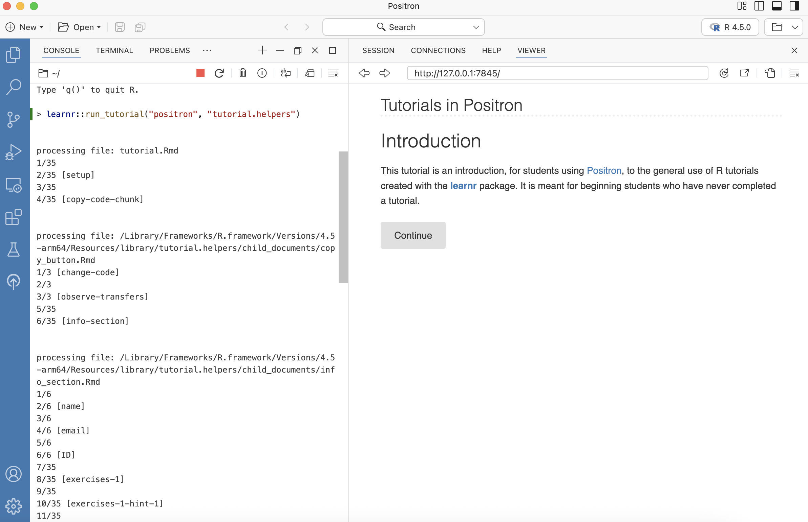
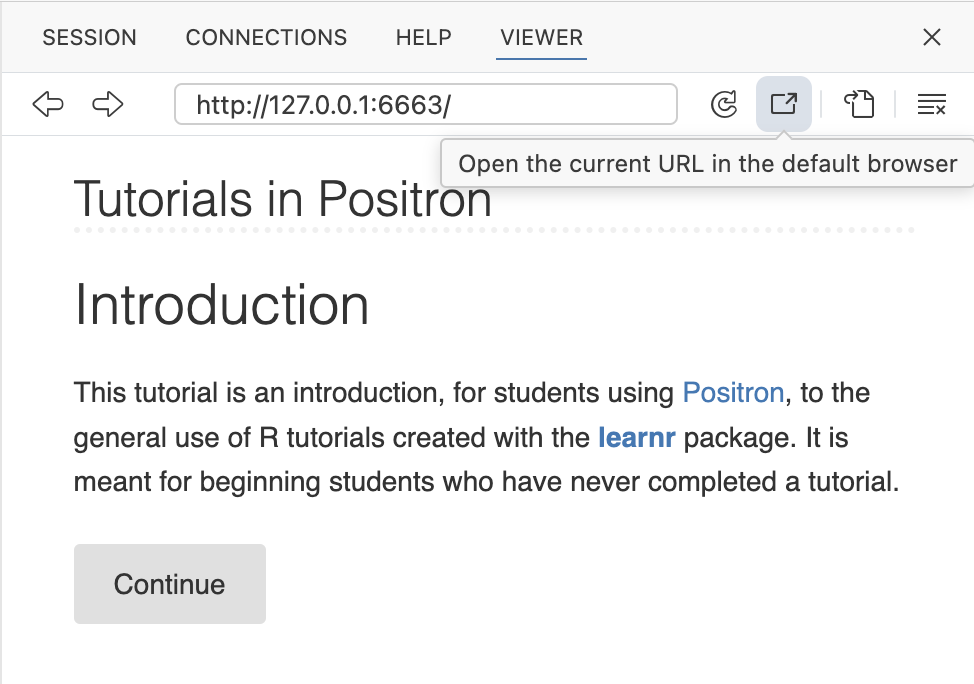
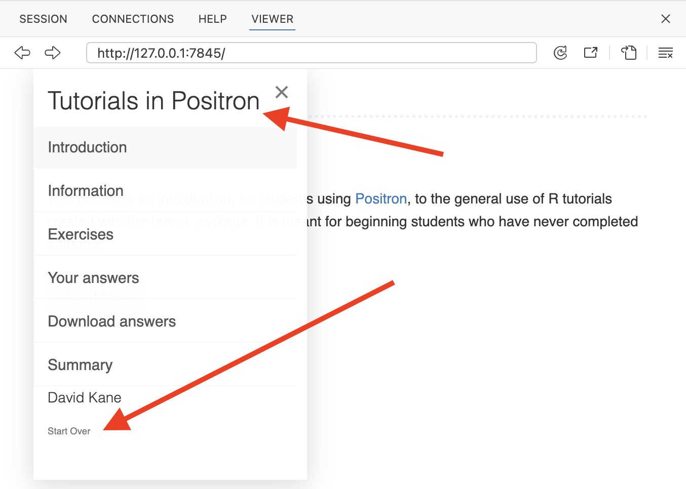
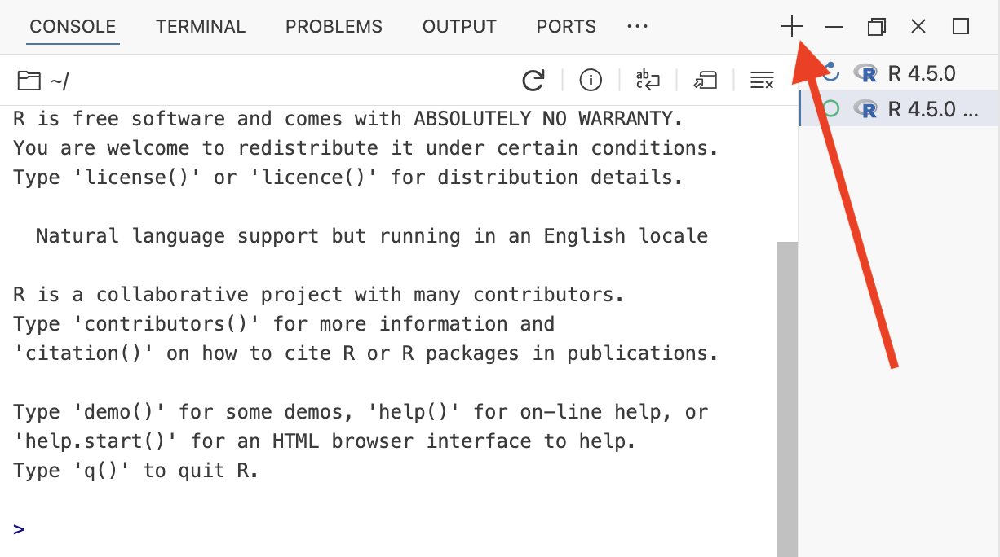
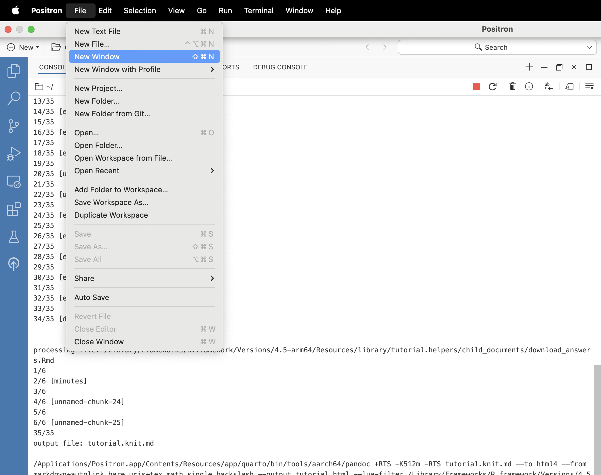

```{r setup, include = FALSE}
library(learnr)
library(tutorial.helpers)
library(knitr)

knitr::opts_chunk$set(echo = FALSE)
knitr::opts_chunk$set(out.width = '90%')
options(tutorial.exercise.timelimit = 60, 
        tutorial.storage = "local") 
```

```{r copy-code-chunk, child = system.file("child_documents/copy_button.Rmd", package = "tutorial.helpers")}
```

## Introduction
### 

This tutorial is an introduction, for students using [Positron](https://positron.posit.co/), to the general use of R tutorials created with the [**learnr**](https://rstudio.github.io/learnr/) package. It is meant for beginning students who have never completed a tutorial.

### 

After you started the tutorial, your Positron window looked something like this:

```{r}

```

Note the red square at the top of the Console menu. This indicates that the Console is "busy." You can't do anything with this Console unless you stop running the tutorial. You can complete the tutorial in the Viewer pane in the Secondary Side Bar. 

###

Or you can "pop" a tutorial up into your browser by pressing the "Open the current URL in the default browser" button --- the item in the Viewer menu just to the right of the circular arrow. It looks like a rectangle containing an arrow pointing up and to the right.

```{r}

```

You can go back and forth between the Viewer tab and the browser. The tutorial is easier to read in the browser, but many students prefer to just keep everything inside of the Positron window.

###

<!-- DK: Revist these instructions once you can use Positron in the cloud. Perhaps add a new vignette discussing Posit Workbench. -->

You complete a tutorial on your computer. You download a copy of your answers to the `Downloads` folder on your computer. Then, you submit your answers to your instructor and/or keep a copy for yourself.

### 

Most tutorials begin by asking for your name and email. (Your instructor might also request that you fill in the "ID" field so that your work can be matched to a grading database. If not, leave the "ID" field blank.) Click "Continue" and then fill in your name and email. Click the **"Submit Answer"** button each time. If you make a mistake, you can click **"Try Again"** and, uh, try again. 

```{r info-section, child = system.file("child_documents/info_section.Rmd", package = "tutorial.helpers")}
```


## Exercises 
### 

In each tutorial, there will be a set of exercises for you to complete. For non-coding questions, you write your answer and then hit the "Submit Answer" button, as you did above.

### 

Clicking **"Start Over"** --- look for small letters at the bottom of the left-hand side menu --- deletes all your work and allows you to begin the entire tutorial again. 

If you are working on your tutorial in the Viewer in the Secondary Side Bar, the screen might not be wide enough to show the left-hand side menu. If so, just click on the name of the tutorial. This brings up the section menu of the tutorial with "Start Over" on the bottom.

```{r}

```


### Exercise 1

Let's practice some simple math. Type `4 + 5` into the box below. Hit **"Run Code"** to see your results. Clicking **"Hint"** gives you a hint about what to type. 

```{r exercises-1, exercise = TRUE}

```

```{r exercises-1-hint-1, eval = FALSE}
4 + 5
```

### 

Once you click "Run Code," the answer `[1] 9` should appear below the code you entered. This is the same behavior you would see if you ran this code in the Console, which is where R is run, in a tab beneath the Welcome page.

###

The problem right now is that we can't check that claim since the Console is currently busy with the tutorial. To confirm the claim, you will need a second Console. Create it by pressing the "Start a New Session" button: the `+` sign, as indicated by the red arrow. Choose the R option, if you are asked. After you do so, the Console should look like:

```{r}

```

### 

Typing `4 + 5` and hitting `return/enter` produces the same result in the Console as it does in the exercise.

###

There are two types of answers for tutorial questions: prose and code. With prose answers, you will use the "Submit Answer" button, as you did with your name and email. With code answers, you use the "Run Code" button, as you did for this question.

### 

If you don't "Run Code" (or "Submit Answer") your response, nothing is recorded.

### Exercise 2

Let's use variables to perform the same calculation. Below, we have already assigned 5 to `x` and 4 to `y`. On the line below those two provided lines of code, add the two variables by typing `x + y`. Hit "Run Code" to see your results. 

```{r exercises-2, exercise = TRUE}
x <- 5
y <- 4

```

```{r exercises-2-hint-1, eval = FALSE}
x <- 5
y <- 4
x + y
```

### 

Once you click "Run Code", the answer `[1] 9` should appear below the code you entered. 

### Exercise 3

We will often need to copy code from the previous exercise to continue working on a multi-step problem. To make this easier, we provide a "Copy previous code" button. Below the following box, click on the "Copy previous code" button. 

```{r exercises-3, exercise = TRUE}

```

<button onclick = "transfer_code(this)">Copy previous code</button>

```{r exercises-3-hint-1, eval = FALSE}
x <- ...
y <- 10
x + ...
```

### 

This should paste all work from the previous exercise into the above exercise code area. Note that this will only copy code which has already been run in the previous exercise.

### 

Change the values to `x <- 6` and `y <- 10`. Hit "Run Code." You should get the answer `[1] 16`.

### 

Note that the assignment symbol, `<-`, is a less-than-sign followed by a dash. We often pronounce this symbol as "gets." So, we might say, when reading this code, that "x gets 6."

### 

Did you remember to hit the "Run Code" button above? Lots of people forget! You must hit the button for your answer to be recorded.

### Exercise 4

<!-- DK: Seems like it should be possible to restart the R session. But the various buttons don't seem to work very well, at least when you are in a tutorial. Try this again in a month. In the meantime, this radical close-Positron approach is OK. -->

Read all of the following instructions before continuing.

* Quit and then restart Positron. (The purpose of this exercise is to demonstrate that your tutorial answers are saved automatically.)

* Restart the tutorial. The most common approach is to run this command at the Console:

```
learnr::run_tutorial("positron", package = "tutorial.helpers")
```

* Copy the above code now so that you can easily paste it into the Console after you restart Positron.

Now that you have read all the instructions, go ahead and follow them.

### 

Note how all your answers to previous questions have been saved. It is not a problem to quit a tutorial. In fact, if you ignore a tutorial for awhile, it will quit automatically.


### Exercise 5

Instead of creating a new Console, as we did before, click `File -> New Window` in the Positron menu.

```{r}

```

This brings up a new instance of Positron, completely independent of this one. This is the most common set up when working on tutorials. One Positron window, this one, runs the tutorial, but we don't do any work in it. We generally don't even bother to create a second Console. The second Positron window is where we do the work which the tutorial requires.

###

There are many ways to move between Positron windows. One approach is to hold down the Control key and hit the letter W. This is usually abbreviated as `Ctrl + w`. This pulls up a list of the open Positron windows. You then select the one you want and hit `return/enter`. On the Mac, you can hold down the Command key and then hit the backtick key: `` ` ``, i.e., ``Cmd + ` ``. This "cycles through" the open Positron windows. `Alt + Tab` on Windows has a similar effect, although the cycle will include all open applications, not just Positron windows.

###

In the Console in the new window, type `version[['version.string']]` and hit the `return/enter` key.

**Do not just type the command into the answer box!** You must paste the command into the Console and then execute the command.

Copy/paste the command **and** the return value into this box.

```{r exercises-5}
question_text(NULL,
	answer(NULL, correct = TRUE),
	allow_retry = TRUE,
	try_again_button = "Edit Answer",
	incorrect = NULL,
	rows = 3)
```

### 

Your answer should look something like:

````
> version[['version.string']]
[1] "R version 4.5.0 (2025-04-11)"
>
````

Your version of R may be more recent, but it should not be older. It is OK if your formatting differs from ours. Exactness does not matter. What matters is that you prove that you have executed the command as instructed.

### 

Tutorial workflow will often look like this. We tell you to run a command **in the Console**, generally in your second Positron window. You run it. We then ask you to copy/paste, from the Console, both the command itself and the response returned. Because we ask you to **c**opy/**p**aste the **c**ommand/**r**esponse so often, we usually shorten this instruction to CP/CR.

### Exercise 6

Positron and your R installation have some default settings which are not good for new users. Run this command at the Console to change them:

`
tutorial.helpers::set_positron_settings()
`

CP/CR.

```{r exercises-6}
question_text(NULL,
	answer(NULL, correct = TRUE),
	allow_retry = TRUE,
	try_again_button = "Edit Answer",
	incorrect = NULL,
	rows = 8)
```

### 

The output from this function will report the changes, if any, which were made. To learn more, look up the help page by running `?tutorial.helpers::set_positron_settings` at the Console.

### 

You can generally call functions by just giving their name along with the ending parentheses, as with `set_positron_settings()`. However, it can be safer to preface the function name with the name of the package in which the function is found, separated by two colons. Since `set_positron_settings()` is in the **tutorial.helpers** package, we can call it using the double colon notation: `tutorial.helpers::set_positron_settings()`, as we do above.

### Exercise 7

Tutorials can include written responses. You have already seen several examples. Sometimes those written answers are just copies of the R commands and their results. Other times, we will ask you to write one or more sentences of prose. 

Copy and paste everything from `Exercise 7` above through the end of this sentence into the answer box below. That is, you are copying from this tutorial, not from the Console. Press "Submit Answer."

```{r exercises-7}
question_text(NULL,
    message = "We will sometimes provide an answer to written questions, as we do here. Other times, we won't. In the former case, we will not allow you to resubmit your answer. Don't stress! Most instructors grade tutorials on pass/fail basis, so, as long as you make an honest effort, you will do fine.",          
    answer(NULL, 
           correct = TRUE),
    allow_retry = FALSE,
    incorrect = NULL,
    rows = 6)
```

### Exercise 8

`show_file()` is a commonly-used function from the **tutorial.helpers** package. It makes it easy for you to share the contents of another file with your instructor, especially a file which you have edited. 

From the Console, run this command:

```
tutorial.helpers::show_file(file.path(R.home(), "COPYING"), end = 7)
```

CP/CR.

```{r exercises-8}
question_text(NULL,
	answer(NULL, correct = TRUE),
	allow_retry = TRUE,
	try_again_button = "Edit Answer",
	incorrect = NULL,
	rows = 10)
```

<!-- I really want a test case to ensure that this works on all OSs. -->

```{r exercises-8-test, include = FALSE}
tutorial.helpers::show_file(file.path(R.home(), "COPYING"), end = 7)
```

### 

Your answer should look something like this:

````
> tutorial.helpers::show_file(file.path(R.home(), "COPYING"), end = 7)
		    GNU GENERAL PUBLIC LICENSE
		       Version 2, June 1991

 Copyright (C) 1989, 1991 Free Software Foundation, Inc.
                       51 Franklin St, Fifth Floor, Boston, MA  02110-1301  USA
 Everyone is permitted to copy and distribute verbatim copies
 of this license document, but changing it is not allowed.
> 
````

### 

For now, don't worry about what `R.home()` and `file.path()` are doing, although you can read about them by running `?R.home` and `?file.path` at the Console. Those details are less important than seeing the intended usage of `show_file()`. 


## Your answers
### 

At the end of every tutorial, you will save your work (and submit it, at the discretion of your instructor). We will do this in the next topic, labeled "Download answers." Follow the instructions there. 

Make sure to answer the question about how many **minutes** you spent on the tutorial and to click "Submit Answer."

After hitting the "Download" button, you will be prompted to save a file named `positron_answers.html`. This file should be saved in the default Downloads folder on your computer. 

Unless told otherwise by your instructor, you should use the default file name, which will usually be of the form `short-name-of-tutorial` + `_answers` + `.html`. 

```{r download-answers, child = system.file("child_documents/download_answers.Rmd", package = "tutorial.helpers")}
```

## Summary
### 

You now understand how tutorials function and how to download a copy of your answers. Good luck with your data science journey!
