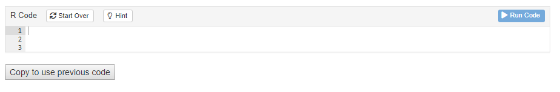

This document reviews some of the technical details behind the special modifications which the **tutorial.helpers** package makes possible and/or necessary, beyond the defaults of the basic **learnr** tutorial technology. It is only of interest to those thinking of modifying the current approach. It also includes some items worth investigating and/or fixing.


## Package locations

<!-- DK: Not sure this is true with new version of renv. Maybe there are more? -->

Keep in mind that there are (at least) two versions of **your.tutorial.package** installed on your machine. In my case (using **all.primer.tutorials**), we have


```bash
> /Library/Frameworks/R.framework/Versions/4.1/Resources/library
```

and


```bash
> /Users/dkane/Library/Caches/org.R-project.R/R/renv/library/all.primer.tutorials-07f29d85/R-4.2/aarch64-apple-darwin20"
```

The first is the default location for packages. This is where things go unless you do something special. The second is installed by `renv`, which was used within the **all.primer.tutorials** project. When you are working in your **all.primer.tutorials** project, as you generally will, the `renv` version of the **all.primer.tutorials** library is what you will be using. You can check this by running `.libPaths()`.


```r
> .libPaths()
[1] "/Users/dkane/Library/Caches/org.R-project.R/R/renv/library/all.primer.tutorials-07f29d85/R-4.2/aarch64-apple-darwin20"
[2] "/Library/Frameworks/R.framework/Versions/4.2-arm64/Resources/library" 
```

Whenever you `library()` a package, R looks through, in order, the values returned by `.libPaths()`. **renv** sets things up so that the first item is its collection of packages. Note that these are placed in a weird location, including a temp directory named something like `all.primer.tutorials-07f29d85`. I am not sure how **renv** decided to create a new one of these. It does not delete the old ones. In the case of major breakdowns, deleting these directories by hand can fix things.


## Copy Code Trickery

### Current Process

In order to implement copy-pasting for an exercise, you need to add the line `<button onclick = "transfer_code(this)">Copy previous code</button>` either before or after the exercise that you want to copy-paste to. This will add a button that looks like this:



The user just needs to click the button in order to copy the code from the previous exercise into the current one.

The downsides to the current approach are: 1) tutorial makers still have to include something in the Exercises and 2) the button would look much better on the toolbar section of the exercise, perhaps in between  `Start Over` and `Hint`..

## Comments on .Rbuildignore

For some reason, it is impossible to include comments in the `.Rbuildignore`, at least by using the "#" symbol. I think the key issue is that using `*` (or maybe a parenthesis) in a line which begins with `#` causes trouble. Regardless, here are some thoughts on the version we currently use in **all.primer.tutorials**.

We would like to ensure that all the junk files which end up in the `tutorials/*` directories are not included in the build. Such files are often large. They also run the risk of messing things up in that they might cause certain tests to pass for us but which would fail for anyone who downloads from Github. (The `.gitignore` file does a reasonable job of ensuring that such files do not end up on Github.)

The key line is:

````
tutorials/[^/]*/(?!(data|images|.*Rmd))
````

This excludes everything in any subdirectory of the tutorials directory except an `images` directory (a file named images would also be included) or a `data` directory or a file suffixed with `.Rmd`. 


## Adding more libraries

If you are using a new library, there are several things you need to check. First, most obviously, you should install the package within the `your.package` directory. Second, you must use `library(X)` in the setup chunk within the `tutorial.Rmd` itself. Third, you need to run `renv::status()`. This should report that there is a new package which is not part of `renv.lock`. Then, you will need to run `renv::snapshot()` so that the `renv.lock` file is updated. Fourth, you need to add the package to the `DESCRIPTION` file, in the `Imports:` section. (And don't forget the comma when you do so.) If you don't do this, then R CMD check might work on your computer, where library X is already installed, but won't work in Github actions since it relies on the DESCRIPTION file to know which packages to install.

It makes sense to use high quality tools for these steps. For example, `renv::install()` is a better way of installing needed packages within the **renv** environment. `usethis::use_package()` updates the `DESCRIPTION` file to include the package. 

We have seen weird situations in which even doing all of the above did not work. The required hack was to install the new package in your main (default) library. Now, it seems weird that this would help since, with **renv**, we should never be using that location. I suspect that there is a bug involved in the interaction between `R CMD check` and **renv**.


## Tour of the Package Functions

### Submission Functions

**submission_ui** is an HTML structure defined through Shiny, which is inserted to the end of every tutorial. It creates buttons to download submission reports in the forms of RDS and HTML.

**submission_server()** is a function that communicates with the Shiny server during a tutorial. It provides the download functions, **downloadHtml** and **downloadRds**, for the user interface to call when downloading submission reports.

### Submission Helper Functions

**build_html** is a function that creates and downloads a tibble report of tutorial submissions in HTML.

**build_rds** is a function that creates and downloads an tibble report of tutorial submissions in RDS.

**get_submissions_from_learnr_session** is a function that gets submissions of the current tutorial session through **learnr** functions, specifically `learnr::get_all_state_objects()` and `learnr::submissions_from_state_objects()`. It returns a list of submission objects, each containing details about the question and answer.


### Add-in Functions

**format_tutorial** is a function that takes a tutorial path and formats the code chunk labels into a standardized format.

**check_current_tutorial** is an add-in function that runs `format_tutorial()` on the current opened tutorial. It is a handy add-in for tutorial makers who want to make sure their chunk labels are correct.

**make_exercise** is an add-in function that creates a exercises with correctly formatted labels and general structure. 


## Permanent objects

Permanent objects should be avoided, if possible. The problem is that each Exercise code chunk is its own "world." It knows nothing of any actions taken in previous code chunks, except for three exceptions:

1) Any objects created in the global "setup" code chunk are available in all Exercise code chunks. The annoying thing about this option is that we would, ideally like to have the objects created near --- in the Rmd --- to the Exercises which use them. This also means that we can only use names like "fit_1" or "pp" once in each tutorial.

2) Objects created in a setup chunk for just one exercise. 

3) Objects created in a code chunk which is then referenced by using the exercise.setup code chunk option in any Exercise which needs access to these objects. This is probably the best approach.

But what about regular code chunks which are neither Exercise code chunks nor setup chunks. Do objects created there persist? Maybe! Sometimes!? My *sense* is that such objects are available when the tutorial is knitted. This is why we can show a plot at the end of a Section after creating it at the start. But such objects are not available at run time, which is why they are not seen in Exercises.

No aspect of the tutorials has given us more trouble than permanent objects. In particular, it sometimes seems like things will work with Run Document but not with Run Tutorial. Since students always do the latter, we need to test that way as well.


