## This is a walkthrough on how to set up your own Google OAuth App for Submission Collection with Gmail and Google Drive.

### 1. Navigate to [console.cloud.google.com](https://console.cloud.google.com) and login to your cloud console.

Note: It may not be necessary to login if you already logged in to your google account.

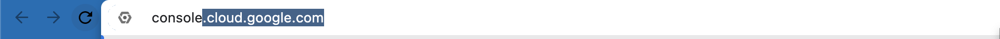

### 2. Click the dropdown that displays the name of your project or "Select a Project". This takes you to the modal where you will create the project.

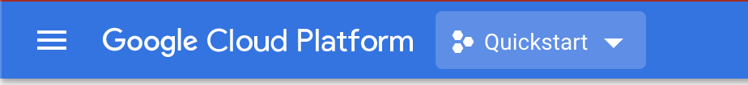

### 3. Click "New Project" on the top right of the modal. It should tell you there is a certain number of projects remaining.

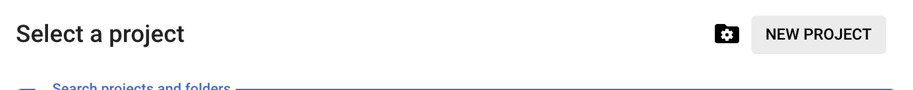

### 4. Name and Create your project.

We used the name "Submission Collector", but you can use whatever name you want.

Don't worry about the Organization Tab.

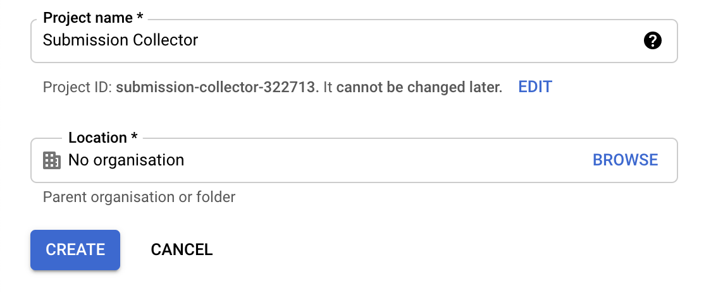

### 5. Select the project.

You may use the project dropdown menu from Step 2 to navigate to your new project,

Or click "Select the project" to navigate to your new project.

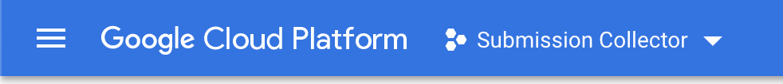

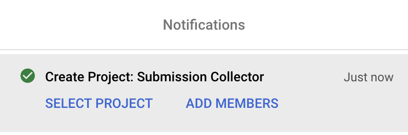

### 6. Click the triple dash side bar and navigate to "Marketplace"

Note: No payment is needed for this walkthrough or for this project.

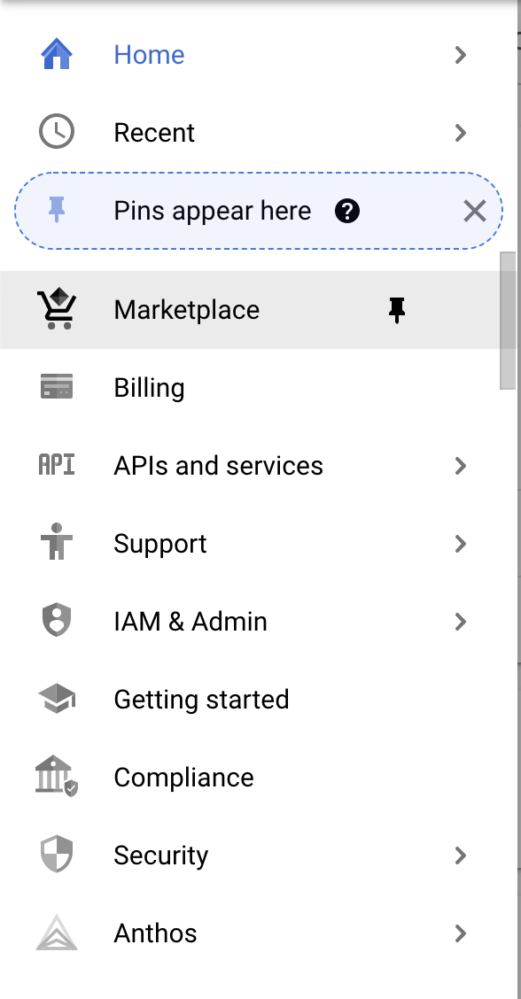

### 7. Search for and Click "Enable" for Gmail API

Search for "Gmail API" in the searchbar.

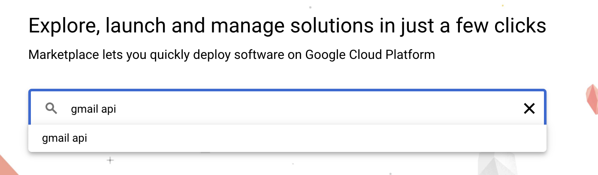

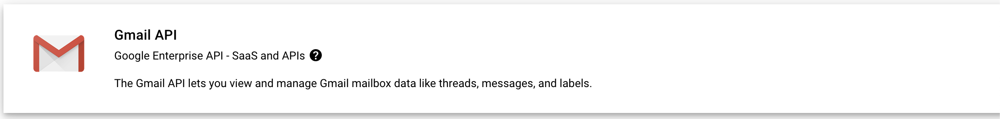

Click "Enable" to enable the Gmail API in your project.

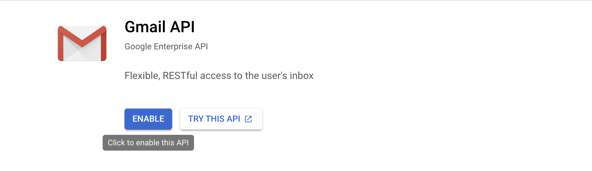

### 8. Do the same for Google Drive API

Search for "Google Drive API" in the searchbar.

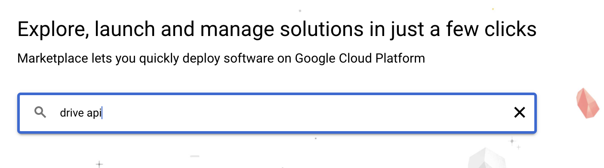

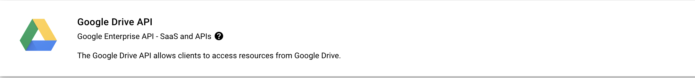

Click "Enable" to enable the Google Drive API in your project.

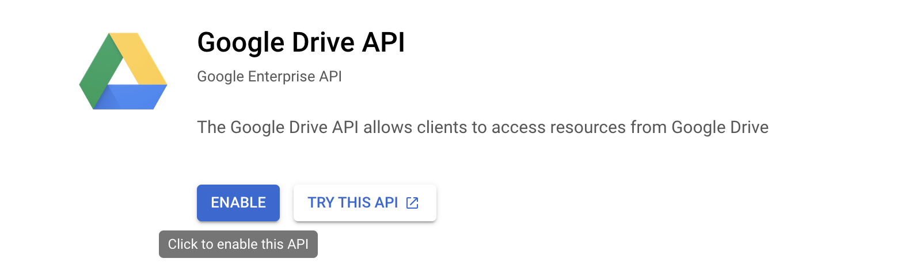

### 9. Use the triple dash side bar to navigate to "APIs and services" > "Credentials"

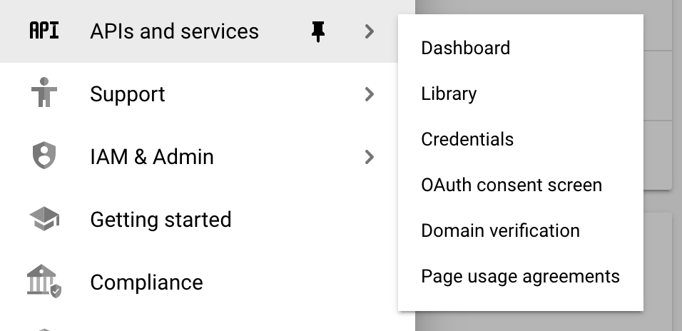

### 10. Click on "Configure Consent Screen"

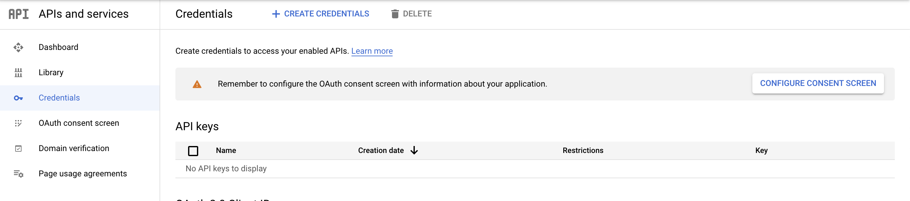

### 11. For the first question, select "External" and click "Create"

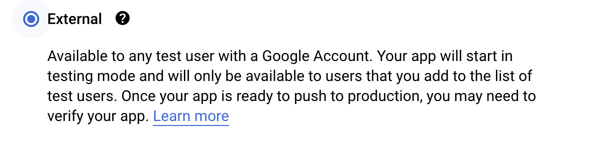

### 12. Fill out and save the form for the consent screen. You have to fill in all the fields with a red * beside it.

For the "App Name", we used "personal submission collector" but you can use any name you want.

For the "User Support Email", select your email from the dropdown menu.

For the "Developer contact information", fill in your own email.

Click "Select and Continue"

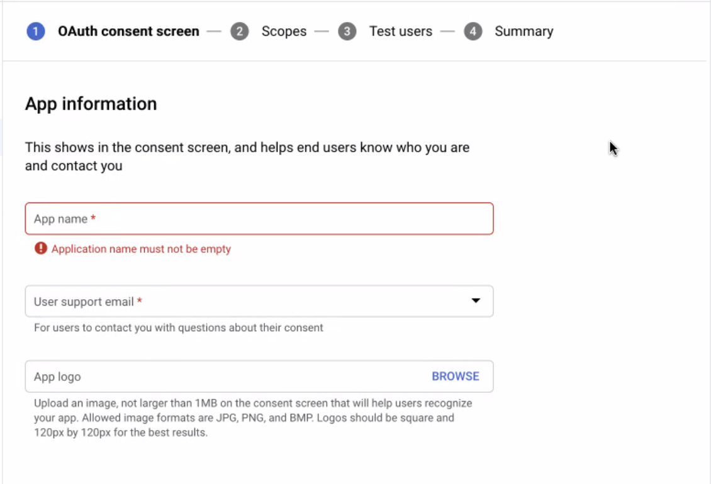

For all the next steps, skip everything and just click "Save and Continue".

### 13. Navigate back to the "Credentials" Screen

### 14. Click "+ Create Credentials" and in the dropdown, select "OAuth client ID"

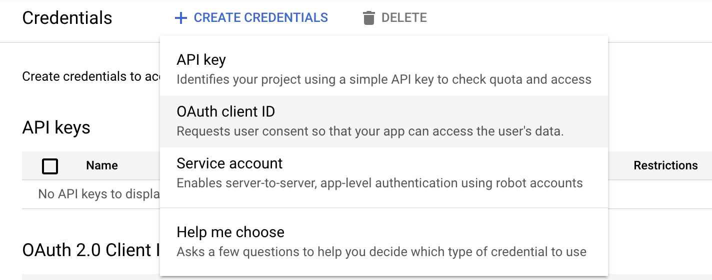

### 15. Fill out the form as below, you can change the name based on your liking

For the "Redirect URI", add "http://localhost:1410/"

Then click "Create".

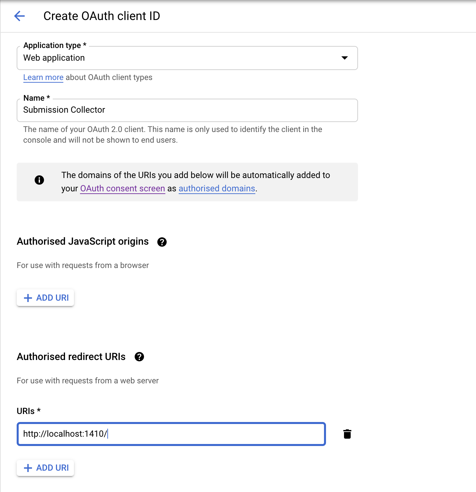

### 16. VERY IMPORTANT: After creating your credentials, a modal will pop up with your client id (key) and client secret. Store them somewhere safe because this will be used for the submission collection script.

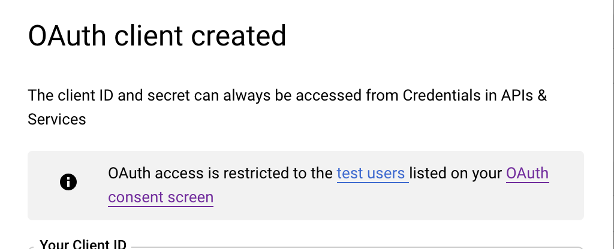

### 17. After saving your key and secret, navigate to the "OAuth consent screen".

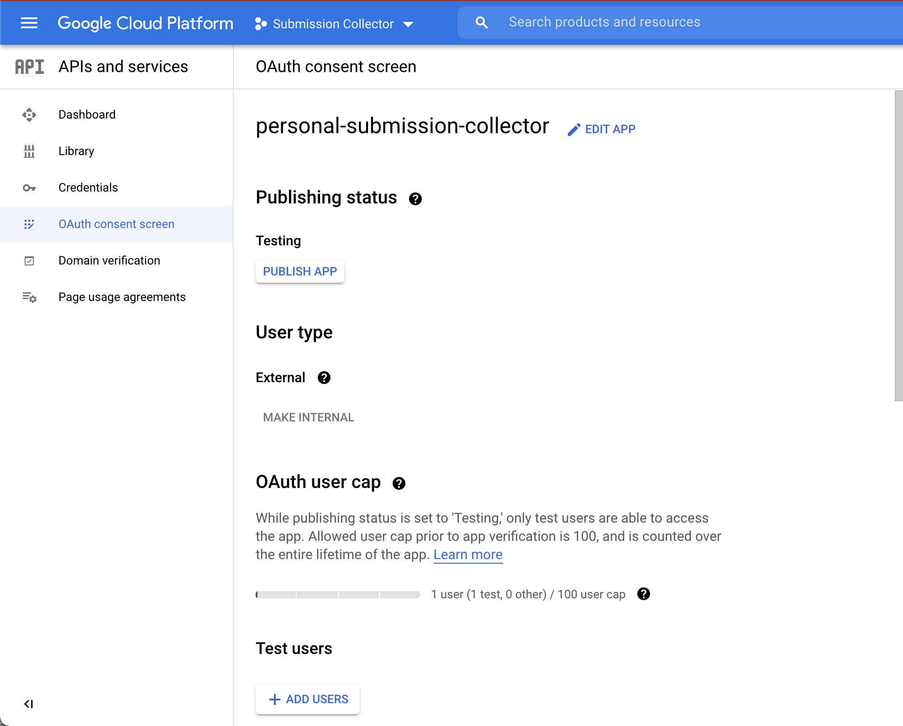

### 18. Scroll down to "Test users", click "+ Add Users"

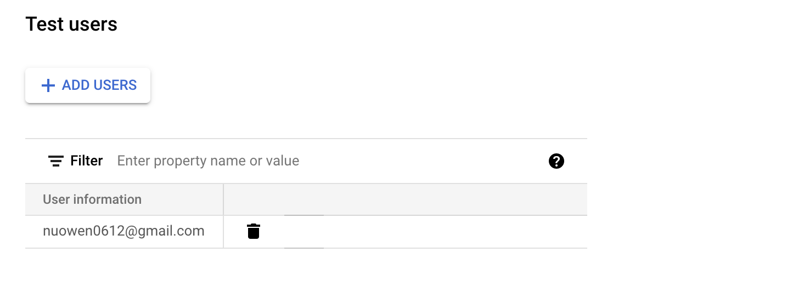

### 19. Add the email you are using to receive submission with and "Save".

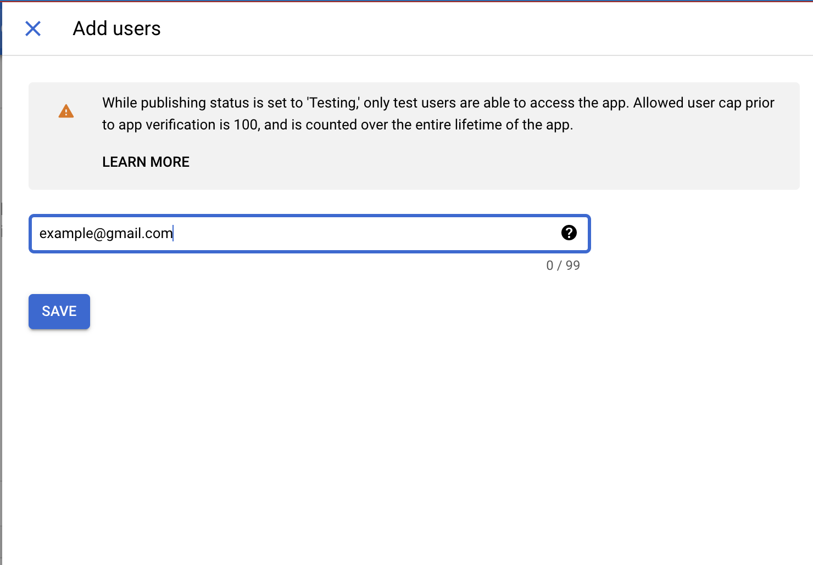

## YOU'RE DONE!

